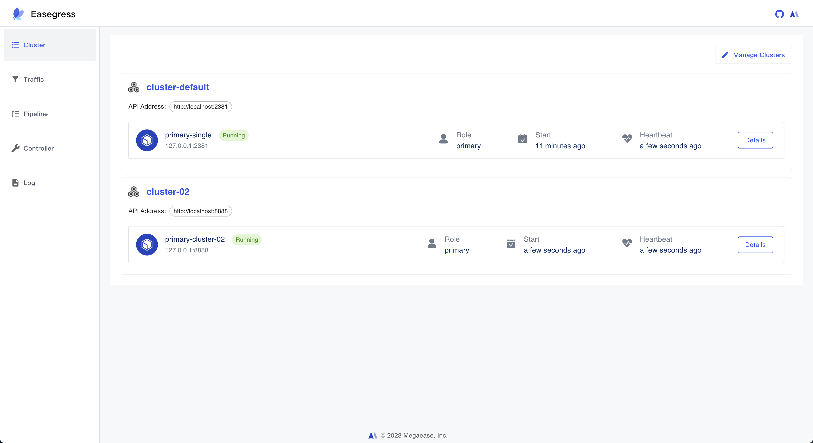
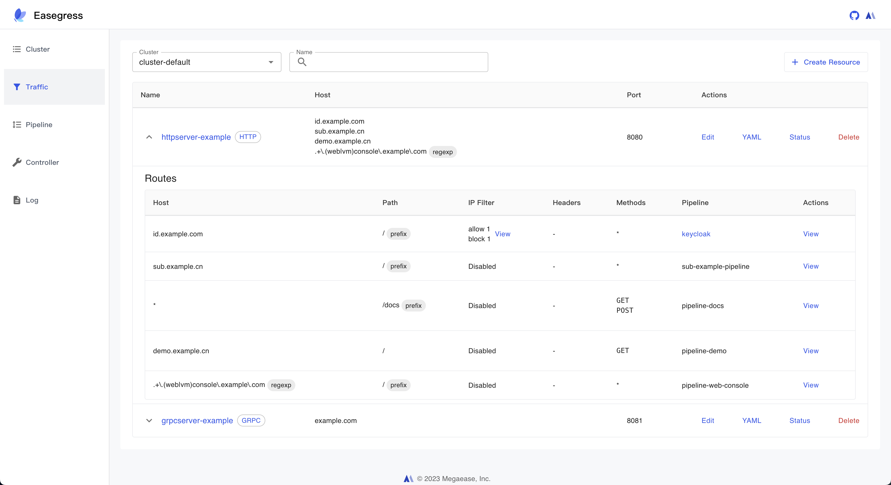
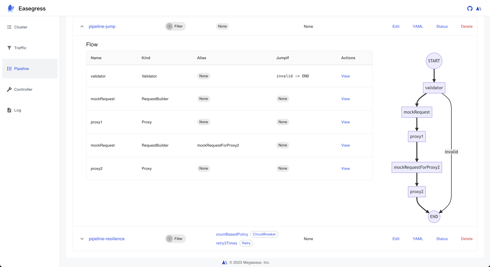

# Easegress  <!-- omit from toc -->

[](https://goreportcard.com/report/github.com/megaease/easegress)
[](https://github.com/megaease/easegress/actions/workflows/test.yml)
[](https://codecov.io/gh/megaease/easegress)
[](https://hub.docker.com/r/megaease/easegress)
[](https://opensource.org/licenses/Apache-2.0)
[](https://github.com/megaease/easegress/blob/main/go.mod)
[](https://cloud-native.slack.com/messages/easegress)
[](https://www.bestpractices.dev/projects/8265)
[](https://app.fossa.com/projects/git%2Bgithub.com%2Feasegress-io%2Feasegress?ref=badge_shield)

<a href="https://megaease.com/easegress">
    
</a>

- [What is Easegress](#what-is-easegress)
- [Features](#features)
- [Getting Started](#getting-started)
  - [Launch Easegress](#launch-easegress)
  - [Reverse Proxy](#reverse-proxy)
- [Use Cases](#use-cases)
- [Documentation](#documentation)
- [Easegress Portal](#easegress-portal)
  - [Screenshots](#screenshots)
- [Community](#community)
- [Contributing](#contributing)
- [License](#license)

## What is Easegress

`Easegress` is a Cloud Native traffic orchestration system designed for:

- **High Availability:** Built-in Raft consensus & leader election provides 99.99% availability.
- **Traffic Orchestration:** Simple orchestration of various filters for each traffic pipeline.
- **High Performance:** Lightweight and essential features speed up the performance.
- **Observability:** There are many meaningful statistics periodically in a readable way.
- **Extensibility:** It's easy to develop your own filter or controller with high-level programming language.
- **Integration:** The simple interfaces make it easy to integrate with other systems, such as Kubernetes Ingress, [EaseMesh](https://github.com/megaease/easemesh) sidecar, Workflow, etc.

The architecture of Easegress:


## Features

- **Service Management**
  - **Multiple protocols:**
    - HTTP/1.1
    - HTTP/2
    - HTTP/3(QUIC)
    - MQTT
  - **Rich Routing Rules:** exact path, path prefix, regular expression of the path, method, headers, clientIPs.
  - **Resilience&Fault Tolerance**
    - **CircuitBreaker:** temporarily blocks possible failures.
    - **RateLimiter:** limits the rate of incoming requests.
    - **Retry:** repeats failed executions.
    - **TimeLimiter:** limits the duration of execution.
  - **Deployment Management**
    - **Blue-green Strategy:** switches traffic at one time.
    - **Canary Strategy:** schedules traffic slightly.
  - **API Management**
    - **API Aggregation:** aggregates results of multiple APIs.
    - **API Orchestration:** orchestrates the flow of APIs.
  - **Security**
    - **IP Filter:** Limits access to IP addresses.
    - **Static HTTPS:** static certificate files.
    - **API Signature:** supports [HMAC](https://en.wikipedia.org/wiki/HMAC) verification.
    - **JWT Verification:** verifies [JWT Token](https://jwt.io/).
    - **OAuth2:** validates [OAuth/2](https://datatracker.ietf.org/doc/html/rfc6749) requests.
    - **Let's Encrypt:** automatically manage certificate files.
  - **Pipeline-Filter Mechanism**
    - **Filter Management:** makes it easy to develop new filters.
  - **Service Mesh**
    - **Mesh Master:** is the control plane to manage the lifecycle of mesh services.
    - **Mesh Sidecar:** is the data plane as the endpoint to do traffic interception and routing.
    - **Mesh Ingress Controller:** is the mesh-specific ingress controller to route external traffic to mesh services.
        > Notes: This feature is leveraged by [EaseMesh](https://github.com/megaease/easemesh)
  - **Third-Part Integration**
    - **FaaS** integrates with the serverless platform Knative.
    - **Service Discovery** integrates with Eureka, Consul, Etcd, and Zookeeper.
    - **Ingress Controller** integrates with Kubernetes as an ingress controller.
- **Extensibility**
  - **WebAssembly** executes user developed [WebAssembly](https://webassembly.org/) code.
- **High Performance and Availability**
  - **Adaption**: adapts request, response in the handling chain.
  - **Validation**: headers validation, OAuth2, JWT, and HMAC verification.
  - **Load Balance:** round-robin, random, weighted random, IP hash, header hash and support sticky sessions.
  - **Cache:** for the backend servers.
  - **Compression:** compresses body for the response.
  - **Hot-Update:** updates both config and binary of Easegress in place without losing connections.
- **Operation**
  - **Easy to Integrate:** command line([egctl](docs/02.Tutorials/2.1.egctl-Usage.md)), Easegress Portal, HTTP clients such as curl, postman, etc.
  - **Distributed Tracing**
    - Built-in [OpenTelemetry](https://opentelemetry.io/), which provides a vendor-neutral API.
  - **Observability**
    - **Node:** role(primary, secondary), raft leader status, healthy or not, last heartbeat time, and so on
    - **Traffic:** in multi-dimension: server and backend.
      - **Throughput:** total and error statistics of request count, TPS/m1, m5, m15, and error percent, etc.
      - **Latency:** p25, p50, p75, p95, p98, p99, p999.
      - **Data Size:** request and response size.
      - **Status Codes:** HTTP status codes.
      - **TopN:** sorted by aggregated APIs(only in server dimension).

## Getting Started
The basic usage of Easegress is to quickly set up a proxy for the backend servers.

### Launch Easegress

Easegress can be installed from pre-built binaries or from source. For details, see [Install](docs/01.Getting-Started/1.2.Install.md).


Then we can execute the server:

```bash
$ easegress-server
2023-09-06T15:12:49.256+08:00   INFO    cluster/config.go:110   config: advertise-client-urls: ...
...
```

By default, Easegress opens ports 2379, 2380, and 2381; however, you can modify these settings along with other arguments either in the configuration file or via command-line arguments. For a complete list of arguments, please refer to the `easegress-server --help` command.

After launching successfully, we could check the status of the one-node cluster.

```bash
$ egctl get member
...

$ egctl describe member
...
```

### Reverse Proxy

Assuming you have two backend HTTP services running at `127.0.0.1:9095` and `127.0.0.1:9096`, you can initiate an HTTP proxy from port 10080 to these backends using the following command:

```bash
$ egctl create httpproxy demo --port 10080 \
  --rule="/pipeline=http://127.0.0.1:9095,http://127.0.0.1:9096"
```

Then try it:
```bash
$ curl -v 127.0.0.1:10080/pipeline
```

The request will be forwarded to either `127.0.0.1:9095/pipeline` or `127.0.0.1:9096/pipeline`, utilizing a round-robin load-balancing policy.

More about getting started with Easegress:

- [Quick Start](docs/01.Getting-Started/1.1.Quick-Start.md)
- [Install Easegress](docs/01.Getting-Started/1.2.Install.md)
- [Main Concepts](docs/01.Getting-Started/1.3.Concepts.md)

## Use Cases

The following examples show how to use Easegress for different scenarios.

- [API Aggregation](docs/02.Tutorials/2.3.Pipeline-Explained.md#api-aggregation) - Aggregating many APIs into a single API.
- [Cluster Deployment](docs/05.Administration/5.1.Config-and-Cluster-Deployment.md) - How to deploy multiple Easegress cluster nodes.
- [Canary Release](docs/03.Advanced-Cookbook/3.04.Canary-Release.md) - How to do canary release with Easegress.
- [Distributed Tracing](docs/03.Advanced-Cookbook/3.05.Distributed-Tracing.md) - How to do APM tracing  - Zipkin.
- [FaaS](docs/03.Advanced-Cookbook/3.09.FaaS.md) - Supporting Knative FaaS integration
- [Flash Sale](docs/03.Advanced-Cookbook/3.09.FaaS.md) - How to do high concurrent promotion sales with Easegress
- [Kubernetes Ingress Controller](docs/04.Cloud-Native/4.1.Kubernetes-Ingress-Controller.md) - How to integrate with Kubernetes as ingress controller
- [LoadBalancer](docs/02.Tutorials/2.3.Pipeline-Explained.md#load-balancer) - A number of the strategies of load balancing
- [MQTTProxy](docs/03.Advanced-Cookbook/3.01.MQTT-Proxy.md) - An Example to MQTT proxy with Kafka backend.
- [Multiple API Orchestration](docs/03.Advanced-Cookbook/3.03.Multiple-API-Orchestration.md) - An Telegram translation bot.
- [Performance](docs/03.Advanced-Cookbook/3.11.Performance.md) - Performance optimization - compression, caching etc.
- [Pipeline](docs/02.Tutorials/2.3.Pipeline-Explained.md) - How to orchestrate HTTP filters for requests/responses handling
- [Resilience and Fault Tolerance](docs/02.Tutorials/2.4.Resilience.md) - CircuitBreaker, RateLimiter, Retry, TimeLimiter, etc. (Porting from [Java resilience4j](https://github.com/resilience4j/resilience4j))
- [Security](docs/02.Tutorials/2.5.Traffic-Verification.md) - How to do authentication by Header, JWT, HMAC, OAuth2, etc.
- [Service Registry](docs/03.Advanced-Cookbook/3.06.Service-Registry.md) - Supporting the Microservice registries - Zookeeper, Eureka, Consul, Nacos, etc.
- [WebAssembly](docs/03.Advanced-Cookbook/3.07.WasmHost.md) - Using AssemblyScript to extend the Easegress
- [WebSocket](docs/02.Tutorials/2.6.Websocket.md) - WebSocket proxy for Easegress
- [Workflow](docs/03.Advanced-Cookbook/3.10.Workflow.md) - An Example to make a workflow for a number of APIs.

For full list, see [Tutorials](docs/02.Tutorials/README.md) and [Cookbook](docs/03.Advanced-Cookbook/README.md).
## Documentation

- [Getting Started](docs/01.Getting-Started/README.md)
- [Tutorials](docs/02.Tutorials/README.md)
- [Advanced Cookbook](docs/03.Advanced-Cookbook/README.md)
- [Cloud Native](docs/04.Cloud-Native/README.md)
- [Administration](docs/05.Administration/README.md)
- [Development](docs/06.Development-for-Easegress/README.md)
- [Reference](docs/07.Reference/README.md)

## Easegress Portal

[Easegress Portal](https://github.com/megaease/easegress-portal) is an intuitive, open-source user interface for the Easegress traffic orchestration system. Developed with React.js, this portal provides config management, metrics, and visualizations, enhancing the overall Easegress experience.

### Screenshots

**1. Cluster Management**



**2. Traffic Management**



**3. Pipeline Management**




## Community

- [Join Slack Workspace](https://cloud-native.slack.com/messages/easegress) for requirement, issue and development.
- [MegaEase on Twitter](https://twitter.com/megaease)

## Contributing

See [Contributing guide](./CONTRIBUTING.md#contributing). The project welcomes contributions and suggestions that abide by the [CNCF Code of Conduct](./CODE_OF_CONDUCT.md).

## License

Easegress is under the Apache 2.0 license. See the [LICENSE](./LICENSE) file for details.


[](https://app.fossa.com/projects/git%2Bgithub.com%2Feasegress-io%2Feasegress?ref=badge_large)