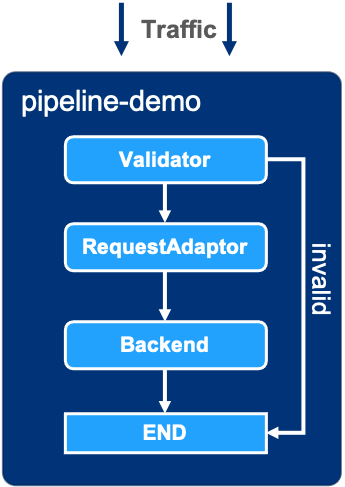

# Easegress

[](https://goreportcard.com/report/github.com/megaease/easegress)
[](https://github.com/megaease/easegress/actions/workflows/test.yml)
[](https://codecov.io/gh/megaease/easegress)
[](https://hub.docker.com/r/megaease/easegress)
[](https://opensource.org/licenses/Apache-2.0)
[](https://github.com/megaease/easegress/blob/main/go.mod)
[](https://join.slack.com/t/openmegaease/shared_invite/zt-upo7v306-lYPHvVwKnvwlqR0Zl2vveA) 

<a href="https://megaease.com/easegress">
    
</a>

- [Easegress](#easegress)
  - [What is Easegress](#what-is-easegress)
  - [Features](#features)
  - [Use Cases](#use-cases)
  - [Getting Started](#getting-started)
    - [Setting up Easegress](#setting-up-easegress)
    - [Create an HTTPServer and Pipeline](#create-an-httpserver-and-pipeline)
    - [Test](#test)
    - [More Filters](#more-filters)
  - [Documentation](#documentation)
  - [Roadmap](#roadmap)
  - [Community](#community)
  - [Contributing](#contributing)
  - [License](#license)

## What is Easegress

`Easegress` is a Cloud Native traffic orchestration system designed for:

- **High Availability:** Built-in Raft consensus & leader election provides 99.99% availability.
- **Traffic Orchestration:** Simple orchestration of various filters for each traffic pipeline.
- **High Performance:** Lightweight and essential features speed up the performance.
- **Observability:** There are many meaningful statistics periodically in a readable way.
- **Extensibility:** It's easy to develop your own filter or controller with high-level programming language.
- **Integration:** The simple interfaces make it easy to integrate with other systems, such as Kubernetes Ingress, [EaseMesh](https://github.com/megaease/easemesh) sidecar, Workflow, etc.

The architecture of Easegress:


## Features

- **Service Management**
  - **Multiple protocols:**
    - HTTP/1.1
    - HTTP/2
    - HTTP/3(QUIC)
    - MQTT
  - **Rich Routing Rules:** exact path, path prefix, regular expression of the path, method, headers.
  - **Resilience&Fault Tolerance**
    - **Circuit break:** temporarily blocks possible failures.
    - **Rate limit:** limits the rate of incoming requests.
    - **Retry:** repeats failed executions.
    - **Time limit:** limits the duration of execution.
  - **Deployment Management**
    - **Blue-green Strategy:** switches traffic at one time.
    - **Canary Strategy:** schedules traffic slightly.
  - **API Management**
    - **API Aggregation:** aggregates results of multiple APIs.
    - **API Orchestration:** orchestrates the flow of APIs.
  - **Security**
    - **IP Filter:** Limits access to IP addresses.
    - **Static HTTPS:** static certificate files.
    - **API Signature:** supports [HMAC](https://en.wikipedia.org/wiki/HMAC) verification.
    - **JWT Verification:** verifies [JWT Token](https://jwt.io/).
    - **OAuth2:** validates [OAuth/2](https://datatracker.ietf.org/doc/html/rfc6749) requests.
    - **Let's Encrypt:** automatically manage certificate files.
  - **Pipeline-Filter Mechanism**
    - **Chain of Responsibility Pattern:** orchestrates filters chain.
    - **Filter Management:** makes it easy to develop new filters.
  - **Service Mesh**
    - **Mesh Master:** is the control plane to manage the lifecycle of mesh services.
    - **Mesh Sidecar:** is the data plane as the endpoint to do traffic interception and routing.
    - **Mesh Ingress Controller:** is the mesh-specific ingress controller to route external traffic to mesh services.
        > Notes: This feature is leveraged by [EaseMesh](https://github.com/megaease/easemesh)
  - **Third-Part Integration**
    - **FaaS** integrates with the serverless platform Knative.
    - **Service Discovery** integrates with Eureka, Consul, Etcd, and Zookeeper.
    - **Ingress Controller** integrates with Kubernetes as an ingress controller.
- **Extensibility**
  - **WebAssembly** executes user developed [WebAssembly](https://webassembly.org/) code.
- **High Performance and Availability**
  - **Adaption**: adapts request, response in the handling chain.
  - **Validation**: headers validation, OAuth2, JWT, and HMAC verification.
  - **Load Balance:** round-robin, random, weighted random, IP hash, header hash.
  - **Cache:** for the backend servers.
  - **Compression:** compresses body for the response.
  - **Hot-Update:** updates both config and binary of Easegress in place without losing connections.
- **Operation**
  - **Easy to Integrate:** command line(`egctl`), MegaEase Portal, HTTP clients such as curl, postman, etc.
  - **Distributed Tracing**
    - Built-in [Open Zipkin](https://zipkin.io/)
    - [Open Tracing](https://opentracing.io/) for vendor-neutral APIs
  - **Observability**
    - **Node:** role(primary, secondary), raft leader status, healthy or not, last heartbeat time, and so on
    - **Traffic:** in multi-dimension: server and backend.
      - **Throughput:** total and error statistics of request count, TPS/m1, m5, m15, and error percent, etc.
      - **Latency:** p25, p50, p75, p95, p98, p99, p999.
      - **Data Size:** request and response size.
      - **Status Codes:** HTTP status codes.
      - **TopN:** sorted by aggregated APIs(only in server dimension).

## Use Cases

The following examples show how to use Easegress for different scenarios.

- [API Aggregation](./doc/cookbook/api-aggregation.md) - Aggregating many APIs into a single API.
- [Cluster Deployment](./doc/cookbook/multi-node-cluster.md) - How to deploy multiple Easegress cluster nodes.
- [Distributed Tracing](./doc/cookbook/distributed-tracing.md) - How to do APM tracing  - Zipkin.
- [FaaS](./doc/cookbook/faas.md) - Supporting Knative FaaS integration
- [Flash Sale](./doc/cookbook/flash-sale.md) - How to do high concurrent promotion sales with Easegress
- [Kubernetes Ingress Controller](./doc/cookbook/k8s-ingress-controller.md) - How to integrate with Kubernetes as ingress controller
- [LoadBalancer](./doc/cookbook/load-balancer.md) - A number of the strategies of load balancing
- [MQTTProxy](./doc/cookbook/mqtt-proxy.md) - An Example to MQTT proxy with Kafka backend.
- [Performance](./doc/cookbook/performance.md) - Performance optimization - compression, caching etc.
- [Pipeline](./doc/cookbook/pipeline.md) - How to orchestrate HTTP filters for requests/responses handling
- [Resilience and Fault Tolerance](./doc/cookbook/resilience.md) - Circuit Break, Rate Limit, Retry, Time Limit, etc. (Porting from [Java resilience4j](https://github.com/resilience4j/resilience4j))
- [Security](./doc/cookbook/security.md) - How to do authentication by Header, JWT, HMAC, OAuth2, etc.
- [Service Proxy](./doc/cookbook/service-proxy.md) - Supporting the Microservice registries - Zookeeper, Eureka, Consul, Nacos, etc.
- [WebAssembly](./doc/cookbook/wasm.md) - Using AssemblyScript to extend the Easegress
- [WebSocket](./doc/cookbook/websocket.md) - WebSocket proxy for Easegress
- [Workflow](./doc/cookbook/workflow.md) - An Example to make a workflow for a number of APIs.


For full list, see [Cookbook](./doc/README.md#1-cookbook--how-to-guide).

## Getting Started

The basic common usage of Easegress is to quickly set up proxy for the backend servers. We split it into multiple simple steps to illustrate the essential concepts and operations.

### Setting up Easegress

We can download the latest or history binaries from the [release page](https://github.com/megaease/easegress/releases). The following shell script will do:

- Download and extract the latest binaries to `./easegress` folder  
- Install the Easegress Systemd service.

```bash
/bin/bash -c "$(curl -fsSL https://raw.githubusercontent.com/megaease/easegress/main/scripts/install.sh)"
```

or if we can install Easegress from source code:

```bash
git clone https://github.com/megaease/easegress && cd easegress
make
```

> **Note**:
>
> - This repo requires Go 1.17+ compiler for the build.
> - If you need the WebAssembly feature, please run `make wasm`.

Then we can add the binary directory to the `PATH` and execute the server:

```bash
$ export PATH=${PATH}:$(pwd)/bin/
$ easegress-server
2021-11-26T16:10:08.419+08:00	INFO	cluster/config.go:172	etcd config: init-cluster:eg-default-name=http://localhost:2380 cluster-state:new force-new-cluster:false
2021-11-26T16:10:09.515+08:00	INFO	cluster/cluster.go:400	client connect with endpoints: [http://localhost:2380]
2021-11-26T16:10:09.516+08:00	INFO	cluster/cluster.go:413	client is ready
2021-11-26T16:10:09.608+08:00	INFO	cluster/cluster.go:692	server is ready
2021-11-26T16:10:09.649+08:00	INFO	cluster/cluster.go:546	lease is ready (grant new one: b6a7d5b4b68ff07)
2021-11-26T16:10:09.649+08:00	INFO	cluster/cluster.go:219	cluster is ready
2021-11-26T16:10:09.669+08:00	INFO	supervisor/supervisor.go:137	create TrafficController
2021-11-26T16:10:09.67+08:00	INFO	supervisor/supervisor.go:137	create RawConfigTrafficController
2021-11-26T16:10:09.67+08:00	INFO	supervisor/supervisor.go:137	create ServiceRegistry
2021-11-26T16:10:09.671+08:00	INFO	supervisor/supervisor.go:137	create StatusSyncController
2021-11-26T16:10:09.671+08:00	INFO	cluster/cluster.go:586	session is ready
2021-11-26T16:10:09.671+08:00	INFO	api/api.go:73	register api group admin
2021-11-26T16:10:09.671+08:00	INFO	api/server.go:78	api server running in localhost:2381
2021-11-26T16:10:14.673+08:00	INFO	cluster/member.go:223	self ID changed from 0 to 689e371e88f78b6a
2021-11-26T16:10:14.674+08:00	INFO	cluster/member.go:157	store clusterMembers: eg-default-name(689e371e88f78b6a)=http://localhost:2380
2021-11-26T16:10:14.674+08:00	INFO	cluster/member.go:158	store knownMembers  : eg-default-name(689e371e88f78b6a)=http://localhost:2380
```

The default target of Makefile is to compile two binary into the directory `bin/`. `bin/easegress-server` is the server-side binary, `bin/egctl` is the client-side binary. We could add it to the `$PATH` for simplifying the following commands.

We could run `easegress-server` without specifying any arguments, which launch itself by opening default ports 2379, 2380, 2381. Of course, we can change them in the config file or command arguments that are explained well in `easegress-server --help`.

```bash
$ egctl member list | grep "cluster-role"
    cluster-role: primary
$ egctl member list | grep "api-addr"
    api-addr: localhost:2381
$ egctl member list | grep "name"
    name: eg-default-name
    cluster-name: eg-cluster-default-name
$ egctl member list | grep "id"
    id: 689e371e88f78b6a
```

After launching successfully, we could check the status of the one-node cluster. It shows the static options and dynamic status of heartbeat and etcd.

### Create an HTTPServer and Pipeline

Now let's create an HTTPServer listening on port 10080 to handle the HTTP traffic.

```bash
$ echo '
kind: HTTPServer
name: server-demo
port: 10080
keepAlive: true
https: false
rules:
  - paths:
    - pathPrefix: /pipeline
      backend: pipeline-demo' | egctl object create
```

The rules of routers above mean that it will lead the traffic with the prefix `/pipeline` to the pipeline `pipeline-demo`, which will be created below. If we `curl` it before created, it will return 503.

```bash
$ echo '
name: pipeline-demo
kind: Pipeline
flow:
  - filter: proxy
filters:
  - name: proxy
    kind: Proxy
    pools:
    - servers:
      - url: http://127.0.0.1:9095
      - url: http://127.0.0.1:9096
      - url: http://127.0.0.1:9097
      loadBalance:
        policy: roundRobin' | egctl object create
```

The pipeline means it will do proxy for 3 backend endpoints in load balance policy `roundRobin`.

### Test

Now you can use some HTTP clients such as `curl` to test the feature:

```bash
curl -v http://127.0.0.1:10080/pipeline
```

If you are not set up some applications to handle the 9095, 9096, and 9097 in the localhost, it will return 503 too. We prepare a simple service to let us test handily, the example shows:

```bash
$ go run example/backend-service/mirror/mirror.go & # Running in background
$ curl http://127.0.0.1:10080/pipeline -d 'Hello, Easegress'
Your Request
===============
Method: POST
URL   : /pipeline
Header: map[Accept:[*/*] Accept-Encoding:[gzip] Content-Type:[application/x-www-form-urlencoded] User-Agent:[curl/7.64.1]]
Body  : Hello, Easegress
```

### More Filters

Now we want to add more features to the pipeline, then we could add kinds of filters to the pipeline. For example, we want validation and request adaptation for the `pipeline-demo`.

<p align="center">
  
</p>

```bash
$ cat pipeline-demo.yaml
name: pipeline-demo
kind: Pipeline
flow:
  - filter: validator
    jumpIf: { invalid: END }
  - filter: requestAdaptor
  - filter: proxy
filters:
  - name: validator
    kind: Validator
    headers:
      Content-Type:
        values:
        - application/json
  - name: requestAdaptor
    kind: RequestAdaptor
    header:
      set:
        X-Adapt-Key: goodplan
  - name: proxy
    kind: Proxy
    pools:
    - servers:
      - url: http://127.0.0.1:9095
      - url: http://127.0.0.1:9096
      - url: http://127.0.0.1:9097
      loadBalance:
        policy: roundRobin

$ egctl object update -f pipeline-demo.yaml
```

After updating the pipeline, the original `curl -v http://127.0.0.1:10080/pipeline` will get 400 because of the validating. So we changed it to satisfy the limitation:

```bash
$ curl http://127.0.0.1:10080/pipeline -H 'Content-Type: application/json' -d '{"message": "Hello, Easegress"}'
Your Request
===============
Method: POST
URL   : /pipeline
Header: map[Accept:[*/*] Accept-Encoding:[gzip] Content-Type:[application/json] User-Agent:[curl/7.64.1] X-Adapt-Key:[goodplan]]
Body  : {"message": "Hello, Easegress"}
```

We can also see Easegress send one more header `X-Adapt-Key: goodplan` to the mirror service.

## Documentation

See [Easegress Documentation](./doc/README.md) for all documents.

## Roadmap

See [Easegress Roadmap](./doc/Roadmap.md) for details.

## Community

- [Join Slack Workspace](https://join.slack.com/t/openmegaease/shared_invite/zt-upo7v306-lYPHvVwKnvwlqR0Zl2vveA) for requirement, issue and development.
- [MegaEase on Twitter](https://twitter.com/megaease)

## Contributing

See [Contributing guide](./CONTRIBUTING.md#contributing).

## License

Easegress is under the Apache 2.0 license. See the [LICENSE](./LICENSE) file for details.
