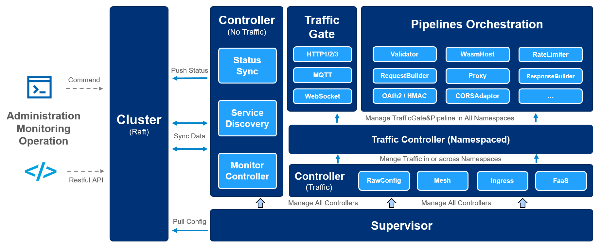

# Easegress   <!-- omit from toc -->

- [Easegress 简介](#easegress-简介)
- [功能](#功能)
- [用户案例](#用户案例)
- [入门](#入门)
- [文档](#文档)
- [社区](#社区)
- [许可证](#许可证)

## Easegress 简介

`Easegress`是一个云原生流量协调系统，具有以下特性：

- **高可用性：** 内置 Raft 共识和选举算法，提供 99.99% 的可用性。
- **流量编排：** 支持多种流量过滤器，轻松编排流量处理流程（Pipeline）。
- **高性能：** 基础功能采用轻量级方法实现，性能优异。
- **可观察性：** 周期性报告多种统计数据，系统状态尽在掌握。
- **可扩展性：** 良好的 API 设计，不必知道底层细节，也能自己开发过滤器和控制器。
- **集成性：** 接口简单，易于与其他系统集成，如: Kubernetes Ingress Controller、[EaseMesh](https://github.com/megaease/easemesh) 边车、工作流等。

下面是其架构图：

## 功能

- **服务管理**
  - **支持多种协议**
    - HTTP/1.1
    - HTTP/2
    - HTTP/3(QUIC)
    - MQTT
  - **路由规则**：精确路径、路径前缀、路径的正则表达式、方法、标头、客户端IP地址。
  - **弹性和容错**。
    - **断路器**： 暂时阻止可能的故障。
    - **速率限制**： 限制请求的速率。
    - **重试**：重试失败的请求。
    - **时间限制**：限制请求的执行时间。
  - **部署管理**
    - **蓝绿部署**：一次性切换流量。
    - **金丝雀部署**：按着色编排流量。
  - **API管理**
    - **API聚合**：聚合多个API的结果。
    - **API编排**：编排API的处理流程。
  - **安全**
    - **IP过滤**：限制对IP地址/地址段的访问。
    - **静态HTTPS**：静态证书文件。
    - **API签名**：支持 [HMAC](https://en.wikipedia.org/wiki/HMAC) 验证。
    - **JWT验证**：验证 [JWT Token](https://jwt.io/)。
    - **OAuth2**：验证 [OAuth/2](https://datatracker.ietf.org/doc/html/rfc6749) 请求。
    - **Let's Encrypt:** 自动管理证书文件。
  - **管道过滤机制**。
    - **过滤器管理**：轻松开发新过滤器。
  - **服务网格**
    - **网格主控**：是管理网格服务生命周期的控制平面。
    - **边车**：是数据平面，作为端点进行流量拦截和路由。
    - **网格入口控制器**：是针对网格的入口控制器，将外部流量路由到网格服务。
        > 注意，[EaseMesh](https://github.com/megaease/easemesh)使用了此功能。
  - **第三方的集成**
    - **FaaS**：与 ServerLess 平台 Knative 集成。
    - **服务发现**：与 Eureka、Consul、Etcd 和 Zookeeper 集成。
    - **入口控制器**：与 Kubernetes 集成，作为入口控制器。
- **扩展性**
  - **WebAssembly**：执行用户开发的 [WebAssembly](https://webassembly.org/) 代码。
- **高性能和可用性**
  - **改编**：使用过滤器改编请求和应答。
  - **验证**：标头验证、OAuth2、JWT 和 HMAC 验证。
  - **负载平衡**：轮询、随机、加权随机、IP哈希、标头哈希，支持会话锁定。
  - **缓存**：缓存后端服务的应答，减少对后端服务的请求量。
  - **压缩**：减少应答数据的体积。
  - **热更新**：线上更新 Easegress 的配置和二进制文件，服务不中断。
- **操作**
  - **易于集成**：命令行([egctl](docs/02.Tutorials/2.1.egctl-Usage.md))、Easegress Portal，以及 HTTP 客户端，如 curl、postman 等。
  - **分布式跟踪**
    - 内置 [OpenTelemetry](https://opentelemetry.io/)，提供厂商中立的 API。
  - **可观察性**
    - **节点**：角色（primary、secondary）、是不是Leader，健康状态、最后一次心跳时间，等等。
    - **多维度的服务器和后端流量数据**
      - **吞吐量**：请求数、TPS/m1、m5、m15 和错误百分比等。
      - **延迟**：p25、p50、p75、p95、p98、p99、p999。
      - **数据大小**：请求和响应大小。
      - **状态代码**：HTTP状态代码。
      - **TopN**：按 API 聚合并排序（仅服务器维度）。

## 用户案例

下面的例子展示了如何在不同场景下使用 Easegress。

- [API 聚合](docs/02.Tutorials/2.3.Pipeline-Explained.md#api-aggregation) - 将多个 API 聚合为一个。
- [Easegress 集群化部署](docs/05.Administration/5.1.Config-and-Cluster-Deployment.md) - Easegress 如何进行集群化多点部署。
- [灰度部署](docs/03.Advanced-Cookbook/3.04.Canary-Release.md) - 如何使用 Easegress 进行灰度部署。
- [分布式调用链](docs/03.Advanced-Cookbook/3.05.Distributed-Tracing.md) - 如何使用 Zipkin 进行 APM 追踪。
- [函数即服务 FaaS](docs/03.Advanced-Cookbook/3.09.FaaS.md) - 支持 Knative FaaS 集成。
- [高并发秒杀](docs/03.Advanced-Cookbook/3.09.FaaS.md) - 如何使用 Easegress 进行高并发的秒杀活动。
- [Kubernetes入口控制器](docs/04.Cloud-Native/4.1.Kubernetes-Ingress-Controller.md) - 如何作为入口控制器与 Kubernetes 集成。
- [负载均衡](docs/02.Tutorials/2.3.Pipeline-Explained.md#load-balancer) - 各种负载均衡策略。
- [MQTT代理](docs/03.Advanced-Cookbook/3.01.MQTT-Proxy.md) - 支持 Kafka 作为后端的 MQTT 代理
- [多 API 编排](docs/03.Advanced-Cookbook/3.03.Multiple-API-Orchestration.md) - 通过多 API 编排实现 Telegram 翻译机器人.
- [高性能](docs/03.Advanced-Cookbook/3.11.Performance.md) - 性能优化，压缩、缓存等。
- [管道编排](docs/02.Tutorials/2.3.Pipeline-Explained.md) - 如何编排 HTTP 过滤器来处理请求和应答。
- [弹力和容错设计](docs/02.Tutorials/2.4.Resilience.md) - 断路器、速率限制、重试、时间限制等（移植自[Java resilience4j](https://github.com/resilience4j/resilience4j)
- [安全](docs/02.Tutorials/2.5.Traffic-Verification.md) - 如何通过标头、JWT、HMAC、OAuth2 等进行认证。
- [服务注册](docs/03.Advanced-Cookbook/3.06.Service-Registry.md) - 使用 Zookeeper、Eureka、Consul、Nacos 等进行服务注册。
- [WebAssembly](docs/03.Advanced-Cookbook/3.07.WasmHost.md) - 使用 AssemblyScript 来扩展 Easegress。
- [WebSocket](docs/02.Tutorials/2.6.Websocket.md) - Easegress 的 WebSocket 代理。
- [工作流](docs/03.Advanced-Cookbook/3.10.Workflow.md) - 将若干 API 进行组合，定制为工作流。

完整的列表请参见 [Tutorials](docs/02.Tutorials/README.md) 和 [Cookbook](docs/03.Advanced-Cookbook/README.md)。

## 入门

- [快速开始](docs/01.Getting-Started/1.1.Quick-Start.md)
- [安装 Easegress](docs/01.Getting-Started/1.2.Install.md)
- [主要概念](docs/01.Getting-Started/1.3.Concepts.md)

## 文档

- [入门](docs/01.Getting-Started/README.md)
- [教程](docs/02.Tutorials/README.md)
- [进阶教程](docs/03.Advanced-Cookbook/README.md)
- [云原生](docs/04.Cloud-Native/README.md)
- [管理](docs/05.Administration/README.md)
- [开发](docs/06.Development-for-Easegress/README.md)
- [参考](docs/07.Reference/README.md)

## 社区

- [加入Slack工作区](https://cloud-native.slack.com/messages/easegress)，提出需求、讨论问题、解决问题。
- [推特上的 MegaEase](https://twitter.com/megaease)

## 许可证

Easegress 采用 Apache 2.0 许可证。详见 [LICENSE](./LICENSE) 文件。
