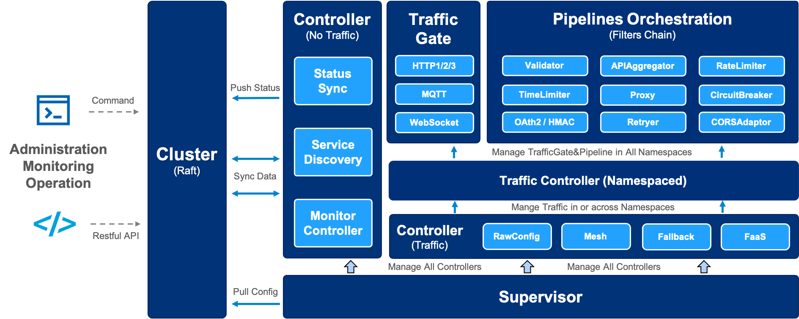
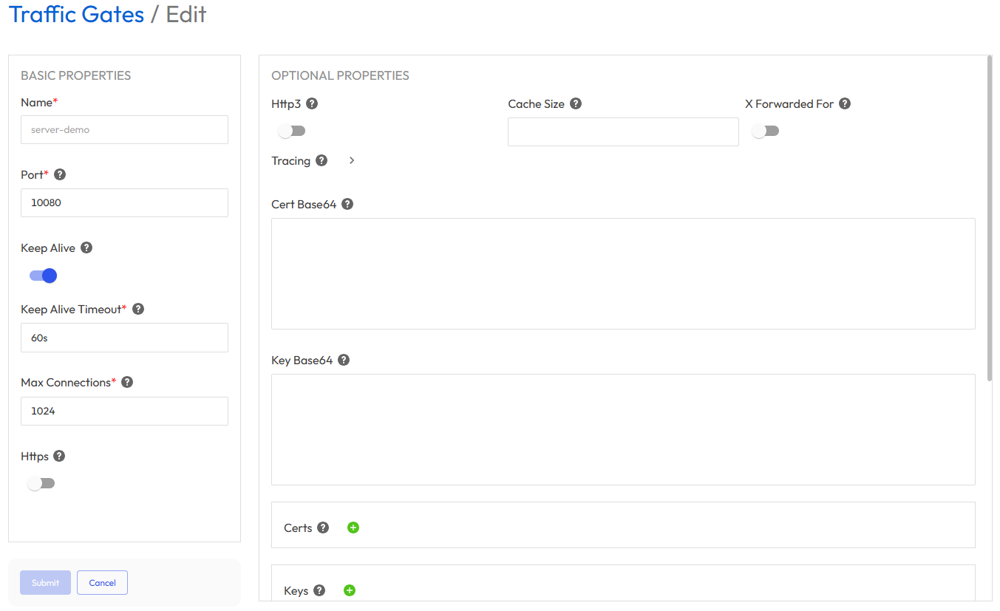
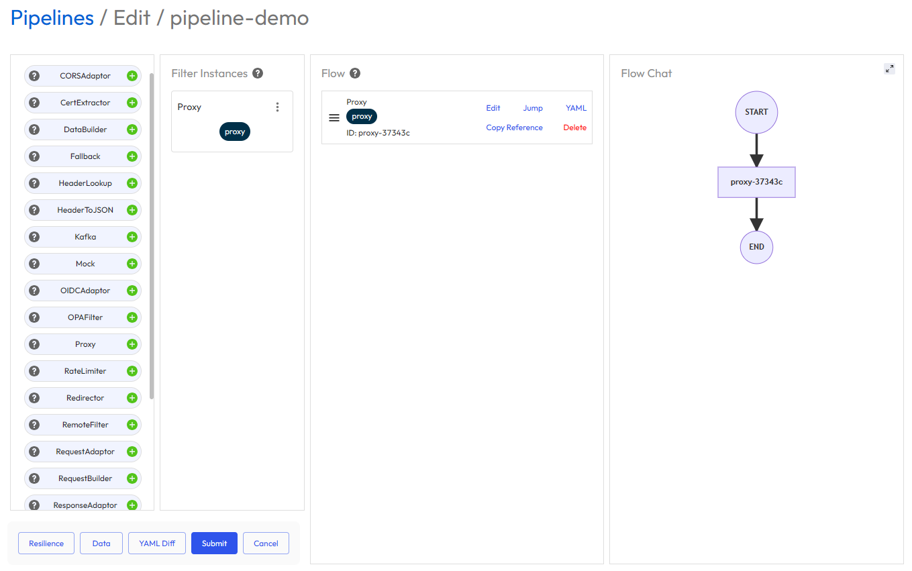
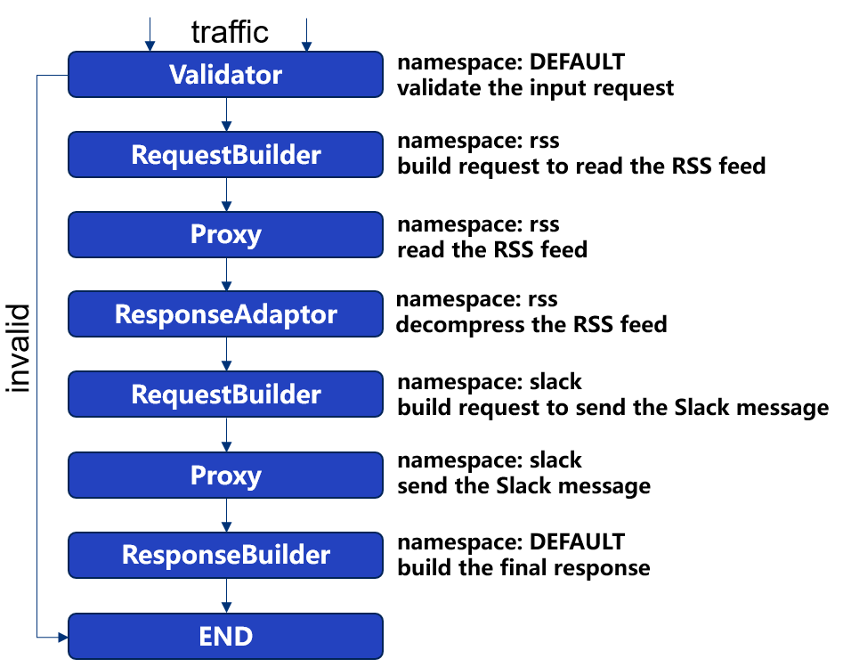

# Easegress

[](https://goreportcard.com/report/github.com/megaease/easegress)
[](https://github.com/megaease/easegress/actions/workflows/test.yml)
[](https://codecov.io/gh/megaease/easegress)
[](https://hub.docker.com/r/megaease/easegress)
[](https://opensource.org/licenses/Apache-2.0)
[](https://github.com/megaease/easegress/blob/main/go.mod)
[](https://join.slack.com/t/openmegaease/shared_invite/zt-upo7v306-lYPHvVwKnvwlqR0Zl2vveA)

<a href="https://megaease.com/easegress">
    
</a>

- [Easegress](#easegress)
  - [Easegress 简介](#easegress-简介)
  - [功能](#功能)
  - [用户案例](#用户案例)
  - [入门](#入门)
    - [安装 Easegress](#安装-easegress)
    - [创建 HTTPServer 和 Pipeline](#创建-httpserver-和-pipeline)
    - [测试](#测试)
    - [添加一条新的 Pipeline](#添加一条新的-pipeline)
    - [更新 HTTPServer](#更新-httpserver)
    - [测试 RSS Pipeline](#测试-rss-pipeline)
  - [文档](#文档)
  - [路线图](#路线图)
  - [社区](#社区)
  - [许可证](#许可证)

## Easegress 简介

`Easegress`是一个云原生流量协调系统，具有以下特性：

- **高可用性：** 内置 Raft 共识和选举算法，提供 99.99% 的可用性。
- **流量编排：** 支持多种流量过滤器，轻松编排流量处理流程（Pipeline）。
- **高性能：** 基础功能采用轻量级方法实现，性能优异。
- **可观察性：** 周期性报告多种统计数据，系统状态尽在掌握。
- **可扩展性：** 良好的 API 设计，不必知道底层细节，也能自己开发过滤器和控制器。
- **集成性：** 接口简单，易于与其他系统集成，如: Kubernetes Ingress Controller、[EaseMesh](https://github.com/megaease/easemesh) 边车、工作流等。

下面是其架构图：



## 功能

- **服务管理**
  - **支持多种协议**
    - HTTP/1.1
    - HTTP/2
    - HTTP/3(QUIC)
    - MQTT
  - **路由规则**：精确路径、路径前缀、路径的正则表达式、方法、标头、客户端IP地址。
  - **弹性和容错**。
    - **断路器**： 暂时阻止可能的故障。
    - **速率限制**： 限制请求的速率。
    - **重试**：重试失败的请求。
    - **时间限制**：限制请求的执行时间。
  - **部署管理**
    - **蓝绿部署**：一次性切换流量。
    - **金丝雀部署**：按着色编排流量。
  - **API管理**
    - **API聚合**：聚合多个API的结果。
    - **API编排**：编排API的处理流程。
  - **安全**
    - **IP过滤**：限制对IP地址/地址段的访问。
    - **静态HTTPS**：静态证书文件。
    - **API签名**：支持 [HMAC](https://en.wikipedia.org/wiki/HMAC) 验证。
    - **JWT验证**：验证 [JWT Token](https://jwt.io/)。
    - **OAuth2**：验证 [OAuth/2](https://datatracker.ietf.org/doc/html/rfc6749) 请求。
    - **Let's Encrypt:** 自动管理证书文件。
  - **管道过滤机制**。
    - **过滤器管理**：轻松开发新过滤器。
  - **服务网格**
    - **网格主控**：是管理网格服务生命周期的控制平面。
    - **边车**：是数据平面，作为端点进行流量拦截和路由。
    - **网格入口控制器**：是针对网格的入口控制器，将外部流量路由到网格服务。
        > 注意，[EaseMesh](https://github.com/megaease/easemesh)使用了此功能。
  - **第三方的集成**
    - **FaaS**：与 ServerLess 平台 Knative 集成。
    - **服务发现**：与 Eureka、Consul、Etcd 和 Zookeeper 集成。
    - **入口控制器**：与 Kubernetes 集成，作为入口控制器。
- **扩展性**
  - **WebAssembly**：执行用户开发的 [WebAssembly](https://webassembly.org/) 代码。
- **高性能和可用性**
  - **改编**：使用过滤器改编请求和应答。
  - **验证**：标头验证、OAuth2、JWT 和 HMAC 验证。
  - **负载平衡**：轮询、随机、加权随机、IP哈希、标头哈希，支持会话锁定。
  - **缓存**：缓存后端服务的应答，减少对后端服务的请求量。
  - **压缩**：减少应答数据的体积。
  - **热更新**：线上更新 Easegress 的配置和二进制文件，服务不中断。
- **操作**
  - **易于集成**：命令行([egctl](./doc/egctl-cheat-sheet.md))、MegaEase Portal，以及 HTTP 客户端，如 curl、postman 等。
  - **分布式跟踪**
    - 内置 [OpenTelemetry](https://opentelemetry.io/)，提供厂商中立的 API。
  - **可观察性**
    - **节点**：角色（primary、secondary）、是不是Leader，健康状态、最后一次心跳时间，等等。
    - **多维度的服务器和后端流量数据**
      - **吞吐量**：请求数、TPS/m1、m5、m15 和错误百分比等。
      - **延迟**：p25、p50、p75、p95、p98、p99、p999。
      - **数据大小**：请求和响应大小。
      - **状态代码**：HTTP状态代码。
      - **TopN**：按 API 聚合并排序（仅服务器维度）。

## 用户案例

下面的例子展示了如何在不同场景下使用 Easegress。

- [API 聚合](./doc/cookbook/api-aggregation.md) - 将多个 API 聚合为一个。
- [Easegress 集群化部署](./doc/cookbook/multi-node-cluster.md) - Easegress 如何进行集群化多点部署。
- [灰度部署](./doc/cookbook/canary-release.md) - 如何使用 Easegress 进行灰度部署。
- [分布式调用链](./doc/cookbook/distributed-tracing.md) - 如何使用 Zipkin 进行 APM 追踪。
- [函数即服务 FaaS](./doc/cookbook/faas.md) - 支持 Knative FaaS 集成。
- [高并发秒杀](./doc/cookbook/flash-sale.md) - 如何使用 Easegress 进行高并发的秒杀活动。
- [Kubernetes入口控制器](./doc/cookbook/k8s-ingress-controller.md) - 如何作为入口控制器与 Kubernetes 集成。
- [负载均衡](./doc/cookbook/load-balancer.md) - 各种负载均衡策略。
- [MQTT代理](./doc/cookbook/mqtt-proxy.md) - 支持 Kafka 作为后端的 MQTT 代理
- [多 API 编排](./doc/cookbook/translation-bot.md) - 通过多 API 编排实现 Telegram 翻译机器人.
- [高性能](./doc/cookbook/performance.md) - 性能优化，压缩、缓存等。
- [管道编排](./doc/cookbook/pipeline.md) - 如何编排 HTTP 过滤器来处理请求和应答。
- [弹力和容错设计](./doc/cookbook/resilience.md) - 断路器、速率限制、重试、时间限制等（移植自[Java resilience4j](https://github.com/resilience4j/resilience4j)
- [安全](./doc/cookbook/security.md) - 如何通过标头、JWT、HMAC、OAuth2 等进行认证。
- [服务网关](./doc/cookbook/service-proxy.md) - 使用 Zookeeper、Eureka、Consul、Nacos 等进行服务注册。
- [WebAssembly](./doc/cookbook/wasm.md) - 使用 AssemblyScript 来扩展 Easegress。
- [WebSocket](./doc/cookbook/websocket.md) - Easegress 的 WebSocket 代理。
- [工作流](./doc/cookbook/workflow.md) - 将若干 API 进行组合，定制为工作流。


完整的列表请参见 [Cookbook](./doc/README.md#1-cookbook--how-to-guide)。

## 入门

Easegress 的基本用法是做为后端服务器的代理。本节，我们会先从最简单的反向代理开始，然后逐步添加组件来实现复杂的 API 编排，并同步介绍相关基本概念和操作方法。

### 安装 Easegress

我们可以从[发布页](https://github.com/megaease/easegress/releases)下载 Easegress 的最新或历史版本。下面的 Shell 命令会做如下的事：

- 下载并解压最新版的 Easegress 到 `./easegress` 目录下
- 安装 Systemd 服务，并启动 easegress

```bash
/bin/bash -c "$(curl -fsSL https://raw.githubusercontent.com/megaease/easegress/main/scripts/install.sh)"
```

或者，也可以通过源码安装：

```bash
git clone https://github.com/megaease/easegress && cd easegress
make
```

> **注意事项**：
>
> - 我们需要 Go 1.19 以上版本的编译器
> - 如果需要支持 WebAssembly 的版本，你需要运行 `make wasm`

然后把二进制所在目录添加到 `PATH` 中，并启动服务：

```bash
$ export PATH=${PATH}:$(pwd)/bin/
$ easegress-server
2022-07-04T13:47:36.579+08:00   INFO    cluster/config.go:106   etcd config: advertise-client-urls: [{Scheme:http Opaque: User: Host:localhost:2379 Path: RawPath: ForceQuery:false RawQuery: Fragment: RawFragment:}] advertise-peer-urls: [{Scheme:http Opaque: User: Host:localhost:2380 Path: RawPath: ForceQuery:false RawQuery: Fragment: RawFragment:}] init-cluster: eg-default-name=http://localhost:2380 cluster-state: new force-new-cluster: false
2022-07-04T13:47:37.516+08:00   INFO    cluster/cluster.go:332  client connect with endpoints: [http://localhost:2380]
2022-07-04T13:47:37.521+08:00   INFO    cluster/cluster.go:346  client is ready
2022-07-04T13:47:37.529+08:00   INFO    cluster/cluster.go:638  server is ready
2022-07-04T13:47:37.534+08:00   INFO    cluster/cluster.go:498  lease is ready (grant new one: b6a81c7bffb1a07)
2022-07-04T13:47:37.534+08:00   INFO    cluster/cluster.go:218  cluster is ready
2022-07-04T13:47:37.541+08:00   INFO    supervisor/supervisor.go:137    create TrafficController
2022-07-04T13:47:37.542+08:00   INFO    supervisor/supervisor.go:137    create RawConfigTrafficController
2022-07-04T13:47:37.544+08:00   INFO    supervisor/supervisor.go:137    create ServiceRegistry
2022-07-04T13:47:37.544+08:00   INFO    supervisor/supervisor.go:137    create StatusSyncController
2022-07-04T13:47:37.544+08:00   INFO    statussynccontroller/statussynccontroller.go:139        StatusUpdateMaxBatchSize is 20
2022-07-04T13:47:37.544+08:00   INFO    cluster/cluster.go:538  session is ready
2022-07-04T13:47:37.545+08:00   INFO    api/api.go:73   register api group admin
2022-07-04T13:47:37.545+08:00   INFO    api/server.go:86        api server running in localhost:2381
```

Makefile 默认会将两个二进制文件编译到 `bin/` 目录中。`bin/easegress-server` 是服务器端的二进制文件，`bin/egctl` 是客户端的二进制文件。我们可以把它添加到 `$PATH` 中，以便于执行后续命令。

如果启动时不指定任何参数，`easegress-server` 会默认使用端口 2379、2380 和 2381。我们可以在配置文件中更改默认端口，或者在命令行启动时指定相关参数（参数具体释义可通过执行 `easegress-server --help` 命令获取）。

```bash
$ egctl get member
NAME                    ROLE            AGE     STATE   API-ADDR        HEARTBEAT
eg-default-name         primary         9s      Leader  localhost:2381  3s ago

$ egctl describe member
Name: eg-default-name
LastHeartbeatTime: "2023-07-03T17:39:30+08:00"

Etcd:
=====
  id: 689e371e88f78b6a
  startTime: "2023-07-03T17:39:14+08:00"
  state: Leader
...
```

成功启动后，我们可以用上述命令检查单节点集群的状态，它展示示了系统的静态选项，以及心跳和 etcd 的动态状态。

### 创建 HTTPServer 和 Pipeline

现在我们可以创建一个监听 10080 端口的 HTTPServer 来接收 HTTP 流量。

```bash
$ echo '
kind: HTTPServer
name: server-demo
port: 10080
keepAlive: true
https: false
rules:
  - paths:
    - pathPrefix: /pipeline
      backend: pipeline-demo' | egctl create -f -
```

上面的路由规则将把路径前缀为 `/pipeline` 的请求分发到名为 `pipeline-demo` 的 Pipeline，目前还没有这条 Pipeline，如果 `curl` 这个地址，将返回 503。

```bash
$ echo '
name: pipeline-demo
kind: Pipeline
flow:
  - filter: proxy
filters:
  - name: proxy
    kind: Proxy
    pools:
    - servers:
      - url: http://127.0.0.1:9095
      - url: http://127.0.0.1:9096
      - url: http://127.0.0.1:9097
      loadBalance:
        policy: roundRobin' | egctl create -f -
```

这条 Pipeline 的定义是将请求按轮询的方式分发到三个后端服务实例上。

此外，我们也提供一个 [仪表盘](https://cloud.megaease.cn) 来简化上述步骤。 您可以
通过这个工具创建和管理 HTTPServer、Pipeline 以及其他 Easegress 配置。




### 测试

现在可以使用一个 HTTP 客户端，如 `curl` 进行测试：

```bash
curl -v http://127.0.0.1:10080/pipeline
```

在没有后端程序处理本机端口 9095、9096 和 9097 的流量时，它也会返回503。为便于测试，我们提供了一个简单的服务程序，使用方法如下：

```bash
$ go run example/backend-service/mirror/mirror.go & # Running in background
$ curl http://127.0.0.1:10080/pipeline -d 'Hello, Easegress'
Your Request
===============
Method: POST
URL   : /pipeline
Header: map[Accept:[*/*] Accept-Encoding:[gzip] Content-Type:[application/x-www-form-urlencoded] User-Agent:[curl/7.64.1]]
Body  : Hello, Easegress
```

### 添加一条新的 Pipeline

现在我们添加一条新的 Pipeline，它会从请求中提取出一个 RSS feed 的地址，并将其中的文章列表组织成一条 Slack 消息发送到 Slack。在执行下面的命令之前，请务必按照[这个文档](https://api.slack.com/messaging/webhooks)创建你自己的 Slack WebHook URL，并用它替换掉下面命令中的那个。

<p align="center">
  
</p>

```bash
$ echo '
name: rss-pipeline
kind: Pipeline

flow:
- filter: validator
- filter: buildRssRequest
  namespace: rss
- filter: sendRssRequest
  namespace: rss
- filter: decompressResponse
  namespace: rss
- filter: buildSlackRequest
  namespace: slack
- filter: sendSlackRequest
  namespace: slack
- filter: buildResponse

filters:
- name: validator
  kind: Validator
  headers:
    "X-Rss-Url":
       regexp: ^https?://.+$

- name: buildRssRequest
  kind: RequestBuilder
  template: |
    url: /developers/feed2json/convert?url={{index (index .requests.DEFAULT.Header "X-Rss-Url") 0 | urlquery}}

- name: sendRssRequest
  kind: Proxy
  pools:
  - loadBalance:
      policy: roundRobin
    servers:
    - url: https://www.toptal.com
  compression:
    minLength: 4096

- name: buildSlackRequest
  kind: RequestBuilder
  template: |
    method: POST
    url: /services/T0XXXXXXXXX/B0YYYYYYY/ZZZZZZZZZZZZZZZZZZZZ   # 替换此 URL
    body: |
      {
         "text": "Recent posts - {{.responses.rss.JSONBody.title}}",
         "blocks": [{
            "type": "section",
            "text": {
              "type": "plain_text",
              "text": "Recent posts - {{.responses.rss.JSONBody.title}}"
            }
         }, {
            "type": "section",
            "text": {
              "type": "mrkdwn",
              "text": "{{range $index, $item := .responses.rss.JSONBody.items}}• <{{$item.url}}|{{$item.title}}>\n{{end}}"
         }}]
      }

- name: sendSlackRequest
  kind: Proxy
  pools:
  - loadBalance:
      policy: roundRobin
    servers:
    - url: https://hooks.slack.com
  compression:
    minLength: 4096

- name: decompressResponse
  kind: ResponseAdaptor
  decompress: gzip

- name: buildResponse
  kind: ResponseBuilder
  template: |
    statusCode: 200
    body: RSS feed has been sent to Slack successfully.' | egctl create -f -
```

### 更新 HTTPServer

更新 HTTPServer 让它将前缀 `/rss` 的请求转发到新创建的 pipeline。

```bash
$ echo '
kind: HTTPServer
name: server-demo
port: 10080
keepAlive: true
https: false
rules:
  - paths:
    - pathPrefix: /rss          # +
      backend: rss-pipeline     # +
    - pathPrefix: /pipeline
      backend: pipeline-demo' | egctl apply -f -
```

### 测试 RSS Pipeline

执行下面的命令，你的 Slack 会收到 RSS feed 中的文章列表。

```bash
$ curl -H X-Rss-Url:https://hnrss.org/newest?count=5 http://127.0.0.1:8080/rss
```

请注意，Slack 允许的最大消息长度大约是 3K, 所以，需要限制某些网站（例如 Hack News）的 RSS feed 返回的文章数量。

## 文档

更多更详细的文档请移步 [Easegress 文档列表](./doc/README.md) 。

## 路线图

请参考 [Easegress 路线图](./doc/Roadmap.md) 来了解详情。

## 社区

- [加入Slack工作区](https://join.slack.com/t/openmegaease/shared_invite/zt-upo7v306-lYPHvVwKnvwlqR0Zl2vveA)，提出需求、讨论问题、解决问题。
- [推特上的 MegaEase](https://twitter.com/megaease)

## 许可证

Easegress 采用 Apache 2.0 许可证。详见 [LICENSE](./LICENSE) 文件。
