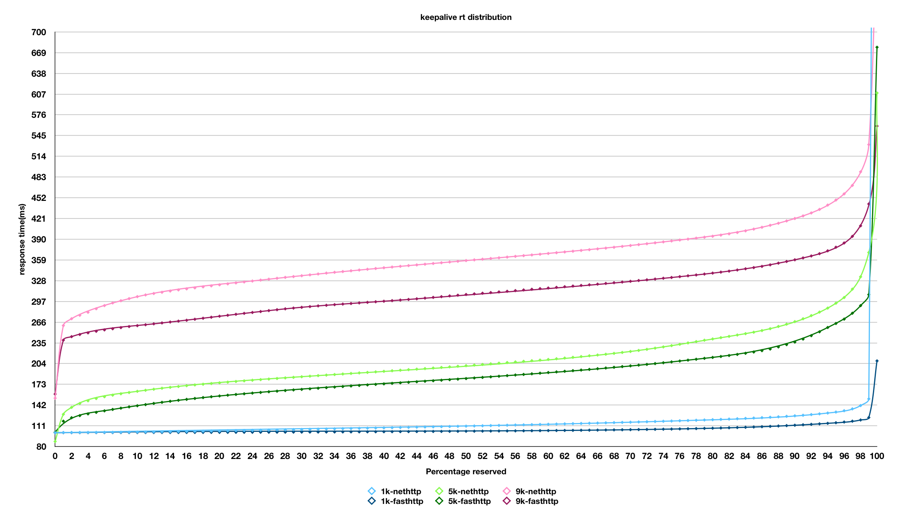
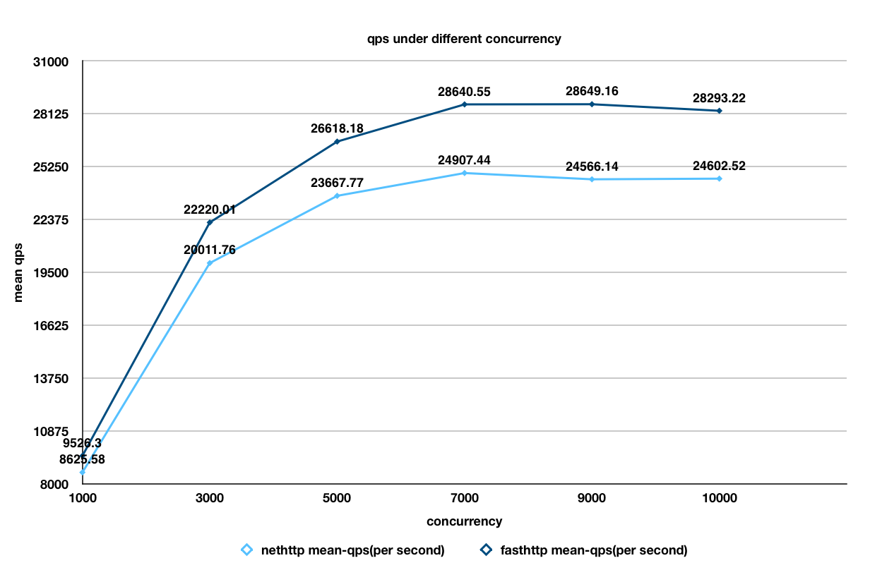
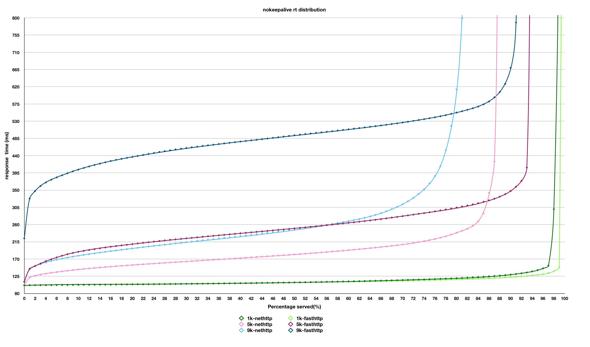
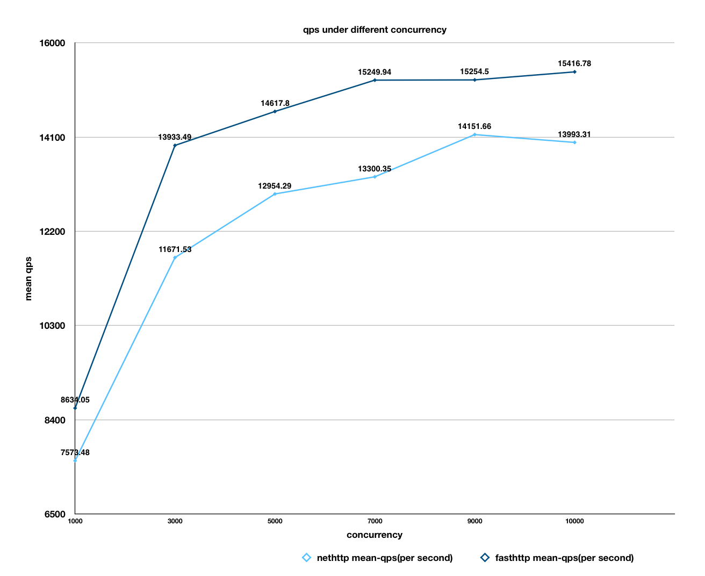
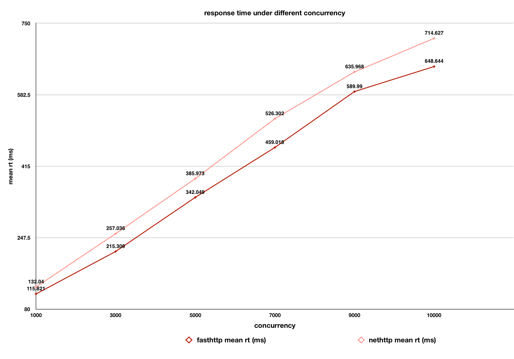
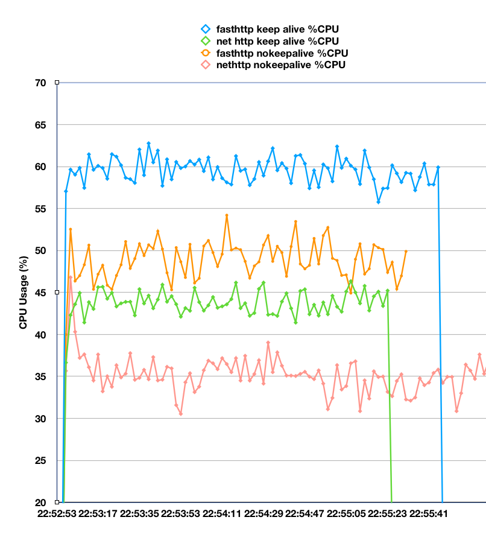
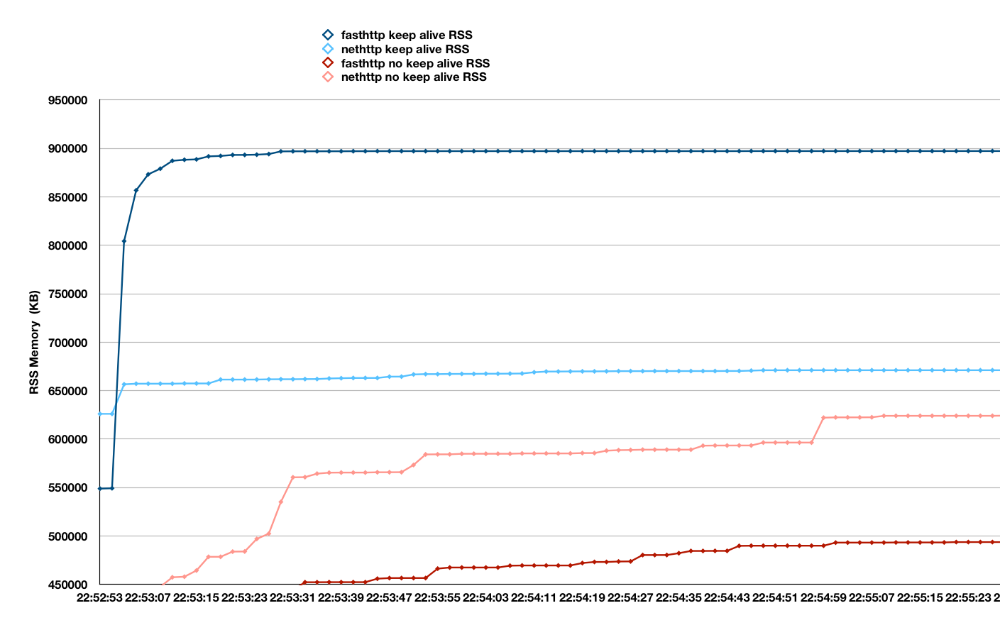
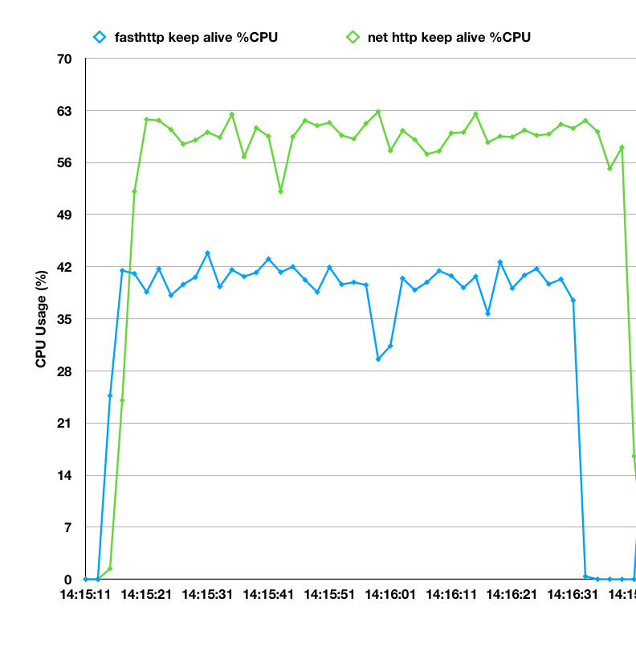
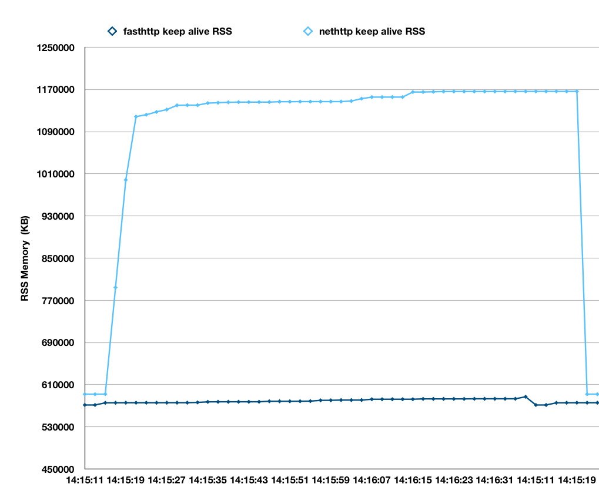

This document shows the benchmark result when EG(easegateway) leverages different HTTP implementations([net/http](https://golang.org/pkg/net/http/) or [fasthttp](https://github.com/erikdubbelboer/fasthttp)) in proxy mode.

## Environment
### EG hardware
32 core cpu, 64G memory

### Backend hardware
2 core 8G memory

### EG Configuration
The pipeline assembled a simple http proxy.

pipelines:

```json
{
    "pipelines": [
        {
            "type": "LinearPipeline",
            "config": {
                "pipeline_name": "test",
                "plugin_names": [
                    "httpserver",
                    "httpinput",
                    "httpoutput"
                ],
                "parallelism": 0,
                "cross_pipeline_request_backlog": 0
            }
        }
    ]
}
```

httpserver and coordinate httpoutput plugin both have the same `http_impl` option configured.

## Performance Result
### Summary

nethttp implementation

|  | KeepAlive  | Non-KeepAlive |
|:--|:--|:--:|
| Resource Constrained | [So So](#1-keepalive-request) | [Good](#2-no-keepalive-request) |
| Resource Unconstrained | [So So](#1-keepalive-request) | [Good](#2-no-keepalive-request) |

fasthttp implementation

|  | KeepAlive  | Non-KeepAlive |
|:--|:--|:--:|
| Resource Constrained | [Good](#1-keepalive-request) | [Bad](#2-no-keepalive-request)|
| Resource Unconstrained | [Good](#1-keepalive-request) | [So So](#2-no-keepalive-request) |

Notes on using fasthttp version:
 
1. fasthttp server does't support HTTP2
2. fasthttp server does't support `CloseNotifier`, so EG doesn't known client is gone until it try to write response data.
3. Using nokeepalive requests, fasthttp version's rt in distribution is higher than nethttp version, but rt's standard variance is lower. see [connection-time comparisons](#-connection-time)


We benchmarked EG under different concurrency(`-c` option in ab).
### 1. Keepalive request
Using keepalive request (`-k` option in ab), so the client in EG's httpoutput plugin will also use keepalive in request.

#### Response time distribution
The response time distribution plot is show as below:

According to the above plot, we can see  response time of EG's fasthttp version is effectively better than nethttp version especially in higher concurrency.

#### Mean qps and rt
The mean response time and mean query per seond plot is show as below:




According to the above plots, we can conclude that mean qps of fasthttp version is 11%~15% higher than nethttp version,
mean response time of fasthttp version is 10%~13% lower than nethttp version.


### 2. No keepalive request
Using non-keepalive request, so the client in EG's httpoutput plugin will also use non-keepalive request.

#### Response time distribution
The response time distribution graph is show as below:


The above plot is very interesting, we can see nethttp version performs better rt for example under 84% in 3k concurrency, but fasthttp version performs better rt after 84%.

#### Mean qps and rt
The mean response time and mean query per seond plot is show as below:





Although nethttp performs better rt distribution in some part, but according to above plots, we can conclude that mean qps of fasthttp version is 10%~15% higher than nethttp version, mean response time of fasthttp version is 10%~13% lower than nethttp version. 

To see more details, let's check the `connection Times(ms)` comparision under 5k concurrency.

##### Connection time

fasthttp version:

||min |  mean | mean +/-sd | median  | max |
|:--|:--|:--|:--|:--|:--|
|Connect: | 0 |  114 | 355.6    | 36 |   7088 |
|Processing: | 101 | 214 | 52.1  |  207  |  1005 |
|Waiting:   | 101 | 199 | 47.5  |  192    | 981 |
|Total:    |  110 | 328 |  360.0 |   250   | 7330 |

nethttp version

||min |  mean | mean +/-sd | median  | max |
|:--|:--|:--|:--|:--|:--|
|Connect:    |    0 | 207 | 664.8 | 17 | 7071|
|Processing: | 101 | 172 | 76.2 | 160 | 3337|
|Waiting:   |   99 | 165 | 74.6 | 153  | 3333|
|Total:     | 102 | 379 | 673.9 | 182 | 7301|

So we can conclude that although fasthttp version's rt in distribution is higher than nethttp version, but rt's standard variance is lower.


## Resource usage
### Same concurrency
Under 5k concurrency, cpu usage plot(contains keepalive or nokeepalive) is as below:



We can see that fasthttp version consumes more cpu both in keepalive or nonkeepalive conditions, so it works hard and cpu consumption is higher.

Under 5k concurrency, memory usage(contains keepalive or nokeepalive) is as below:



Under keepalive conditions, we can see that fasthttp version consumes more memory , but it consumes less memory than nethttp version under nonkeepalive conditions.

### Same qps
We tested the resource usage when nethttp and fasthttp version achieves almost the same mean qps of 22643 {fasthttp version is using 4300 concurrency, nethttp version is using 5000 concurrency} under keepalive requests.


We can see from the above plot that fasthttp saves cpu usage better than nethttp, about 40% lower.


We can see from the above plot that fasthttp also saves cpu usage better than nethttp.
