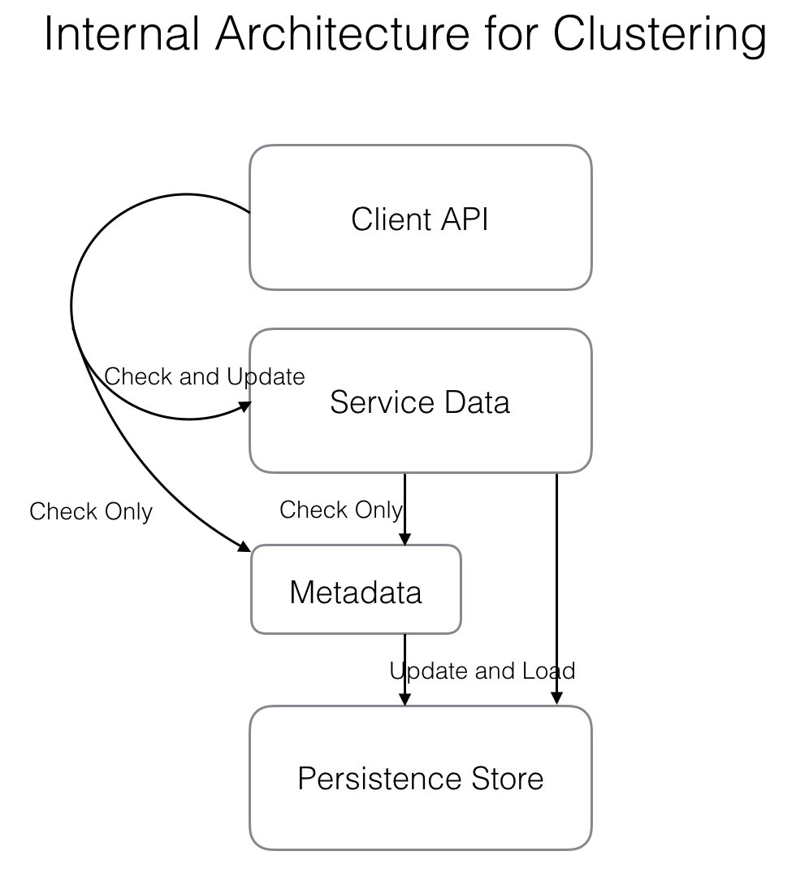

# Clustering Design of Ease Gateway(Beta Version)

## Background
In milestone 2, we wanna deploy Ease Gateway carrying with large scale use cases such as flash sale. So it's necessary to solve following clustering problems.
Here we put a regular issue we have now: In the scenario of flash sale, since there are different amounts of online users at every area waiting to rush to buy something, we must give different percents of pass for the crowd **at corresponding area**. It's hard to manually administrate so many instances carrying with different configure, thus we must design a general architecture for Ease Gateway to automate this kind of problems.

## Design
For consistency with jargons in most distributed system, we call instance of Ease Gateway **node**.
First of all, we would like to draw up important goals of our cluster to guide our next design path.
1. high availability
2. deploy in WAN
3. differentiate nodes carrying diverse tasks (aka. collect nodes carrying the same task together)

Fix 1: According to CAP theory, we have to make a compromise to decline one feature, it's nature to choose to decline Consistency with our requirements, so Ease Gateway is an AP type system. And for high availability, so it's necessary to decentralize because we can't bear with the whole system is unavailable owing to central nodes down. So P2P is our main architecture like Cassandra.

Fix 2: Because unstable network status of WAN, it's hard to get strong consistency or lets system hang out a long time which violate the goal high availability. So we compromise to choose eventual consistency so common and mature protocol **Gossip** is our choice to synchronize information of cluster. By the way, in the 3 models of Gossip push, pull, push/pull we choose push/pull whose convergence rate is fastest.

Fix 3: We bring a plain **logical** concept: **group**, which is one kind of metadata of cluster and separate diverse kinds of nodes carrying different tasks. From user's perspective, the action of each node in the same group must be the same.

### Synchronized Content
Every node stores some data which specifies its environment, responsibility and so on. There are two layers of data: metadata and service data. Metadata is foundation for service data, the former provides necessary information for the latter.



#### Metadata
1. IP, port, status of every node of the cluster
2. group information

The metadata is read-only from perspective of administrator after deployment in theory. For simplicity, every node belongs to one and only one group. Therefore metadata can be maintained by Ease Gateway automatically.

Here is an example to illustrate how Ease Gateway maintain metadata automatically(< for add, << for update).

1. Initially the info is:
```
real info:
	Group-BJ: Node-1

info in Node-1:
	key       value             timestamp
	Group-BJ  Node-1            1000
	Node-1    56.56.56.1:10443  1000 (for clarity we omit IP, port of a node in succeeding steps)
```
2. Adds a new node `Node-2` to `Group-CQ` with current information by administrator:
```
real info:
	Group-BJ: Node-1
	Group-CQ: Node-2    <

info in Node-1:
	key       value             timestamp
	Group-BJ  Node-1            1000

info in Node-2:    <
	key       value             timestamp
	Group-BJ  Node-1            1000
	Group-CQ  Node-2            1002
```

3. `Node-2` pushes/pulls any one of all alive nodes which currently is only `Node-1` in its local info, then `Node-1` updates its local information:
```
real info:
	Group-BJ: Node-1
	Group-CQ: Node-2

info in Node-1:
	key       value             timestamp
	Group-BJ  Node-1            1000
	Group-CQ  Node-2            1002    <

info in Node-2:
	key       value             timestamp
	Group-BJ  Node-1            1000
	Group-CQ  Node-2            1002
```

4. Adds a new node `Node-3` to `Group-BJ`:
```
real info:
	Group-BJ: Node-1, Node-3    <<
	Group-CQ: Node-2

info in Node-1:
	key       value             timestamp
	Group-BJ  Node-1            1000
	Group-CQ  Node-2            1002

info in Node-2:
	key       value             timestamp
	Group-BJ  Node-1            1000
	Group-CQ  Node-2            1002

info in Node-3:    <
	key       value             timestamp
	Group-BJ  Node-1, Node-3    1006
	Group-CQ  Node-2            1002
```

5. `Node-3` pushes/pulls any one of all alive nodes, let's suppose `Node-1`:
```
real info:
	Group-BJ: Node-1, Node-3
	Group-CQ: Node-2

info in Node-1:
	key       value             timestamp
	Group-BJ  Node-1, Node-3    1006    <<
	Group-CQ  Node-2            1002

info in Node-2:
	key       value             timestamp
	Group-BJ  Node-1            1000
	Group-CQ  Node-2            1002

info in Node-3:
	key       value             timestamp
	Group-BJ  Node-1, Node-3    1006
	Group-CQ  Node-2            1002
```

6. Supposes`Node-1` goes down, and `Node-2` found its death firstly:
```
real info:
	Group-BJ: Node-3
	Group-CQ: Node-2

info in Node-2:
	key       value             timestamp
	Group-CQ  Node-2            1002

info in Node-3:
	key       value             timestamp
	Group-BJ  Node-1, Node-3    1006
	Group-CQ  Node-2            1002
```

7. `Node-3` pushes/pulls any one of all alive nodes(it hasn't found death of `Node-1` yet), let's suppose `Node-2`:
```
real info:
	Group-BJ: Node-3
	Group-CQ: Node-2

info in Node-2:
	key       value             timestamp
	Group-CQ  Node-2            1002
	Group-BJ  Node-1, Node-3    1006    <

info in Node-3:
	key       value             timestamp
	Group-BJ  Node-1, Node-3    1006
	Group-CQ  Node-2            1002
```
You can see the `Node-3` spread wrong info which is `Node-2` is still alive temporarily. But the `Node-2` and `Node-3` will also find death of `Node-2` finally. Moreover in here we could use quick check for down-node to dodge fake news: )

#### Service Data
1. pipeline configure
2. plugin configure
3. user-defined data such as all ports of nodes(which is a kind of aggregate-metadata)

The service data can be grouped or ungrouped. And the ungrouped data belongs to every node, but grouped data belongs to corresponding grouped nodes. The administrator can update service data manually, or in the scene of flash sale the flash-sale-master could use cluster API to update percents of pass in corresponding nodes dynamically.

Here is a example to illustrate how Ease Gateway synchronizes service data automatically(< for add, << for update).
```
constant group information here:
	Group-BJ: Node-1, Node-2
	Group-CQ: Node-3
```
1. Initially the info is:
```
info in Node-1:
	key         value                  timestamp
	Pipeline-A  {"group": "Group-BJ"}  1000

info in Node-2:
	key         value                  timestamp
	Pipeline-A  {"group": "Group-BJ"}  1000

info in Node-3:
	key         value                  timestamp
	Pipeline-B  {"group": "Group-CQ"}  1000
```

2. Adds a new grouped pipeline `Pipeline-C` to `Group-BJ`, and `Node-3` received firstly:
```
info in Node-1:
	key         value                  timestamp
	Pipeline-A  {"group": "Group-BJ"}  1000

info in Node-2:
	key         value                  timestamp
	Pipeline-A  {"group": "Group-BJ"}  1000

info in Node-3:
	key         value                  timestamp
	Pipeline-B  {"group": "Group-CQ"}  1000
	Pipeline-C  {"group": "Group-BJ"}  1002    <
```

3. `Node-3` issues `Pipeline-C` to any one alive nodes of `Group-BJ`, let's suppose `Node-2`:
```
info in Node-1:
	key         value                  timestamp
	Pipeline-A  {"group": "Group-BJ"}  1000

info in Node-2:
	key         value                  timestamp
	Pipeline-A  {"group": "Group-BJ"}  1000
	Pipeline-C  {"group": "Group-BJ"}  1002    <

info in Node-3:
	key         value                  timestamp
	Pipeline-B  {"group": "Group-CQ"}  1000
	Pipeline-C  {"group": "Group-BJ"}  1002
```
4. `Node-2` issues `Pipeline-C` to any one alive nodes of `Group-BJ` which is only `Node-1` here, and `Node-3` could delete `Pipeline-C` because it has synchronized `Pipeline-C` to one node in `Group-BJ`(of course we could set a replica option):
```
info in Node-1:
	key         value                  timestamp
	Pipeline-A  {"group": "Group-BJ"}  1000
	Pipeline-C  {"group": "Group-BJ"}  1002    <

info in Node-2:
	key         value                  timestamp
	Pipeline-A  {"group": "Group-BJ"}  1000

info in Node-3:
	key         value                  timestamp
	Pipeline-B  {"group": "Group-CQ"}  1000
	Pipeline-C  {"group": "Group-BJ"}  1002
```

5. Adds a new ungrouped pipeline `Pipeline-D`, suppose `Node-1` received firstly:
```
info in Node-1:
	key         value                  timestamp
	Pipeline-A  {"group": "Group-BJ"}  1000
	Pipeline-C  {"group": "Group-BJ"}  1002
	Pipeline-D  {"group": ""}          1005    <

info in Node-2:
	key         value                  timestamp
	Pipeline-A  {"group": "Group-BJ"}  1000

info in Node-3:
	key         value                  timestamp
	Pipeline-B  {"group": "Group-CQ"}  1000
	Pipeline-C  {"group": "Group-BJ"}  1002
```
As usual, `Pipeline-D` will be spread to all nodes finally.

So at the layer of service data, the node will keep some data which is unnecessary for itself for a moment to issue the data to other nodes. In this scenario, the node plays a temporary spreader for service data.

#### Version Control
FIXME:  Is there time sequence of synchronized data and need to redo version11->version20 after the node reboot from version10(need redo log)?  Or just cover current version with newest version.

#### Data Persistence
The persistence of cluster data is the same with data of standalone version like the configure of pipeline/plugin is stored in disk. But for some service data unnecessary for current node could be cleared under some condition.

#### Serialization & Compression
JSON is friendly to debug. Binary protocols such as Protocol Buffers of Google, Thrift/Avro of Apache are good to bandwidth and efficiency. It's a tradeoff here.

As for compression, make a trade-off between CPU and bandwidth, it's appropriate to choose common gzip.

### Conclusion
Let's conclude our design by simply answering common design questions in distributed system.

1. How to split the whole system to subsystems?
	Group(logically) and node(physically).

2. How to fix consistency and communication between subsystems?
	Push/pull model of Gossip.

3. How to make subsystem Scalable?
	Every node spreads up/down of a node it knew.

4. How to guarantee availability?
	when a node down, the others in the same group share responsibility of the death one, the behavior to users is the same.

## API Specification
As usual, we choose common RESTful HTTP API to administrate cluster. Here we just give two typical demos.

### Check Metadata
```shell
$ curl https://gateway.megaease.com/cluster/v1/metadata \
-X POST \
-H 'Accept:application/json'
```

### Update Service Data
Given an example here, other APIs are similar. Create a pipeline to a group:
```shell
$ curl https://gateway.megaease.com/cluster/v1/groups/pipelines \
-X POST \
-H 'Content-Type: application/json' -H 'Accept:application/json' \
-d '
{
	"group": "Group-BJ",
	"type": "LinearPipeline",
	"config": {
		"pipeline_name": "test-pipeline",
		"plugin_names": ["test-httpinput", "test-kafkaoutput"],
		"parallelism": 10
	}
}
'
```
It needs attention that we could open the control power to user to admin single node(debug mode or something else) in a group, but that will bring inconsistency between nodes in a group probably. For example, `Node-1` has plugin `test-httpinput`, but `Node-2` has not. Then `Node-1` will take the above request but `Node-2` won't.

## References
1. [Brewer’s CAP Theorem](https://fenix.tecnico.ulisboa.pt/downloadFile/1126518382178117/10.e-CAP-3.pdf)
2. [Efficient Reconciliation and Flow Control for Anti-Entropy Protocols](https://www.cs.cornell.edu/home/rvr/papers/flowgossip.pdf)
3. [Dynamo: Amazon’s Highly Available Key-value Store](http://www.cs.bu.edu/~jappavoo/jappavoo.github.com/451/papers/dynamo.pdf)
4. [Protocol Buffers](https://developers.google.com/protocol-buffers/)
5. [Thrift](https://thrift.apache.org/)
6. [Avro](http://avro.apache.org/)
