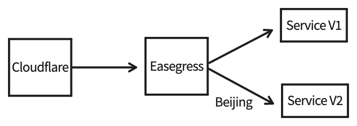
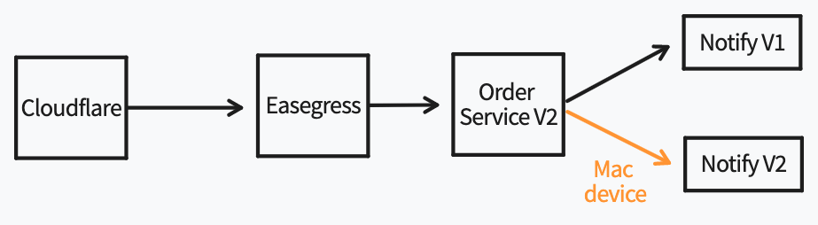
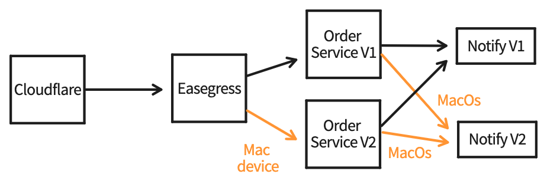

# Canary Release With Cloudflare

- [Canary Release With Cloudflare](#Canary-Release-With-Cloudflare)
  - [Background](#Background)
    - [Advantages](#Advantages)
    - [Key Points](#Key-Point)
  - [Why use Easegress and Cloudflare](#Why-use-Easegress-and-Cloudflare)
  - [Case Study: based on geographic location](#based-on-geographic-location)
  - [Case Study: based on user devices](#based-on-user-devices)
  - [Case Study: based on user OS](#based-on-user-OS)

## Background

A [canary release](https://martinfowler.com/bliki/CanaryRelease.html) is a software testing technique used to reduce the risk of introducing a new software version into production by gradually rolling out the change to a small subset of users, before rolling it out to the entire platform/infrastructure.

### Advantages

* **Service Evaluation**: You can evaluate multiple service versions side by side using canary release in real-world environments with actual users and use cases.
* **Zero downtime**: Canary release does not cause downtime
* **Simple Rollback Mechanism**: You can always easily roll back to the previous version.

### Key point

* **Traffic tagging**: We can label the traffic with various business tags, such as user devices, geographic locations, user business labels etc. Also note that user tags should not use IP addresses, which are inaccurate and inconsistent.
* **Traffic scheduling**: After label the traffic, we can specify traffic rules to schedule a certain part of the user’s traffic to a certain Canary, for example, the IPhone user from Beijing is scheduled to the 2.0 Canary version of Service A.

## Why use Easegress and Cloudflare

* For traffic tagging, Using [Cloudflare](https://www.cloudflare.com/) we can easily label the traffic.
  * geographic location: Cloudflare provides [Managed Transforms](https://developers.cloudflare.com/rules/transform/managed-transforms/reference/) features that can be used to identify the geographic location of the user.
  * user device or OS: We can get user device and OS from the user-agent filed of HTTP request by [Workers](https://developers.cloudflare.com/workers/).
  * user's business label: Cloudflare provides [Rules](https://developers.cloudflare.com/rules/transform/request-header-modification/) features that can be used to identify the user's business label.

* For traffic scheduling, Easegress provides `Filter` and `Proxy` features that can be used to schedule traffic to different canaries.

## based on geographic location



Suppose we operate an E-Commerce service as shown, and we have recently upgrade the Order Service from V1 to V2. In order to ensure that our users have the best experience possible, we would like to direct users who are accessing our service from Beijing to use the new order service (v2). 

1. Traffic tagging: the geographic location judgment is based on the `CF-IPCity` field in Cloudflare's HTTP header. Add the location header to HTTP request through Cloudflare's Transform feature.

   * Cloudflare Dashboard -> Rules -> Transform Rules -> Managed Transforms -> [enabled “Add visitor location headers”](https://developers.cloudflare.com/rules/transform/managed-transforms/configure/)

2. Traffic scheduling rules:

Save the below YAML to ecommerce-service.yaml, and make sure you have replaced the servers with yours.

```yaml
name: ecommerce-pipeline
kind: Pipeline
flow:
- filter: buildOrderRequest
  namespace: order
- filter: order-service
  namespace: order
- filter: buildResponse
filters:
- name: buildOrderRequest
  kind: RequestBuilder
  template: |
    url: /order
- name: order-service
  kind: Proxy
  pools:
  - servers:
    - url: http://megaease.com/api/v2  # new version
  - filter:
      headers:
        cf-ipcity: # Cloudflare geographic location header
          exact: Beijing # the traffic from Beijing should be directed to the new version
    servers:
    - url: http://megaease.com/api/v1 # old version
- name: buildResponse
  kind: ResponseBuilder
  template: |
    statusCode: {{.responses.order.StatusCode}}
    body: |
      [{{.responses.notify.Body}}]
```

Then create the E-commerce pipeline with the command:

```bash
egctl object create -f ecommerce-service.yaml
```

Save below YAML to ecommerce-server.yaml.

```yaml
kind: HTTPServer
name: ecommerce-server
port: 8080
https: false
keepAlive: true
keepAliveTimeout: 75s
maxConnection: 10240
cacheSize: 0
rules:
  - paths:
    - pathPrefix: /ecommerce
      backend: ecommerce-pipeline
```

Then create the HTTP server with command:

```bash
egctl object create -f ecommerce-server.yaml
```

## based on user devices



In the real world, services are rarely ever standalone entities, but rather are often interconnected and dependent on one another to provide a holistic experience for the customer. As shown, we have recently upgraded our notify service from v1 to v2. we would like to direct users who are accessing our service from a Mac device to use the new notify service (v2).

1. Traffic tagging: the user device judgment is based on the `user-agent` field in HTTP request. We can get user device and system from the user-agent filed of HTTP request by [Workers](https://developers.cloudflare.com/workers/).

We provided easy way to parse user-agent in [easegress-rust-uaparser](https://github.com/megaease/easegress-rust-uaparser). Download `easegress-rust-uaparser`

```bash
git clone https://github.com/megaease/easegress-rust-uaparser.git
```

Enter the `easegress-rust-uaparser/cloudflare` directory and deploy the worker using the wrangler command

```bash
npx wrangler publish
```

Enter the Cloudflare website configuration page and configure Workers Routes as you needed.

2. Traffic scheduling rules:

Save the below YAML to ecommerce-service.yaml, and make sure you have replaced the servers with yours.

```yaml
name: ecommerce-pipeline
kind: Pipeline
flow:
- filter: buildOrderRequest
  namespace: order
- filter: order-service
  namespace: order
- filter: buildNotifyRequest
  namespace: notify
- filter: notify-service
  namespace: notify
- filter: buildResponse
filters:
- name: buildOrderRequest
  kind: RequestBuilder
  template: |
    url: /order
- name: order-service
  kind: Proxy
  pools:
  - servers:
    - url: http://megaease.com/api/v2
- name: buildNotifyRequest
  kind: RequestBuilder  # use order response as notify request body
  template: |
    url: /notify
    method: POST
    body: |
      {"order": "{{.responses.order.Body | jsonEscape}}"}
- name: notify-service
  kind: Proxy
  pools:
  - servers:
    - url: http://megaease.com/api/v1
  - filter:
      headers:
        x-ua-device: # Cloudflare's user device header
          exact: Mac # the traffic from Mac should be directed to the new version
    servers:
    - url: http://megaease.com/api/v2
- name: buildResponse
  kind: ResponseBuilder
  template: |
    statusCode: {{.responses.notify.StatusCode}}
    body: |
      [{{.responses.notify.Body}}]
```

Then update the E-commerce pipeline with the command:

```bash
egctl object update -f ecommerce-service.yaml
```

## based on user OS



Suppose order service and notify service have upgraded at the same time. The user who is accessing our service from a Mac device should be directed to the new version of the order service (v2), and from MacOS should be directed to the new version of the notify service (v2). 

You may think Cloudflare's Worker is not suitable for you, there is another easy way to parse user-agent with Easegress's WASM.

1. Traffic tagging: using Easegress's WASM to parse user-agent. 

Download `easegress-rust-uaparser`

```bash
git clone https://github.com/megaease/easegress-rust-uaparser.git
```

Navigate to the `easegress-rust-uaparser/binary` directory and use the `easegress.wasm` file directly. It will parse user-agent and add the `x-ua-device` and `x-ua-os` headers to the HTTP request.

2. Traffic scheduling rules:

Save the below YAML to ecommerce-service.yaml, and make sure you have replaced the servers and wasm file path with yours.

```yaml
name: ecommerce-pipeline
kind: Pipeline
flow:
- filter: wasm
- filter: buildOrderRequest
  namespace: order
- filter: order-service
  namespace: order
- filter: buildNotifyRequest
  namespace: notify
- filter: notify-service
  namespace: notify
- filter: buildResponse
filters:
- name: wasm # parse user-agent, add `x-ua-device` and `x-ua-os` headers to the HTTP request.
  kind: WasmHost
  maxConcurrency: 2
  code: /<Path>/easegress.wasm  # easegress.wasm file path
  timeout: 100ms
- name: buildOrderRequest
  kind: RequestBuilder
  template: |
    url: /order
- name: order-service
  kind: Proxy
  pools:
  - servers:
    - url: http://megaease.com/api/v1
  - filter:
      headers:
        x-ua-device: # Easegress's user device header
          exact: Mac # the traffic from Mac should be directed to the new version
    servers:
    - url: http://megaease.com/api/v2
- name: buildNotifyRequest
  kind: RequestBuilder  # use order response as notify request body
  template: |
    url: /notify
    method: POST
    body: |
      {"order": "{{.responses.order.Body | jsonEscape}}"}
- name: notify-service
  kind: Proxy
  pools:
  - servers:
    - url: http://megaease.com/api/v1
  - filter:
      headers:
        x-ua-os: # Easegress's user os header
          exact: MacOS # the traffic from MacOS should be directed to the new version
    servers:
    - url: http://megaease.com/api/v2
- name: buildResponse
  kind: ResponseBuilder
  template: |
    statusCode: {{.responses.notify.StatusCode}}
    body: |
      [{{.responses.notify.Body}}]
```

Then update the E-commerce pipeline with the command:

```bash
egctl object update -f ecommerce-service.yaml
```
