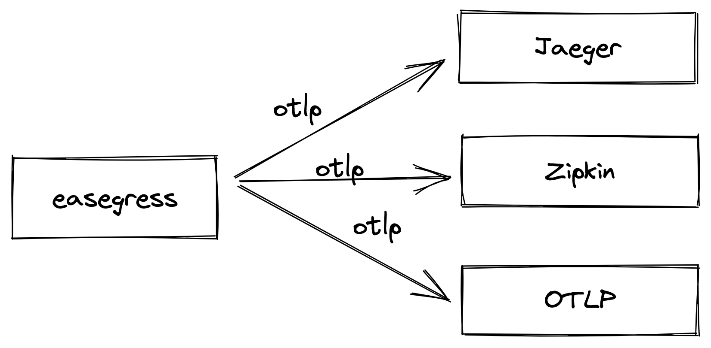

# Distributed Tracing

Easegress tracing is based on [OpenTelemetry](https://opentelemetry.io/). We can enable tracing in Traffic Gates, for example, in `HTTPServer`, we can do this by defining the `tracing` entry. Tracing creates spans containing the tracing service name (`tracing.serviceName`) and other information. The matched pipeline will start a child span, and its internal filters will start children spans according to their implementation and configuration. For example, the `Proxy` filter has a specific span implementation.

```yaml
kind: HTTPServer
name: http-server-example
port: 10080
tracing:
  serviceName: httpServerExample
  sampleRate: 1
  exporter:
    zipkin:
      endpoint: http://localhost:9412/api/v2/spans
rules:
  - paths:
    - pathPrefix: /pipeline
      backend: pipeline-example
```

## Custom attributes

Custom attributes can help to further filter and debug tracing spans. Here's an example with custom attribute `customAttributeKey` with value `customAttributeValue`:

```yaml
kind: HTTPServer
name: http-server-example
port: 10080
tracing:
  serviceName: httpServerExample
  attributes:                             # add "attributes" entry and tags as key-value pairs
    customAttributeKey: customAttributeValue
  sampleRate: 1
  exporter:
    zipkin:
      endpoint: http://localhost:9412/api/v2/spans
rules:
  - paths:
    - pathPrefix: /pipeline
      backend: pipeline-example
```

## Exporter

In the above example, we can see that we are sending span to Zipkin, thanks to the standardization of OpenTelemetry, we can also send span to other tracing backend, which currently supports Jaeger, Zipkin, OTLP (OpenTelemetry Collector), you can refer to [tracing](../reference/controllers.md#tracingspec) for details.



You can configure more than one exporter at a time, so let's look at an example to understand.

```yaml
kind: HTTPServer
name: http-server-example
port: 10080
tracing:
  serviceName: httpServerExample
  sampleRate: 1
  exporter:
    zipkin:
      endpoint: http://localhost:9412/api/v2/spans
    jaeger:
      mode: agent
      endpoint: localhost:6831
    otlp:
      protocol: grpc
      endpoint: localhost:4317
      insecure: true
rules:
  - paths:
    - pathPrefix: /pipeline
      backend: pipeline-example
```

## Backward Compatibility

In the current version, you can still use the same configuration as before, but there are still some minor differences that need to be adjusted, as you can see in the following example.

```yaml
kind: HTTPServer
name: http-server-example
port: 10080
tracing:
  serviceName: httpServerExample
  tags:                             # tags need to be renamed to attributes
    customTagKey: customTagValue
  zipkin:
    hostport: 0.0.0.0:10080 # This option will no longer be used
    serverURL: http://localhost:9412/api/v2/spans
    sampleRate: 1
    sameSpan: true # This option will no longer be used
    id128Bit: false # # This option will no longer be used
rules:
  - paths:
    - pathPrefix: /pipeline
      backend: pipeline-example
```

The adjusted example should look like this.

```yaml
kind: HTTPServer
name: http-server-example
port: 10080
tracing:
  serviceName: httpServerExample
  attributes:
    customTagKey: customTagValue
  zipkin:
    serverURL: http://localhost:9412/api/v2/spans
    sampleRate: 1
rules:
  - paths:
    - pathPrefix: /pipeline
      backend: pipeline-example
```
