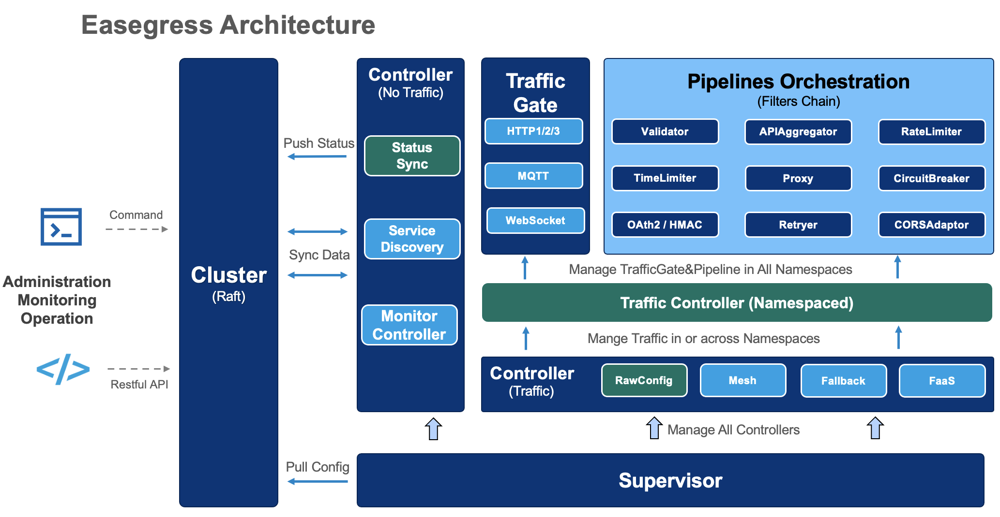

# Developer Guide

- [Developer Guide](#developer-guide)
	- [Architecture](#architecture)
	- [Layout](#layout)
	- [Develop Object](#develop-object)
		- [Main Business Logic](#main-business-logic)
		- [Register Itself to Supervisor](#register-itself-to-supervisor)
	- [Develop Filter](#develop-filter)
		- [Main Business Logic](#main-business-logic-1)
		- [Register Itself to Pipeline](#register-itself-to-pipeline)
		- [JumpIf Mechanism in Pipeline](#jumpif-mechanism-in-pipeline)

## Architecture

As the diagram described, the cluster does data synchronization of all nodes, and the supervisor manages the lifecycle of all kinds of objects:



1. System Controller: Every instance of EG has one and only one kind of it.
2. Business Controller: The component does its own task which does not directly handle the traffic.
3. Traffic Gate: It receives traffic of different protocols, and dispatches them to pipelines.
4. Pipeline: It is a filter chain that handles traffic from the traffic gate.


## Layout

We try to follow the [go project layout standard](https://github.com/golang-standards/project-layout), and the important directories are described below:

```
.
├── bin					// executable binary
├── cmd					// command source code
├── doc					// documents
├── pkg					// importable golang packages
│   ├── api				// restful api layer
│   ├── cluster				// cluster component
│   ├── common				// some common utilies
│   ├── context				// context for traffic gate and pipeline
│   ├── env				// preparation for running environment
│   ├── filter				// filters bucket
│   ├── graceupdate			// graceful update
│   ├── logger				// logger utilities
│   ├── object				// controllers bucket
│   ├── option				// startup arguments utilities
│   ├── pidfile				// handle file to record pid
│   ├── profile				// dedicated pprof
│   ├── protocol			// decoupling for protocol
│   ├── registry			// registry for all dynamic registering component
│   ├── storage				// distributed storage wrapper
│   ├── supervisor			// the supervisor to manage controllers
│   ├── tracing				// distributed tracing
│   ├── util				// all kinds of utilities
│   ├── v				// validation tool
│   └── version				// release version
├── test				// scripts of integration testing
```

## Develop Object

The first job is to choose which category the object is. The architecture part has described them well enough. In most cases, create a new business controller is the best choice to extend the ability of EG at the object level. So we will develop a lightweight business controller to show the detail. For example, we want to develop a controller to dump the status of all objects to a local file. Let's name the kind of controller `StatusInLocalController`, so the config of the controller:

```yaml
kind: StatusInLocalController
name: statusInLocal
path: ./running_status.yaml
```

### Main Business Logic

We put the controller package in `pkg/object/statusinlocalcontroller`. We could implement the main logic in `pkg/object/statusinlocalcontroller/statusinlocalcontroller.go`:

The supervisor has all references of running objects, so we need invoke supervisor to get status of running objects, and the main business code would be:

```go
type (
	// StatusInLocalController posts status of all objects in a local file.
	StatusInLocalController struct {
		superSpec *supervisor.Spec
		spec      *Spec

		done chan struct{}
	}

	// Spec describes StatusInLocalController.
	Spec struct {
		Path string `yaml:"path" jsonschema:"required"`
	}

	// Entry is the structure of the status file
	Entry struct {
		Statuses     map[string]interface{}
		UnixTimestamp int64
	}
)

func (c *StatusInLocalController) syncStatus() {
	// Step1: Use entry to record status of all running objects.
	entry := &Entry{
		UnixTimestamp: time.Now().Unix(),
		Statuses:      make(map[string]interface{}),
	}

	walkFn := func(entity *supervisor.ObjectEntity) bool {
		defer func() {
			if err := recover(); err != nil {
				logger.Errorf("recover from syncStatus, err: %v, stack trace:\n%s\n",
					err, debug.Stack())
			}
		}()

		name := entity.Spec().Name()
		entry.Statuses[name] = entity.Instance().Status()

		return true
	}

	c.superSpec.Super().WalkControllers(walkFn)

	// Step2: Write the status to the local file.
	buff, err := yaml.Marshal(entry)
	if err != nil {
		logger.Errorf("BUG: marshal %#v to yaml failed: %v",
			entry, err)
		return
	}

	ioutil.WriteFile(c.spec.Path, buff, 0644)
}
```

### Register Itself to Supervisor

All objects must satisfy the interface `Object` in [`pkg/object/supervisor/registry.go`](https://github.com/megaease/easegress/blob/master/pkg/supervisor/registry.go).

```go
package statusinlocalcontroller

import (
	"io/ioutil"
	"runtime/debug"
	"time"

	"github.com/megaease/easegress/pkg/logger"
	"github.com/megaease/easegress/pkg/supervisor"

	"gopkg.in/yaml.v2"
)

const (
	// Kind is the kind of StatusInLocalController.
	Kind = "StatusInLocalController"
)

type (
	// StatusInLocalController posts status of all objects in a local file.
	StatusInLocalController struct {
		superSpec *supervisor.Spec
		spec      *Spec

		done chan struct{}
	}

	// Spec describes StatusInLocalController.
	Spec struct {
		Path string `yaml:"path" jsonschema:"required"`
	}

	// Entry is the structure of the status file.
	Entry struct {
		Statuses      map[string]interface{}
		UnixTimestamp int64
	}
)

// init registers itself to supervisor registry.
func init() {
	supervisor.Register(&StatusInLocalController{})
}

func (c *StatusInLocalController) syncStatus() {
	// Step1: Use entry to record status of all running objects.
	entry := &Entry{
		UnixTimestamp: time.Now().Unix(),
		Statuses:      make(map[string]interface{}),
	}

	walkFn := func(entity *supervisor.ObjectEntity) bool {
		defer func() {
			if err := recover(); err != nil {
				logger.Errorf("recover from syncStatus, err: %v, stack trace:\n%s\n",
					err, debug.Stack())
			}
		}()

		name := entity.Spec().Name()
		entry.Statuses[name] = entity.Instance().Status()

		return true
	}

	c.superSpec.Super().WalkControllers(walkFn)

	// Step2: Write the status to the local file.
	buff, err := yaml.Marshal(entry)
	if err != nil {
		logger.Errorf("BUG: marshal %#v to yaml failed: %v",
			entry, err)
		return
	}

	ioutil.WriteFile(c.spec.Path, buff, 0644)
}

// Category returns the category of StatusInLocalController.
func (c *StatusInLocalController) Category() supervisor.ObjectCategory {
	return supervisor.CategoryBusinessController
}

// Kind return the kind of StatusInLocalController.
func (c *StatusInLocalController) Kind() string { return Kind }

// DefaultSpec returns the default spec of StatusInLocalController.
func (c *StatusInLocalController) DefaultSpec() interface{} { return &Spec{} }

// Init initializes StatusInLocalController.
func (c *StatusInLocalController) Init(superSpec *supervisor.Spec) {
	c.superSpec, c.spec = superSpec, superSpec.ObjectSpec().(*Spec)
	c.reload()
}

// Inherit inherits previous generation of StatusInLocalController.
func (c *StatusInLocalController) Inherit(spec *supervisor.Spec,
	previousGeneration supervisor.Object) {

	previousGeneration.Close()
	c.Init(spec)
}

func (c *StatusInLocalController) reload() {
	c.done = make(chan struct{})

	go c.run()
}

func (c *StatusInLocalController) run() {
	for {
		select {
		case <-time.After(5 * time.Second):
			c.syncStatus()
		case <-c.done:
			return
		}
	}
}

// Status returns the status of StatusInLocalController.
func (c *StatusInLocalController) Status() *supervisor.Status {
	return &supervisor.Status{
		ObjectStatus: struct{}{},
	}
}

// Close closes StatusInLocalController.
func (c *StatusInLocalController) Close() {
	close(c.done)
}
```

In the end, we have to import `StatusInLocalController` in `pkg/registry/registry.go`.
```go
import (
// Filters
// ...

// Objects
// ...
	_ "github.com/megaease/easegress/pkg/object/statusinlocalcontroller"
)

```

## Develop Filter

In most scenarios of handling traffic, do the second development of filters is the right choice, since its scheduling is covered by the flexible pipeline. The filter only does its own business, for example, we want to develop a filter to count the number of requests which have the specified header. Let's name the kind of filter `headerCounter`, so the config of the filter in pipeline spec would be:

```yaml
filters:
- kind: HeaderCounter
  name: headerCounter
  headers: ['Cookie', 'Authorization']
```

### Main Business Logic

We put the filter package in `pkg/filter/headercounter`. We could implement the main logic counting the header in `pkg/filter/headercounter/headercounter.go`:

```go

type (
	HeaderCounter struct {
		pipeSpec *httppipeline.FilterSpec	// The filter spec in pipeline level, which has two more fiels: kind and name.
		spec     *Spec						// The filter spec in its own level.

		// The read and write for count must be locked, because the Handle is called concurrently.
		countMutex sync.Mutex
		count      map[string]int64
	}

	Spec struct {
		Headers []string `yaml:"headers"`
	}
)

func (m *HeaderCounter) Handle(ctx context.HTTPContext) (result string) {
	for _, key := range m.spec.Headers {
		value := ctx.Request().Header().Get(key)
		if value != "" {
			m.countMutex.Lock()
			m.count[key]++
			m.countMutex.Unlock()
		}
	}

	// NOTE: The filter must call the next handler to satisfy the Chain of Responsibility Pattern.
	return ctx.CallNextHandler("")
}

```

### Register Itself to Pipeline

Our core logic is very simple, now let's add some non-business code to make our new filter conform with the requirement of the Pipeline framework. All filters must satisfy the interface `Filter` in [`pkg/object/httppipeline/registry.go`](https://github.com/megaease/easegress/blob/master/pkg/object/httppipeline/registry.go).

All of the methods with their names and comments are clean, the only one we need to emphasize is `Inherit`, it will be called when the pipeline is updated but the filter with the same name and kind has still existed. It's the filter's own responsibility to do hot-update in `Inherit` such as transferring meaningful consecutive data.

```go
// init registers itself to pipeline registry.
func init() { httppipeline.Register(&HeaderCounter{}) }

// Kind returns the kind of HeaderCounter.
func (hc *HeaderCounter) Kind() string { return "HeaderCounter" }

// DefaultSpec returns default spec of HeaderCounter.
func (hc *HeaderCounter) DefaultSpec() interface{} { return &Spec{} }

// Description returns the description of HeaderCounter.
func (hc *HeaderCounter) Description() string {
	return "HeaderCounter counts the number of requests which contain the specified header."
}

// Results returns the results of HeaderCounter.
func (hc *HeaderCounter) Results() []string { return nil }

// Init initializes HeaderCounter.
func (hc *HeaderCounter) Init(pipeSpec *httppipeline.FilterSpec) {
	hc.pipeSpec, hc.spec = pipeSpec, pipeSpec.FilterSpec().(*Spec)
	hc.reload()
}

// Inherit inherits previous generation of HeaderCounter.
func (hc *HeaderCounter) Inherit(pipeSpec *httppipeline.FilterSpec,
	previousGeneration httppipeline.Filter) {

	previousGeneration.Close()
	hc.Init(pipeSpec)
}

func (m *HeaderCounter) reload() {
	m.count = make(map[string]int64)
}

// Status returns status.
func (m *HeaderCounter) Status() interface{} {
	m.countMutex.Lock()
	defer m.countMutex.Unlock()

	return m.count
}

// Close closes HeaderCounter.
func (m *HeaderCounter) Close() {}
```

Then we need to add the import line in the `pkg/registry/registry.go`:

```go
import (
	_ "github.com/megaease/easegress/pkg/filter/headercounter
)
```

### JumpIf Mechanism in Pipeline

As we described in the [get started](../README.md#get-started), the pipeline below uses the result of `validator`:

```yaml
name: pipeline-demo
kind: HTTPPipeline
flow:
- filter: validator
  jumpIf: { invalid: END }
- filter: requestAdaptor
- filter: proxy
```

That `jumpIf` means the request will jump into the end without going through `requestAdaptor` and `proxy` if the `validator` returns the result `invalid`. So the method `Results` is to register all possible results of the filter. In the example of `HeaderCounter`, the empty results mean `Handle` only returns the empty result. So if we want to prevent requests which haven't any counting headers from going forward to next filters, we could change it to:

```go
const resultInvalidHeader = "invalidHeader"

// Results returns the results of HeaderCounter.
func (hc *HeaderCounter) Results() []string {
	return []string{resultInvalidHeader} // New code
}

// Handle counts the header of the requests.
func (m *HeaderCounter) Handle(ctx context.HTTPContext) (result string) {
	counted := false // New code
	for _, key := range m.spec.Headers {
		value := ctx.Request().Header().Get(key)
		if value != "" {
			m.countMutex.Lock()
			counted = true // New code
			m.count[key]++
			m.countMutex.Unlock()
		}
	}

	if !counted { // New code
		return resultInvalidHeader // New code

	} // New code

	return ""
}
```
