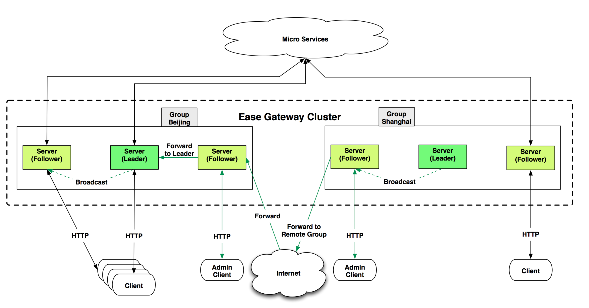
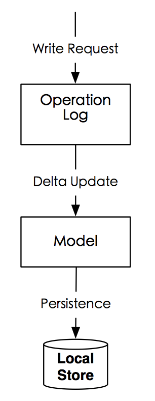
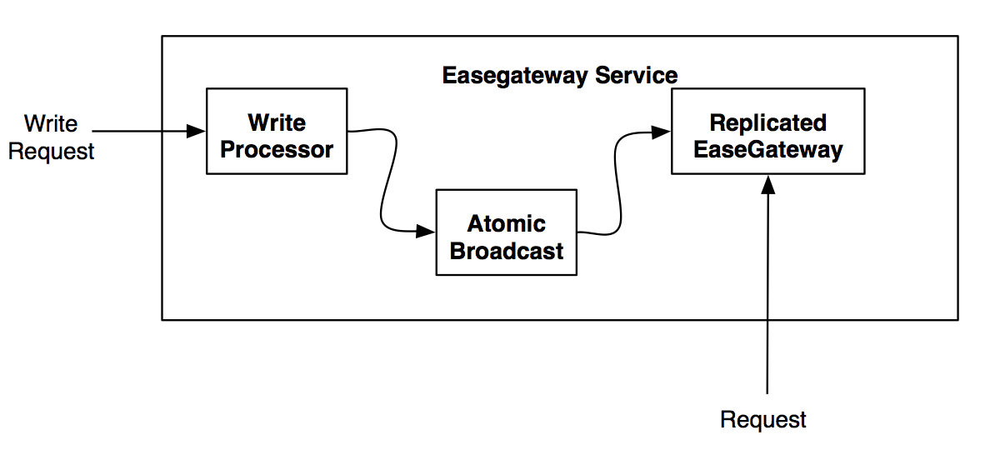
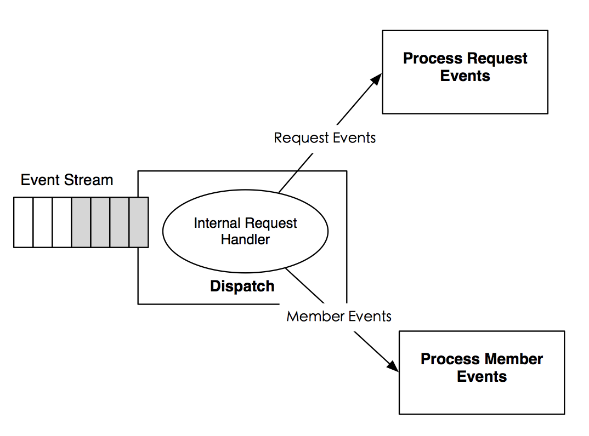

# Table of Contents

* [1. Introduction](#1-introduction)
* [2. Architecture](#2-architecture)
  * [2.1 Groups](#2.1-groups)
* [3. Implementation](#3-implementation)
  * [3.1 Write Requests](#3.1-write-requests)
  * [3.2 Membership Detection And Failure Detection](#3.2-membership-detection-and-failure-detection)
  * [3.3 Fault Tolerance](#3.3-fault-tolerance)
  * [3.4 Replication](#3.4-replication)
  * [3.5 High Availability](#3.5-high-availability)
  * [3.6 Communication Layer](#3.6-communication-layer)
  * [3.7 High Performance](#3.7-high-performance)
  * [3.8 Scaling The Cluster](#3.8-scaling-the-cluster)
  * [3.9 Load Balancing](#3.9-load-balancing)
  * [3.10 System Monitoring](#3.10-system-monitoring)
  * [3.11 System Operations](#3.11-system-operations)

## 1. Introduction
EaseGateway is a decentralized distributed gateway for serving very large amount of requests coming from different areas, while providing highly available service. Gateway provides many [built-in plugins](https://github.com/hexdecteam/easegateway/blob/master/doc/plugin_ref.md) to complete specific work, user can [create pipelines](https://github.com/hexdecteam/easegateway/blob/master/doc/admin_api_ref.swagger.yaml) by assembling different kinds of plugins to complete a business logic.

Ease gateway currently support many [use cases](https://github.com/hexdecteam/easegateway/blob/master/doc/pipeline_practice_guide.md).

### User defined plugins
In addition to built-in plugins, EaseGateway support use defined plugins.

[TODO]  add more details about user defined plugins

## 2. Architecture
Easegateway is client/server architecture. There are two kinds of client: admin clients and clients. Admin clients are used to send administrate commands to Easegateway clusters, such as create pipeline, modify pipeline configurations or get cluster statistics. Ordinary clients are unaware of the existence of the Easegateway cluster, they just send the request and get the response as if they were directly communicate with upsteam servers.

Easegateway is designed to handle large requests across multiple nodes with no single point of failure. Its architecture is based on the understanding that system and hardware failures can and do occur. Easegateway addresses the problem of failures by employing a peer-to-peer distributed system across homogeneous nodes. Data is replicated among all nodes in the cluster. So this mechanisms can ensures service availability and data durability. Easegateway is a AP system with regard to the CAP theorem. This implies that it sacrifices consistency in order to achieve high availability and partition tolerance. Below is the EaseGateway cluster architecture.

Let's break down the above image and describe each piece. First of all, we see that there are two groups, labeled "Beijing" and "Shanghai". Within each group, we have a mixture of leader and followers. It is expected that there be at least three servers.  All the nodes that are in Easegateway clusters participate in a gossip protocol. This servers a few purposes: first, the work of membership and node failure detection is not placed on specific servers but is distributed. This makes failure detection much more scalable than naive heartbeating schemes. Secondly, it is used as a messaging layer to notify when important events such as leader election take place, or to broadcast application level messages.

### 2.1 Groups
As consensus gets progressively slower as more machines are added, we solve this problem by introduce groups. Easegateway supports multiple groups out of the box, and it can be used to purposely scopes some use case (such as flash sale) which needs plugin configs to be per-group. What's more, each group elects an independent leader and maintains a disjoint peer set. This means each group runs an some extent independent cluster of servers. This design allows for lower latency write request and higher availability without sacrificing consistency. Requests are forwarded to remote groups if necessary(such as get specific group's statistics); Connectivity issues between groups do not affect availability within a group. Additionally, the unavailability of one group does not affect the servcies in any other groups.

The servers in each group are all part of a single raft peer set. This means that they work together to elect a single leader, a selected server which has extra duties. The leader is responsible for processing all write requests sent by admin client. The update changes caused by write requests must also be replicated to all peers as part of the consensus protocol. Because of this requirement, when a non-leader server receives an write request, it forwards it to the group leader. When a server receives a request/write for a different group, it forwards it to a random server in the correct group. That server may then forward to the local leader.

## 3. Implementation
### 3.1 Write Requests(state changes)

Critical to the design of Easegateway is the observation that each state change is incremental with respect to the previous state, so there is an implicit dependence on the order of the state changes. State changes are idempotent and applying the same state change multiple times does not lead to inconsistencies as long as the application order is consistent with the deliver order. Each gateway process is built around a single replicated log, we called `Operation Log`. This may be some kind of a single bottleneck at first sight, but because easegateway stores pipeline configs, it's not big application data. Configs are very small, so this will not be a big problem.

Ease Gateway uses [write-ahead-logging(WAL)](https://en.wikipedia.org/wiki/Write-ahead_logging) in which any update details is first written to a log that contains the update information, then write it to `model` and local storage. Only when writing finished successfully, gateway then response to the client that operation finished successfully. This ensures that, given a process failure of any sort, gateway can recover from the log . So WAL enforce atomicity and durability on a standalone Easegateway. In Ease gateway cluster, we need other mechanisms to ensure atomicity.

Every Easegateway server services client request, as we can see from the above Ease Gateway architecture. Clients connect to exactly one server to submit request. Requests are serviced by each server, write requests are processed by an agreement protocol. As part of the agreement protocol all write requests from admin clients are forwarded to a single server, called the leader. The rest of the Easegateway servers, called followers, receive update message proposals from the leader and agree upon message delivery. The atomic broadcast message protocol takes care of replacing leaders on failures and syncing followers with leaders.

### 3.2 Membership Detection And Failure Detection
Ease Gateway manages cluster membership and member failure detection using a SWIM-based gossip protocol. We choose third-party library [memberlist](https://github.com/hashicorp/memberlist) as the gossip layer implementation. Ease Gateway uses gossip based protocol to sovle three major problems:
1. Membership: Easegateway maintains cluster membership lists
2. Failure detection and Recovery: Easegateway can detects failed nodes within seconds, and executes callback processes to handle these events.
3. Application layer message propagation: Easegateway can dissemnate messages through the cluster

#### SWIM Protocol Overview
Gossip is done over UDP with a configurable but fixed fanout and interval. Each node contains a peer chosen at random every timer interval and the two nodes exchange their membership data. Every node maintains a persistent view of the membership. This ensures that network usage is constant with regards to number of nodes. Every node's data is eventually consistent but converges quickly on average.

On top the SWIM-based gossip layer, Easegateway built a application communication layer, used to send some custom message types, please see section [Network Communication]()

#### Failure Detection
Failure detection is a mechanism by which a node can locally determining if any other node in the system is up or down. We rely on 'memberlist' component to detect node failures.  Failure detection in memberlist is done by periodic random probing using a configurable interval. If the nodes fails to ack within a reasonable time, then an indirect probe as well as a direct TCP probe are attempted. If one node is considered dead by node j, then node j will gossip this state to the cluster. Easegateway can distinguish between node failure and node leaving and act accordingly.

### 3.3 Fault Tolerance
#### Failure Recovery

When a replica node comes back up after crashing, it gain membership information through gossip and synchronizes data exactly from where it left before crash by relying on stable storage. It sychronizes data by pulling from the current leader until it is caught up enough. So an Easegateway node can self-healing.

Upon leader crashes, Ease gateway processes execute a recovery protocol:
1. Agree upon a common consistent state before resuming regular operation
2. Establish a new primary to broadcast state changes

New leader must come from the lastest follower. To exercise the primary role, a process must have the support of a quorum of follower processes.

Easegateway can tolerate maximum of f node failures if the group have 2f + 1 nodes(not include observer nodes). Follower failure Observer failure

#### Network partition failure
Network partitions are partially tolerated by attempting to communicate to potentially dead nodes through other routes. You can find more details on section [Network Communication]

### 3.4 Replication
Ease Gateway uses replication to avoid a single point of failure, ensure fault tolerance and achieve high availability. It's [primary-backup schema(master-slave scheme)](https://en.wikipedia.org/wiki/Master-slave_(computers)). In easegateway, we have leader and followers basically. Leader is selected from a group of eligible nodes, with the other nodes acting in the role of follower.

#### Replica Synchronization
Easegateway uses a leader-based atomic broadcast protocol, just like 'zookeeper atomic broad casting' to synchronize write updates.  It's kind of passive replication, only the write leader executes the incoming client requests, executes them and propagates the resulting non-commutative, incremental state changes to the write followers. Atomically boradcasting protocol will ensure that nodes deliver the same messages and they deliver them in the same order (totally ordered). Because the updates are deterministic, then the state across all replicas is guaranteed to be always consistent. Those updates are idempotent.

#### Quorum-based Writing
we use [quorum](https://en.wikipedia.org/wiki/Quorum_(distributed_computing)) based voting when process writes request to enforce serial consistency. One disadvantage of majority quorums is their requirement of at least (n+1)/2 acknowledgements, so it grows with the number of replicas n. So this architecture makes it hard to scale out to huge number of servers. The problem is that as we add more servers, the write performance drops. This is due to the fact that a write operation requires majority consensus before a response is generated[the agreement of (in general) at least half of the nodes in an ensemble] and therefore the cost of a vote can increase significantly as more voters are added. So we introduced a new type of Ease Gateway node called an Observer which helps address this problem and further improves Easegateway's scalability. Observers are non-voting members of an ensemble which only hear the results of votes. Other than this simple distinction, Observers function exactly the same as Followers - clients may connect to them and send request and write requests to them. Observers forward write requests to the Leader just like Followers do, but they are simply wait to hear the results of the vote. Because of this, we can increase the number of Observers as much as we like without harming the performance of votes.

### 3.5 High Availability

Ease Gateway supports high availabilty through replication and fast failure recoveries

### 3.6 Communication Layer
As mentioned in above sections, SWIM-based gossip protocol is not only used for membership and failure detection but also to dissemnate other messages like requests or responses.

#### Gossip layer
The implementation of gossip protocol Memberlist provided two kinds of transport interface to transport messages:
1. Broadcast to the cluster(via gossip): QueueBroadcast()
2. send to specific node by TCP : sendReliable()

Currently we have member related messages(LeaveMessage, memberJoinMessage etc), request/response /relay related message. These messages may need to be broadcast to randomly choosed other members according to the needs, such as member related message.

#### Application communication layer
We expose `Request(name string, payload, param) Future` an asynchronous interface to application layer. App use this method to communicate with destination node. Use nodename, group in parm to specify the destinate nodes. The response is always send by TCP, if failed, then choose random set of peers to relay this message through TCP. We don't use gossip it's less efficient and we don't need to let whole group knows this response message.

NotifyMsg is called when a user-data message is received.

Because application level events are sent along the gossip layer, which uses UDP, the payload and entire message framing must fit within a single UDP packet.

When a node joins the cluster, Easegateway sends a join message. The purpose of this message is solely to attach a logical clock time to a join message so that this node's message can be ordered properly.

When a node gracefully leaves the cluster, this node will sends a leave intent through the gossip layer. Because the underlying gossip layer makes no differentiation between a node leaving the cluster and a node being detected as failed, this allows the higher level Easegateway layer to detect a failure versus a graceful leave.

##### RequestMessage 
Request message is broadcast through gossip, easegateway stores request message's context on 'RequestOperationBook', use Request.RequestTime as a stub.
 
RequestId: uuid, 
RequestTime: requestClock.Time() This id will be global unique(cluster wide)
RequestFlags, RequestFilters, RequestPayload

##### ResponseMessage
It's used to carray response payload. It will usually send through TCP, if send failed, then easegateway will try to send it over relay message.

##### RelayMessage
We relay message by configurable hops(currently set 1), and then the receiver will send this message through TCP.
RelayMessage structure:
SourceNodeName
TargetNodeAddress
TargetNodePort
RelayPlayload

##### Request Operation Book
We record every Request Message on a book[requestId, time, requestClockTime ? two kinds of time], we call it request operation book.

##### Future
requestId
requestTime: it's used to identify it self in requester.
requestDeadline
closed
ackBook: record whether this future needs ack, and which node's ack received
responseBook: record which node's response received
ackStream: output response to observer
responseStream: output response to observer

#### Event

### 3.7 High performance
#### Staged Event drived Architecture

### 3.8 Scaling the cluster
We can easily scale the cluster by adding more nodes to the cluster.
#### Bootstraping
When a node needs to join a cluster, it get a list of a few peers specified by options. We call these initial contact peers, seeds of the cluster. Then this node will go through below two phases:

i) synchronization
	Synchronizes the memberlist and gain its data by pulling from the current leader.
ii) became follower or observer

#### Message ordering
Easegateway makes heavy use of logical cloks(Lamport clocks) to maintain some notion of message ordering despite being eventually consistent. Every message sent by easegateway contains a logical clock time.

When a node joins the cluster, Easegateway sends a join message. The purpose of this message is solely to attach a logical clock time to a join so that it can be ordered properly in case a leave comes out of order.

Request time, Member clock time

### 3.9 Load Balancing
Gateway cluster depends on external load balancer such as DNS to do load balancing. As for gateway upstreams, we support some route policy like round-robin and weighted round robin policy in [upstreams output plugin](https://github.com/hexdecteam/easegateway/blob/master/doc/plugin_ref.md#upstream-output-plugin).

### 3.10 System Monitoring
Easegateway expose system staticsics through [Health staticsics API](https://github.com/hexdecteam/easegateway/blob/master/doc/statistics_api_ref.swagger.yaml).

### 3.11 System Operations

References:

[Kafka ISR]()

[Zab- High-performance broadcast for primary-backup systems.pdf]

[Scalable Weakly-consistent Infection-style Process Group Membership Protocol.pdf]

[SEDA: An Architecture for Well-Conditioned, Scalable Internet Services]

[The Origin of Quorum Systems.pdf]

[Weighting voting for replicated data.pdf]

[Observer]
[Consul's architecture](https://www.consul.io/docs/internals/architecture.html)
[Cassandra](http://docs.datastax.com/en/cassandra/3.0/cassandra/architecture/archGossipAbout.html)
[Cassandra Architecture](http://docs.datastax.com/en/cassandra/3.0/cassandra/architecture/archGossipAbout.html)
[Dynamo]
[Amazon S3]
