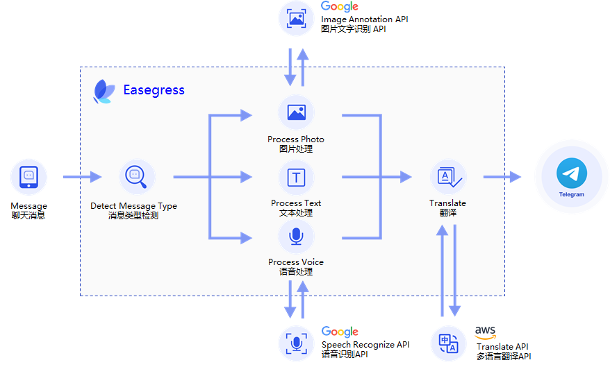
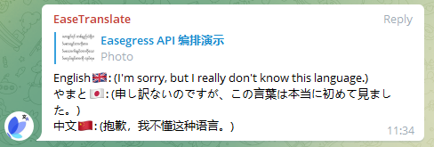

# Build A Telegram Translation Bot With Easegress <!-- omit from toc -->

Easegress is the next-generation traffic-based gateway product. It is completely architected on top of cloud-native technology, avoiding the shortcomings of traditional reverse proxy in terms of high availability, traffic orchestration, monitoring, service discovery, etc.

We released Easegress v2.0 recently, with another significant enhancement to traffic orchestration, allowing users to implement a super API by orchestrating multiple APIs without writing any code. This article will demonstrate this feature by building a Telegram translation bot. This bot can automatically translate incoming messages into Chinese, Japanese, and English, and, in addition to text messages, it also supports translating voice and photo messages.

- [1. Prerequisites](#1-prerequisites)
- [2. How It Works](#2-how-it-works)
- [3. Pipeline](#3-pipeline)
- [4. Filter](#4-filter)
  - [4.1 Backend Proxies](#41-backend-proxies)
  - [4.2 Detect Message Type](#42-detect-message-type)
  - [4.3 Reading The File Content](#43-reading-the-file-content)
  - [4.4 Speech Recognize and OCR](#44-speech-recognize-and-ocr)
  - [4.5 Text Extraction](#45-text-extraction)
  - [4.6 Translating](#46-translating)
  - [4.7 Construct Translation Results Into Reply Message](#47-construct-translation-results-into-reply-message)
  - [4.8 Response](#48-response)
- [5. Deploy](#5-deploy)


## 1. Prerequisites

Since the bot needs to receive Telegram message notifications and call third-party APIs, we must prepare the following in advance:

* Install the latest version of Easegress according to [this document](https://github.com/megaease/easegress#setting-up-easegress) and make sure that external applications can access the Easegress instance on at least one of ports 80, 88, 443, or 8443.
* Create a Telegram bot by following [this document](https://core.telegram.org/bots#3-how-do-i-create-a-bot), set its name (EaseTranslateBot is used in this article), write down its token, and [set up a Webhook](https://core.telegram.org/bots/api#setwebhook) that points to the Easegress instance installed in the previous step. Our bot will receive notifications of new messages through this Webhook.
* AWS Access Key ID and Access Key Secret, and ensure that you can use the AWS translation API with this Access Key.
* Google Cloud's Token and ensure that you can use Google Cloud's Speech Recognize API and OCR (Image Annotation) API with this Token.

It is fine for you to use other vendors' translation, speech recognition, or OCR APIs, but this will require you to adapt the examples in the later sections accordingly.

## 2. How It Works

The diagram below shows the workflow of this bot:



Upon receiving a notification of a new message from the Telegram server via webhook, the bot first checks the message type and does the following accordingly：

* **Text Message**: Extract message text directly；
* **Voice Message**: In this case, the message body only contains the ID of the voice file, so we need to call Telegram's API to convert the ID to a file address, then download the file and send its contents to Google's voice recognition service to convert it to text；
* **Photo Message**: Basically, this is the same as the voice message, but the file content is sent to Google's Image Annotation service.

After the above processing, all three types of messages are turned into text, and then AWS translation service can be called to translate them into target languages, the target languages used in this example are Chinese, Japanese, and English.

## 3. Pipeline

First, let's check the overall flow that Pipeline orchestrates:

```yaml
flow:
# we put the final response builder at the top because Telegram requires
# us to return a response for every Request, but we only process some of
# the requests. If we put it at the end, the requests we don't process
# will end the process early and no Response will be returned.
- filter: buildFinalResponse

# detect message type and jump accordingly
- filter: detectMessageType
  jumpIf:
    result0: processText             # text
    result1: processVoice            # voice
    result2: processPhoto            # photo
    "": END                          # ignore, end the processing

# text message
- filter: requestBuilderExtractText
  alias: processText                 # alias of the filter
  namespace: extract                 # namespace the filter belongs to
  jumpIf:                            # conditional jump, begin translation
    "": translate                    # if everything is fine, or end the
                                     # processing otherwise.

# voice message
- filter: requestBuilderGetVoiceFile # Constructing a request to convert a
  alias: processVoice                # voice file ID to a path.
  namespace: extract
- filter: proxyTelegram              # send the request to retrieve file path.
  namespace: extract
- filter: requestBuilderDownloadFile # Constructing a request to download
  namespace: extract                 # the voice file
- filter: proxyTelegram              # send the request to retrieve file content
  namespace: extract
- filter: requestBuilderSpeechRecognize  # Constructing a request to call the
  namespace: extract                 # speech recognition API
- filter: proxySpeechRecognize       # send the request to retrieve the
  namespace: extract                 # recognition result
- filter: requestBuilderSpeechText   # Save recognition result
  namespace: extract
  jumpIf:                            # conditional jump, begin translation
    "": translate                    # if everything is fine, or end the
                                     # processing otherwise.

# photo message (the process is basically the same as for voice message)
- filter: requestBuilderGetPhotoFile
  alias: processPhoto
  namespace: extract
- filter: proxyTelegram
  namespace: extract
- filter: requestBuilderDownloadFile
  namespace: extract
- filter: proxyTelegram
  namespace: extract
- filter: requestBuilderImageAnnotate
  namespace: extract
- filter: proxyImageAnnotate
  namespace: extract
- filter: requestBuilderPhotoText    # no need to jump
  namespace: extract

# translate to Chinese
- filter: requestBuilderTranslate    # Constructing the request to call the
  alias: translate                   # translation API
  namespace: zh
- filter: signAWSRequest             # Signing as required by AWS
  namespace: zh
- filter: proxyTranslate             # Send request to retrieve translation
  namespace: zh                      # result

# translate to English (same process as Chinese translation)
- filter: requestBuilderTranslate
  namespace: en
- filter: signAWSRequest
  namespace: en
- filter: proxyTranslate
  namespace: en

# translate to Japanese (same process as Chinese translation)
- filter: requestBuilderTranslate
  namespace: ja
- filter: signAWSRequest
  namespace: ja
- filter: proxyTranslate
  namespace: ja

# reply, send the translation to Telegram
- filter: requestBuilderReply        # constructing a request to send the reply
  namespace: tg
- filter: proxyTelegram              # send the request to Telegram
  namespace: tg
```

As we have already explained the basic idea behind the bot, it is easy to see the whole process from the flow above. However, because the final response needs to combine the execution results of multiple APIs, we need to use multiple namespaces to store the parameters and execution results of these APIs, i.e., the requests sent and the responses they return.

And, to achieve a better effect, we also defined some data on the pipeline:

```yaml
data:
  zh:
    fallback: "(抱歉，我不懂这种语言。)"
    text:  "中文🇨🇳"
  ja:
    fallback: "(申し訳ないのですが、この言葉は本当に初めて見ました。)"
    text: "やまと🇯🇵"
  en:
    fallback: "(I'm sorry, but I really don't know this language.)"
    text:  "English🇬🇧"
```

where `zh`, `ja` and `en` are the language codes for Chinese, Japanese and English, `text` is the language name and the corresponding flag, and `fallback` is the replacement text in case of translation failure, as shown below:



## 4. Filter

In Easegress, Filter is the component that handles the traffic, specifically in this example, Pipeline is responsible for orchestrating the flow while detecting message types and calling third-party APIs are done by Filter.

### 4.1 Backend Proxies

All external API requests are sent through the Proxy Filter, this example uses four external services, so there are four Proxy filters, as their configuration is very simple, I will not do more to introduce them.

```yaml
# Google Image Annotate
name: proxyImageAnnotate
kind: Proxy
pools:
- servers:
  - url: https://vision.googleapis.com

# Google Speech Recognize
name: proxySpeechRecognize
kind: Proxy
pools:
- servers:
  - url: https://speech.googleapis.com

# AWS Translate
name: proxyTranslate
kind: Proxy
pools:
- servers:
  - url: https://translate.us-east-2.amazonaws.com

# Telegram
name: proxyTelegram
kind: Proxy
pools:
- servers:
  - url: https://api.telegram.org
```

### 4.2 Detect Message Type

This is done by a ResultBuilder Filter, configured as follows:

```yaml
kind: ResultBuilder
name: detectMessageType
template: |
  {{- $msg := or .requests.DEFAULT.JSONBody.message .requests.DEFAULT.JSONBody.channel_post -}}
  {{- if $msg.text}}result0{{else if $msg.voice}}result1{{else if $msg.photo}}result2{{end -}}
```

Its template field is a template written according to the requirements of the [Go text/template package](https://pkg.go.dev/text/template), which generates a string at runtime that the ResultBuilder returns to Pipeline as its execution result, and Pipeline can jump based on this execution result. In other words, ResultBuilder and Pipeline work together to implement switch-case functionality similar to that of programming languages.

A message in Telegram may come from a user group or from a channel, the field representing the message body is different, so the template determines this first, but in both cases, the format of the message body is the same.

`DEFAULT` is the namespace to which the request belongs, where `.requests.DEFAULT` is the HTTP request sent by Telegram via webhook with the message. By checking the validity of the `text`, `voice`, and `photo` fields in the message body, we can know the message type.

Currently, the result of ResultBuilder can only be `result0` - `result9`, so we use `result0` for text messages, `result1` for voice messages, and `result2` for photo messages. Later we will enhance this filter to make the result more readable.

### 4.3 Reading The File Content

Both voice and photo messages need to first convert the file ID in the message to a file path and then read the file to get its content, which is done using the following filters:

```yaml
# Convert voice file ID to path
kind: RequestBuilder
name: requestBuilderGetVoiceFile
template: |
  {{$msg := or .requests.DEFAULT.JSONBody.message .requests.DEFAULT.JSONBody.channel_post}}
  method: GET
  url: https://api.telegram.org/bot{YOUR BOT TOKEN}/getFile?file_id={{$msg.voice.file_id}}

# Convert photo file ID to path
kind: RequestBuilder
name: requestBuilderGetPhotoFile
template: |
  {{$msg := or .requests.DEFAULT.JSONBody.message .requests.DEFAULT.JSONBody.channel_post}}
  method: GET
  url: https://api.telegram.org/bot{YOUR BOT TOKEN}/getFile?file_id={{(last $msg.photo).file_id}}

# Download(read) file
kind: RequestBuilder
name: requestBuilderDownloadFile
template: |
  method: GET
  url: https://api.telegram.org/file/bot{YOUR BOT TOKEN}/{{.responses.extract.JSONBody.result.file_path}}
```

Note that the step of converting file ID to path is a bit more complicated for photos than for voice. This is because, for the same original photo, Telegram may generate multiple thumbnails of different sizes and send all the thumbnails together with the original photo, while the last one is the original.

### 4.4 Speech Recognize and OCR

These two filters are slightly complex, but both are simply creating the corresponding HTTP requests as requested by the third-party service.

```yaml
# Speech Recognize
kind: RequestBuilder
name: requestBuilderSpeechRecognize
template: |
  url: https://speech.googleapis.com/v1/speech:recognize?key={YOUR GOOGLE API KEY}}
  method: POST
  body: |
    {
      "config": {
        "languageCode": "zh",
        "alternativeLanguageCodes": ["en-US", "ja-JP"],
        "enableAutomaticPunctuation": true,
        "model": "default",
        "encoding": "OGG_OPUS",
        "sampleRateHertz": 48000
      },
      "audio": {
        "content": "{{.responses.extract.Body | b64enc}}"
      }
    }

# OCR
kind: RequestBuilder
name: requestBuilderImageAnnotate
template: |
  url: https://vision.googleapis.com/v1/images:annotate?key={YOUR GOOGLE API KEY}}
  method: POST
  body: |
    {
      "requests": [{
        "features": [{
          "type": "TEXT_DETECTION",
          "maxResults": 50,
          "model": "builtin/latest"
         }],
        "image": {
          "content": "{{.responses.extract.Body | b64enc}}"
        }
      }]
    }
```

### 4.5 Text Extraction

For each of the three different message types, we use a filter for text extraction.

```yaml
# Extract text from text message
kind: RequestBuilder
name: requestBuilderExtractText
template: |
  {{- $msg := or .requests.DEFAULT.JSONBody.message .requests.DEFAULT.JSONBody.channel_post -}}
  body: |
    {
       "exclude": true,
       "text": "{{$msg.text | jsonEscape}}"
    }

# Extract Text From Voice(Speech) Message
kind: RequestBuilder
name: requestBuilderSpeechText
template: |
  {{$result := index .responses.extract.JSONBody.results 0}}
  {{$result = index $result.alternatives 0}}
  body: |
    {"text": "{{$result.transcript | jsonEscape}}"}

# Extract Text From Photo Message
kind: RequestBuilder
name: requestBuilderPhotoText
template: |
  {{$result := index .responses.extract.JSONBody.responses 0}}
  body: |
    {"text": "{{replace "\n" " " $result.fullTextAnnotation.text | jsonEscape}}"}
```

You may have noticed that we use an `exclude` field in the text message, this is to exclude the original text in the translation result, while for the voice or photo message, the recognized text content may be inaccurate, so the recognized text should be kept for the user's reference.

### 4.6 Translating

Since AWS requires all requests to be signed, a RequestAdaptor is used to complete the signing after the request is created via RequestBuilder.

```yaml
# Build AWS translate Request
kind: RequestBuilder
name: requestBuilderTranslate
template: |
  method: POST
  url: https://translate.us-east-2.amazonaws.com/TranslateText
  headers:
    "Content-Type": ["application/x-amz-json-1.1"]
    "X-Amz-Target": ["AWSShineFrontendService_20170701.TranslateText"]
  body: |
    {
       "SourceLanguageCode": "auto",
       "TargetLanguageCode": "{{.namespace}}",
       "Text": "{{.requests.extract.JSONBody.text | jsonEscape}}"
    }

# Sign the request
name: signAWSRequest
kind: RequestAdaptor
sign:
  apiProvider: aws4
  accessKeyId: {YOUR AWS ACCESS KEY ID}
  accessKeySecret: {YOUR AWS ACCESS KEY SECRET}
  scopes: ["us-east-2", "translate"]
```

### 4.7 Construct Translation Results Into Reply Message

This is the most complex filter in this article, but in general it is just organizing the information we got earlier, as Telegram requires. In particular, `$.data.PIPELINE` is referencing the data we have defined on the Pipeline.

```yaml
kind: RequestBuilder
name: requestBuilderReply
template: |
  {{$msg := or .requests.DEFAULT.JSONBody.message .requests.DEFAULT.JSONBody.channel_post}}
  method: POST
  url: https://api.telegram.org/bot{YOUR BOT TOKEN}/sendMessage
  headers:
    "Content-Type": ["application/json"]
  body: |
    {
      "chat_id": {{$msg.chat.id}},
      "reply_to_message_id": {{$msg.message_id}},
      "text": "{{- range $ns, $resp := $.responses -}}
        {{- if not (get $.data.PIPELINE $ns)}}{{continue}}{{end -}}
        {{- if and $.requests.extract.JSONBody.exclude (eq $resp.JSONBody.SourceLanguageCode $resp.JSONBody.TargetLanguageCode)}}{{continue}}{{end -}}
        {{- $lang := get $.data.PIPELINE $resp.JSONBody.TargetLanguageCode -}}
        {{print $lang}}: {{printf "%s\n" $resp.JSONBody.TranslatedText | jsonEscape}}
      {{- end}}"
    }
```

### 4.8 Response

Telegram requires us to return a response for each request. Since we don't need to reply to messages via this response, we can simply set the status code to 200.

```yaml
kind: ResponseBuilder
name: buildFinalResponse
template: |
    statusCode: 200
```

## 5. Deploy

Once we have prepared the configuration file (can be downloaded [here](https://github.com/megaease/easegress/tree/main/example/translation-bot)), we can deploy this Pipeline to Easegress (assuming the file name is `translate-pipeline.yaml`) via the following command.

```bash
$ egctl create -f translate-pipeline.yaml
```

But we also need to create an HTTPServer and have it forward telegram's message notifications sent through the webhook to the above pipeline, note that the external access address of this pipeline must be the address of the Telegram webhook we created earlier.

```bash
$ echo '
kind: HTTPServer
name: httpserver
port: 8443           # telegram requires the port to be 80, 88, 443 or 8443
https: true
autoCert: true       # please set it to false if you are not using an AutoCertManager
keepAlive: true
keepAliveTimeout: 75s
maxConnection: 10240
cacheSize: 0
rules:
- paths:
  - path: /translate
    backend: translate-pipeline' | egctl create -f -
```

Now, we can test the bot in the chat. A demo video can be found at: https://www.youtube.com/watch?v=ne0OvV1FmvA.
