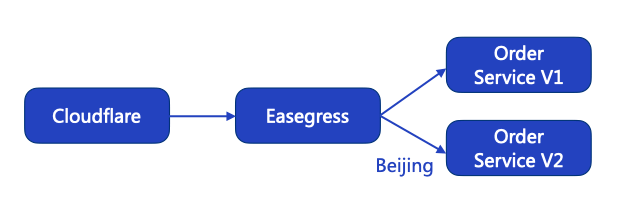
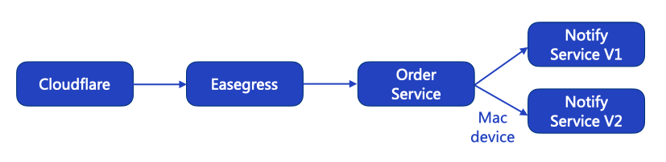
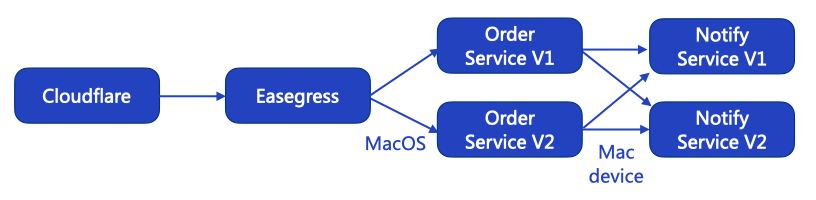

# Canary Release With Cloudflare <!-- omit from toc -->

- [Background](#background)
  - [Advantages](#advantages)
  - [Key point](#key-point)
- [Why use Easegress and Cloudflare](#why-use-easegress-and-cloudflare)
- [Based on geographic location](#based-on-geographic-location)
- [Based on user devices](#based-on-user-devices)
- [Based on user OS](#based-on-user-os)

## Background

A [canary release](https://martinfowler.com/bliki/CanaryRelease.html) is a software testing technique used to reduce the risk of introducing a new software version into production by gradually rolling out the change to a small subset of users, before rolling it out to the entire platform/infrastructure.

### Advantages

* **Service Evaluation**: You can evaluate multiple service versions side by side using canary release in real-world environments with actual users and use cases.
* **Zero downtime**: Canary release does not cause downtime
* **Simple Rollback Mechanism**: You can always easily roll back to the previous version.

### Key point

* **Traffic tagging**: To categorize traffic based on various business attributes such as **user devices**, **geographic locations**, or user attributes(e.g. age, gender, level, etc.), we can apply different labels or tags to the traffic. It's important to note that IP addresses should not be used as user tags as they can be inaccurate and inconsistent.
* **Traffic scheduling**: Once traffic is tagged, we can use traffic rules to schedule specific traffic to a designated Canary. For instance, traffic from an iPhone user in Beijing could be directed to a new version of a service.

## Why use Easegress and Cloudflare

* For traffic tagging, Using [Cloudflare](https://www.cloudflare.com/) we can easily label the traffic.
  - **Geographic Location**: Cloudflare offers a feature called [Managed Transforms](https://developers.cloudflare.com/rules/transform/managed-transforms/reference/), which can be used to identify the geographic location of a user.
  - **User Device**: Using [Workers](https://developers.cloudflare.com/workers/), we can extract information about the user's device, operating system, and web browser from the `User-Agent` field of the HTTP request.
  - **User's Customized Label**: Using Cloudflare [Rules](https://developers.cloudflare.com/rules/transform/request-header-modification/), it is easy to extract the user's customized business label from HTTP request headers (such as: Cookies, etc.)

- For traffic scheduling, Easegress can be used to route traffic to different canary releases.

## Based on geographic location



Suppose we run an e-Commerce service, and we recently upgraded our Order Service from version 1 to version 2. To ensure that our users have the best experience, we want to route the users who are accessing our service from Beijing to use the new Order service (version 2).

Download the latest Service code from [canary-case-1](https://github.com/megaease/easegress-canary-example/tree/main/case1)

**1. Traffic tagging**

To determine the geographic location of a user, we can leverage the `CF-IPCity` field in Cloudflare's HTTP header. We need to first enable the "Add visitor location headers" option in the Cloudflare dashboard.  (_Cloudflare Dashboard_ -> _Rules_ -> _Transform Rules_ -> _Managed Transforms_ -> [enabled “Add visitor location headers”](https://developers.cloudflare.com/rules/transform/managed-transforms/configure/) )

**2. Traffic scheduling rules:**

Save the following YAML code to `order-service.yaml` and make sure to replace the `servers` configuration with your own. 

```yaml
name: order-pipeline
kind: Pipeline
flow:
- filter: order-service
filters:
- name: order-service
  kind: Proxy
  pools:
  - servers:
    - url: http://0.0.0.0:5002  # new version
    filter:
      headers:
        cf-ipcity: # Cloudflare geographic location header
          exact: Beijing # the traffic from Beijing should be directed to the new version
  - servers:
    - url: http://0.0.0.0:5001  # old version
```

Then create the order pipeline with the command:

```bash
egctl create -f order-service.yaml
```

Save below YAML to `ecommerce-server.yaml`.

```yaml
kind: HTTPServer
name: ecommerce-server
port: 8888
https: false
keepAlive: true
keepAliveTimeout: 75s
maxConnection: 10240
cacheSize: 0
rules:
  - paths:
    - pathPrefix: /order
      backend: order-pipeline
    - pathPrefix: /notify
      backend: notify-pipeline
```

Then create the HTTP server with command:

```bash
egctl create -f ecommerce-server.yaml
```

Send a request to e-Commerce service:

```bash
curl http://127.0.0.1:8888/order -H "cf-ipcity: Beijing"
{"order_id":"5245000","role_id":"44312","order_status":1,"order_version":"v2"}

curl http://127.0.0.1:8888/order -H "cf-ipcity: Shanghai"
{"order_id":"5245000","role_id":"44312","order_status":1,"order_version":"v1"}
```

## Based on user devices



In real-world scenarios, services are usually interconnected and depend on each other to provide a seamless experience for the customer. In our case, we recently upgraded our Notify Service from version 1 to version 2. To ensure that our users have a holistic experience, we want to route users who are accessing our service from a Mac device to use the new version of our Notify Service (version 2).

Download the latest Service code from [canary-case-2](https://github.com/megaease/easegress-canary-example/tree/main/case2)

**1. Traffic tagging**

To determine the user's device and system, we can extract it from the `User-Agent` field in HTTP request by [Workers](https://developers.cloudflare.com/workers/).

We offer an easy way to parse `User-Agent` in [easegress-rust-uaparser](https://github.com/megaease/easegress-rust-uaparser) library. 

```bash
git clone https://github.com/megaease/easegress-rust-uaparser.git
```

Go to the `easegress-rust-uaparser/cloudflare` directory and deploy the worker by using the `wrangler` command.

```bash
npx wrangler publish
```

Go to the Cloudflare website configuration page and configure _Workers Routes_.

**2. Traffic scheduling rules**

Save the following YAML code to `order-service.yaml`, and make sure to replace the `servers` configuration with your own.

```yaml
name: order-pipeline
kind: Pipeline
flow:
- filter: order-service
filters:
- name: order-service
  kind: Proxy
  pools:
  - servers:
    - url: http://0.0.0.0:5003 # order service
```

Then update the order pipeline with the command:

```bash
egctl apply -f order-service.yaml
```

Save the following YAML code to `notify-service.yaml`, and make sure to replace the `servers` configuration with your own.

```yaml
name: notify-pipeline
kind: Pipeline
flow:
- filter: notify-service
filters:
- name: notify-service
  kind: Proxy
  pools:
  - servers:
    - url: http://0.0.0.0:5002  # new version
    filter:
      headers:
        x-ua-device:
          exact: Mac # the traffic from Mac device should be directed to the new version
  - servers:
    - url: http://0.0.0.0:5001  # old version
```

Then create the notify pipeline with the command:

```bash
egctl create -f notify-service.yaml
```

Send a request to e-Commerce service:

```bash
curl http://127.0.0.1:10080/ecommerce -H "user-agent:Mozilla/5.0 (Linux; Android 4.4.2; GT-I9505 Build/KOT49H) AppleWebKit/537.36 (KHTML, like Gecko) Chrome/37.0.2062.117 Mobile Safari/537.36"
{"order_id":"5245000","role_id":"44312","order_status":1,"order_version":"v2","notify_status":1,"notify_version":"v1"}

curl http://127.0.0.1:10080/ecommerce -H "user-agent:Mozilla/5.0 (Macintosh; Intel Mac OS X 10_15_7) AppleWebKit/537.36 (KHTML, like Gecko) Chrome/110.0.0.0 Safari/537.36"
{"order_id":"5245000","role_id":"44312","order_status":1,"order_version":"v2","notify_status":1,"notify_version":"v2"}
```

## Based on user OS



Suppose both the Order service and Notify service have been upgraded simultaneously. The user who is accessing our service from a MacOS should be routed to the new version of the Order service (v2), and from Mac device should be routed to the new version of the Notify service (v2).  

You may think Cloudflare's Workers is not suitable for your needs, there is another easy way to parse `User-Agent` with Easegress's WASM.

Download the latest Service code from [canary-case-3](https://github.com/megaease/easegress-canary-example/tree/main/case3)

**1. Traffic tagging**

Using Easegress's WASM to parse the `User-Agent`.  

Download `easegress-rust-uaparser`

```bash
git clone https://github.com/megaease/easegress-rust-uaparser.git
```

Go to the `easegress-rust-uaparser/binary` directory and just use the `easegress.wasm` file directly. It will parse the `User-Agent` and add the `x-ua-device` and `x-ua-os` headers to the HTTP request.

**2. Traffic scheduling rules**

Save the following YAML code to `order-service.yaml`, and make sure to replace the `servers` configuration and wasm file path with your own.

```yaml
name: order-pipeline
kind: Pipeline
flow:
- filter: wasm
- filter: order-service
filters:
- name: wasm # parse user-agent, add `x-ua-device` and `x-ua-os` headers to the HTTP request.
  kind: WasmHost
  maxConcurrency: 2
  code: /<Path>/easegress.wasm  # easegress.wasm file path
  timeout: 100ms
- name: order-service
  kind: Proxy
  pools:
  - servers:
    - url: http://0.0.0.0:5002 # new version of order service
    filter:
      headers:
        x-ua-os: # Easegress's user OS header
          exact: MacOS # the traffic from MacOS should be directed to the new version
  - servers:
    - url: http://0.0.0.0:5001 # old version of order service
```

Then update the order pipeline with the command:

```bash
egctl apply -f order-service.yaml
```

Send a request to e-Commerce service:

```bash
curl http://127.0.0.1:10080/ecommerce -H "user-agent:Mozilla/5.0 (Linux; Android 4.4.2; GT-I9505 Build/KOT49H) AppleWebKit/537.36 (KHTML, like Gecko) Chrome/37.0.2062.117 Mobile Safari/537.36"
{"order_id":"5245000","role_id":"44312","order_status":1,"order_version":"v1","notify_status":1,"notify_version":"v1"}

curl http://127.0.0.1:10080/ecommerce -H "user-agent:Mozilla/5.0 (Macintosh; Intel Mac OS X 10_15_7) AppleWebKit/537.36 (KHTML, like Gecko) Chrome/110.0.0.0 Safari/537.36"
{"order_id":"5245000","role_id":"44312","order_status":1,"order_version":"v2","notify_status":1,"notify_version":"v2"}
```
