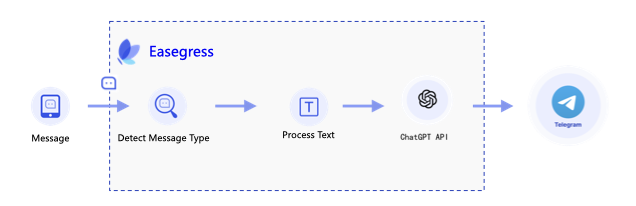

# Build A Telegram ChatGPT Bot With Easegress <!-- omit from toc -->


Before reading this article, please read the [Multiple API Orchestration](3.03.Multiple-API-Orchestration.md) article to ensure an understanding of Easegress API orchestration and Telegram bot.

In this article, we will introduce how to build a Telegram ChatGPT bot with Easegress. This bot can generate a response based on the user's input.

- [1. Prerequisites](#1-prerequisites)
- [2. How it works](#2-how-it-works)
- [3. Pipeline](#3-pipeline)
- [4. Filter](#4-filter)
  - [4.1 Backend Proxies](#41-backend-proxies)
  - [4.2 Check and Extract Text](#42-check-and-extract-text)
  - [4.3 Send Request to ChatGPT](#43-send-request-to-chatgpt)
  - [4.4 Send Reply Message to Telegram](#44-send-reply-message-to-telegram)
  - [4.5 Response](#45-response)
- [5. Deploy](#5-deploy)


## 1. Prerequisites

Since the bot needs to receive Telegram message notifications and call ChatGPT APIs, we must prepare the following in advance:

* Install the latest version of Easegress according to [this document](../01.Getting-Started/1.2.Install.md) and make sure that external applications can access the Easegress instance on at least one of ports 80, 88, 443, or 8443.
* Create a Telegram bot by following [this document](https://core.telegram.org/bots#3-how-do-i-create-a-bot), set its name (EaseChatGPTBot is used in this article), write down its token, and [set up a Webhook](https://core.telegram.org/bots/api#setwebhook) that points to the Easegress instance installed in the previous step. Our bot will receive notifications of new messages through this Webhook.
* Create a [OpenAI](https://openai.com/blog/openai-api/) account and write down its API key.

## 2. How it works

The diagram below shows the workflow of this bot:



Upon receiving a notification of a new message from the Telegram server via webhook, the bot first checks the message type. If it is a text message, then call the [ChatGPT API](https://openai.com/blog/openai-api/) and send the response to the user via Telegram.

## 3. Pipeline

First, let's check the overall flow of the Pipeline:

```yaml
name: chatgpt-pipeline
kind: Pipeline

flow:
# we put the final response builder at the top because Telegram requires
# us to return a response for every Request, but we only process some of
# the requests. If we put it at the end, the requests we don't process
# will end the process early and no Response will be returned.
- filter: buildFinalResponse

# check request type, only process text message
- filter: checkRequestType
  jumpIf:
    result0: processText
    "": END                              # ignore, end the processing

# process text message
- filter: requestBuilderExtractText
  alias: processText                     # alias of the filter
  namespace: extract                     # namespace the filter belongs to

# send to ChatGPT
- filter: requestBuilderChatGPT          # send request to ChatGPT
  alias: chatGPT
  namespace: gpt
- filter: proxyChatGPT
  namespace: gpt

# send reply message to Telegram
- filter: requestBuilderReply            # constructing a request to send the reply
  namespace: tg
- filter: proxyTelegram                  # send the request to Telegram
  namespace: tg
```

## 4. Filter

### 4.1 Backend Proxies

We need to create two proxies to send requests to the ChatGPT API server and the Telegram API server. The configuration of the two proxies is as follows:

```yaml
- name: proxyChatGPT
  kind: Proxy
  pools:
  - servers:
    - url: https://api.openai.com

- name: proxyTelegram
  kind: Proxy
  pools:
  - servers:
    - url: https://api.telegram.org
```

### 4.2 Check and Extract Text

The processing details are the same as that in [Multiple API Orchestration](../03.Advanced-Cookbook/3.03.Multiple-API-Orchestration.md).

```yaml
filters:
- kind: ResultBuilder
  name: checkRequestType
  template: |
    {{- $msg := or .requests.DEFAULT.JSONBody.message .requests.DEFAULT.JSONBody.channel_post -}}
    {{- if $msg.text}}result0{{end -}}

- kind: RequestBuilder
  name: requestBuilderExtractText
  template: |
    {{- $msg := or .requests.DEFAULT.JSONBody.message .requests.DEFAULT.JSONBody.channel_post -}}
    body: |
      {
         "exclude": true,
         "text": "{{$msg.text | jsonEscape}}"
      }
```

### 4.3 Send Request to ChatGPT

Build a request to send to ChatGPT. See more details in [OpenAI API](https://platform.openai.com/docs/guides/chat). Make sure to replace the `{Your OpenAI API Key}` with your own API key.

```yaml
- kind: RequestBuilder
  name: requestBuilderChatGPT
  template: |
    method: POST
    url: /v1/chat/completions
    headers:
      "Authorization": ["Bearer {Your OpenAI API Key}"]
      "Content-Type": ["application/json"]
    body: |
      {
         "model": "gpt-3.5-turbo",
         "messages": [{
            "role": "user",
            "content": "{{.requests.extract.JSONBody.text | jsonEscape}}"
         }]
      }
```

### 4.4 Send Reply Message to Telegram

Make sure to replace the `{YOUR BOT TOKEN}` with your own bot token.

```yaml
- kind: RequestBuilder
  name: requestBuilderReply
  template: |
    {{$msg := or .requests.DEFAULT.JSONBody.message .requests.DEFAULT.JSONBody.channel_post}}
    {{$resp := index .responses.gpt.JSONBody.choices 0}}
    method: POST
    # Please replace it with the url of your bot
    url: https://api.telegram.org/bot{YOUR BOT TOKEN}/sendMessage
    headers:
      "Content-Type": ["application/json"]
    body: |
      {
        "chat_id": {{$msg.chat.id}},
        "reply_to_message_id": {{$msg.message_id}},
        "text": "{{$resp.message.content | jsonEscape}}"
      }
```

### 4.5 Response

Telegram requires us to return a response for each request. Since we don't need to reply to messages via this response, we can simply set the status code to 200.

```yaml
kind: ResponseBuilder
name: buildFinalResponse
template: |
    statusCode: 200
```

## 5. Deploy

Once we have prepared the configuration file (can be downloaded [here](https://github.com/megaease/easegress/tree/main/example/chatgpt-bot)), we can deploy this Pipeline to Easegress (assuming the file name is `chatgpt-pipeline.yaml`) via the following command.

```bash
$ egctl create -f chatgpt-pipeline.yaml
```

Create a HTTPServer to receive the webhook from Telegram.

```bash
$ echo '
kind: HTTPServer
name: httpserver
port: 8443           # telegram requires the port to be 80, 88, 443 or 8443
https: true
autoCert: true       # please set it to false if you are not using an AutoCertManager
keepAlive: true
keepAliveTimeout: 75s
maxConnection: 10240
cacheSize: 0
rules:
- paths:
  - path: /chatgpt
    backend: chatgpt-pipeline' | egctl create -f -
```

Now, we can test the bot in the chat.
