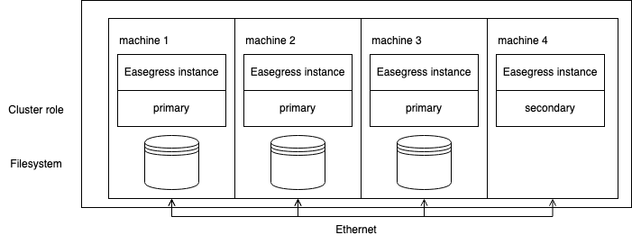
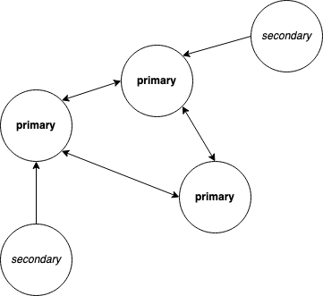

# Configuration & Cluster Deployment <!-- omit from toc -->

- [Background](#background)
- [Prerequisite](#prerequisite)
- [Deploy an Easegress Cluster Step by Step](#deploy-an-easegress-cluster-step-by-step)
  - [Add New Member](#add-new-member)
- [YAML Configuration](#yaml-configuration)
- [Configuration and Environment Variables](#configuration-and-environment-variables)
- [Configuration tips (optional)](#configuration-tips-optional)
- [References](#references)

## Background

When to deploy Easegress as a cluster?
- Your traffic is larger than one machine can handle
- You want to High-availability and minimize the service downtime
- You want to minimize latency on service peaks

It is easy to start multiple Easegress instances to form an Easegress cluster. This tutorial provides instructions on how to create a stand-alone Easegress cluster by starting multiple Easegress instances.

## Prerequisite

The following prerequisites are required for a successful deployment of the Easegress cluster.
- latest `easegress-server` and `egctl` binaries (run `make` in the root of the repository)
- successful creation of an Easegress pipeline (like the Hello World example in the README.md of the repository or any other chapter in [tutorial](../02.Tutorials/README.md) and [cookbook](../03.Advanced-Cookbook/README.md).
- few machines that are in the same network or otherwise accessible or Docker or other container technology. If you only have one machine, then you could use localhost as the host and modify the ports in the example.

## Deploy an Easegress Cluster Step by Step
The goal of this tutorial is to have following infrastructure running Easegress:

<p align="center">
  
</p>

- 4 machines connected
- each running Easegress instance
- 3 of Easegress instances have cluster role *primary* and one *secondary*

The difference between *primary* and *secondary* cluster roles is that *primary* persists the cluster state to disk, while *secondary* does not. The number of *secondary* Easegress instances can scale up and down, but the number of *primary* instances should be fixed.

Let's start by creating three Easegress instances with *primary* role. Add nodes private IPs to following environment variables:

```bash
export HOST1=<host1-IP>
export HOST2=<host2-IP>
export HOST3=<host3-IP>
export CLUSTER=machine-1=http://$HOST1:2380,machine-2=http://$HOST2:2380,machine-3=http://$HOST3:2380
```
`CLUSTER` environment variable now contains IP addresses of each member in the cluster. It will be the same for all members.

Set the environment variables to each machine. Start the first instance at the first machine
```bash
easegress-server \
  --cluster-name "multi-node-cluster" \
  --cluster-role "primary" \
  --name "machine-1" \
  --api-addr $HOST1:2381 \
  --initial-advertise-peer-urls http://$HOST1:2380 \
  --listen-peer-urls http://$HOST1:2380 \
  --listen-client-urls http://$HOST1:2379 \
  --advertise-client-urls http://$HOST1:2379 \
  --initial-cluster $CLUSTER
```

Here we define the basic information, like the name of the instance and the name of the cluster. Arguments `initial-advertise-peer-urls`,`listen-peer-urls`, `listen-client-urls` and `advertise-client-urls` are for communication with other peers (other primary cluster members). You can read more about them at the end of this tutorial, but for now, it's enough to notice that hostname for *machine-1* is `$HOST1`, which is the IP address of this machine.

Then start the second instance at machine 2

```bash
easegress-server \
  --cluster-name "multi-node-cluster" \
  --cluster-role "primary" \
  --name "machine-2" \
  --initial-advertise-peer-urls http://$HOST2:2380 \
  --listen-peer-urls http://$HOST2:2380 \
  --listen-client-urls http://$HOST2:2379 \
  --advertise-client-urls http://$HOST2:2379 \
  --initial-cluster $CLUSTER
```

and the last machine 3.

```bash
easegress-server \
  --cluster-name "multi-node-cluster" \
  --cluster-role "primary" \
  --name "machine-3" \
  --initial-advertise-peer-urls http://$HOST3:2380 \
  --listen-peer-urls http://$HOST3:2380 \
  --listen-client-urls http://$HOST3:2379 \
  --advertise-client-urls http://$HOST3:2379 \
  --initial-cluster $CLUSTER
```

Now you can list cluster members

```bash
egctl --server $HOST1:2381 get member 
```
should print something like
```bash
NAME              ROLE            AGE     STATE     API-ADDR     HEARTBEAT
machine-1         primary         10m     Leader    $HOST1:2381  3s ago
machine-2         primary         10m     Follower  $HOST2:2381  4s ago
machine-3         primary         10m     Follower  $HOST3:2381  2s ago
```

###  Add New Member

Let's add one more node with a *secondary* cluster role this time.

```bash
# on machine 4
easegress-server \
  --cluster-name "multi-node-cluster" \
  --cluster-role "secondary" \
  --name "machine-4" \
  --primary-listen-peer-urls http://$HOST1:2380 \
  --state-flag "existing"
```
Here `primary-listen-peer-urls` tell, where to find a *primary* cluster members and `state-flag` with value "existing" means that this cluster was already created.

We can now see also the 4th instance:
```bash
egctl --server $HOST1:2381 get member 
```
prints to output:
```bash
NAME              ROLE            AGE     STATE     API-ADDR     HEARTBEAT
machine-1         primary         10m     Leader    $HOST1:2381  3s ago
machine-2         primary         10m     Follower  $HOST2:2381  4s ago
machine-3         primary         10m     Follower  $HOST3:2381  2s ago
machine-4         secondary       2m      ""        $HOST1:2381  3s ago
```
Congratulations, you now have your Easegress instances running! You can now start applying resources to Easegress, like [httpserver](../02.Tutorials/2.2.HTTP-Proxy-Usage.md) or [pipeline](../02.Tutorials/2.3.Pipeline-Explained.md) for example.

You can also keep reading this tutorial to know more about YAML configuration of Easegress cluster instances or configuration tips.

## YAML Configuration

The examples above use the *easegress-server's* command-line flags, but often it is more convenient to define server parameters in a YAML configuration file. For example, store the following YAML to each host machine and change the host addresses accordingly.

```yaml
# create one yaml file for each host
name: machine-1 # machine-2, machine-3
cluster-name: cluster-test
cluster-role: primary
api-addr: localhost:2381
data-dir: ./data
wal-dir: ""
cpu-profile-file:
memory-profile-file:
log-dir: ./log
debug: false
cluster:
  listen-peer-urls: # change CURRENT-HOST to current host
   - http://<CURRENT-HOST>:2380
  listen-client-urls:
   - http://<CURRENT-HOST>:2379
  advertise-client-urls:
   - http://<CURRENT-HOST>:2379
  initial-advertise-peer-urls:
   - http://<CURRENT-HOST>:2380
  initial-cluster: # initial-cluster is same for every host
   - machine-1: http://<HOST-1>:2380
   - machine-2: http://<HOST-2>:2380
   - machine-3: http://<HOST-3>:2380
```
Then apply these values on each machine, using `config-file` command line argument:
`easegress-server --config-file config.yaml`.

The configuration file for adding a new secondary node looks like following:

```yaml
name: machine-4
cluster-name: cluster-test
cluster-role: secondary
data-dir: ./data
wal-dir: ""
cpu-profile-file:
memory-profile-file:
log-dir: ./log
debug: false
cluster:
  primary-listen-peer-urls:
   - http://$HOST1:2380
```

## Configuration and Environment Variables

In addition to deploying the easegress-server using command-line flags or a YAML file, you can also utilize environment variables. Below are all the available environment variables along with their corresponding flags.

```bash
# Human-readable name for this member.
EASEGRESS_NAME:                --name

# The labels for the instance of Easegress.
EASEGRESS_LABELS:              --labels

# Load server configuration from a file(yaml format), other command line flags will be ignored if specified.
EASEGRESS_CONFIG_FILE:         --config-file

# Force to create a new one-member cluster.
EASEGRESS_FORCE_NEW_CLUSTER:   --force-new-cluster

# Send an upgrade signal to the server based on the local pid file, then exit. The original server will start a graceful upgrade after signal received.
EASEGRESS_SIGNAL_UPGRADE:      --signal-upgrade

# Use standalone etcd instead of embedded.
EASEGRESS_USE_STANDALONE_ETCD: --use-standalone-etcd

# Human-readable name for the new cluster, ignored while joining an existed cluster.
EASEGRESS_CLUSTER_NAME:            --cluster-name

# Cluster role for this member (primary, secondary).
EASEGRESS_CLUSTER_ROLE:            --cluster-role

# Timeout to handle request in the cluster.
EASEGRESS_CLUSTER_REQUEST_TIMEOUT: --cluster-request-timeout

# List of URLs to listen on for cluster client traffic.
EASEGRESS_LISTEN_CLIENT_URLS:          --listen-client-urls

# List of URLs to listen on for cluster peer traffic.
EASEGRESS_LISTEN_PEER_URLS:            --listen-peer-urls

# List of this member's client URLs to advertise to the rest of the cluster.
EASEGRESS_ADVERTISE_CLIENT_URLS:       --advertise-client-urls

# List of this member's peer URLs to advertise to the rest of the cluster.
EASEGRESS_INITIAL_ADVERTISE_PEER_URLS: --initial-advertise-peer-urls

# List of (member name, URL) pairs that will form the cluster. E.g. primary-1=http://localhost:2380.
EASEGRESS_INITIAL_CLUSTER:             --initial-cluster

# Cluster state (new, existing)
EASEGRESS_STATE_FLAG:                  --state-flag

# List of peer URLs of primary members. Define this only, when cluster-role is secondary.
EASEGRESS_PRIMARY_LISTEN_PEER_URLS:    --primary-listen-peer-urls

# Maximum size in bytes for cluster synchronization messages.
EASEGRESS_MAX_CALL_SEND_MSG_SIZE:      --max-call-send-msg-size

# Address([host]:port) to listen on for administration traffic.
EASEGRESS_API_ADDR:                    --api-addr

# Flag to use secure transport protocol(https).
EASEGRESS_TLS:                         --tls

# Flag to set the certificate file for https.
EASEGRESS_CERT_FILE:                   --cert-file

# Flag to set the private key file for https.
EASEGRESS_KEY_FILE:                    --key-file

# Flag to set lowest log level from INFO downgrade DEBUG.
EASEGRESS_DEBUG:                       --debug

# Flag to set whether to disable access logs
EASEGRESS_DISABLE_ACCESS:              --disable-access

# The time interval to dump running objects config, for example: 30m
EASEGRESS_OBJECTS_DUMP_INTERVAL:       --objects-dump-interval

# List of configuration files for initial objects, these objects will be created at startup if not already exist.
EASEGRESS_INITIAL_OBJECT_CONFIG_FILES: --initial-object-config-files

# Path to the home directory.
EASEGRESS_HOME_DIR:   --home-dir

# Path to the data directory.
EASEGRESS_DATA_DIR:   --data-dir

# Path to the WAL directory.
EASEGRESS_WAL_DIR:    --wal-dir

# Path to the log directory.
EASEGRESS_LOG_DIR:    --log-dir

# Path to the member directory.
EASEGRESS_MEMBER_DIR: --member-dir

# Path to the CPU profile file.
EASEGRESS_CPU_PROFILE_FILE:             --cpu-profile-file

# Path to the memory profile file.
EASEGRESS_MEMORY_PROFILE_FILE:          --memory-profile-file

# Number of object statuses to update at maximum in one transaction.
EASEGRESS_STATUS_UPDATE_MAX_BATCH_SIZE: --status-update-max-batch-size
```

## Configuration tips (optional)

*What is a good size for the cluster?*

It is a good practice to choose an odd number (1,3,5,7,9) of *primary* nodes, to tolerate failures of *primary* nodes. This way the cluster can stay in a healthy state, even if the network partitions. With an even number of *primary* nodes, the cluster can be divided into two groups of equal size due to network partition. Then neither of the sub-clusters have the majority required for consensus. However, with the odd number of *primary* nodes, the cluster cannot be divided into two groups of equal size and this problem cannot occur.

For the *secondary* nodes, there are no constraints for the number of nodes. Secondary nodes do not participate consensus vote of the cluster, so their failure does not affect the cluster health. Adding more (*secondary*) nodes does still increase the communication between nodes.

 *Can a number of primary members scale up?*

Please note that it is not recommended to add additional node with `primary` cluster role, but `primary` nodes should be started at cluster start up. When scaling up the cluster, it is recommended to add and remove `secondary` cluster members.

*What are `advertise-peer-urls` and `listen-client-urls`?*

`advertise-client-urls`, `listen-client-urls`, `listen-peer-urls` and `initial-advertise-peer-urls` are arguments necessary for *primary* cluster members to communicate with other peers (members).

| argument   |  description  |
|-----|-----|
| advertise-client-urls | client URLs member advertises to the rest of the cluster |
| listen-client-urls | URLs that member listens for client traffic |
| listen-peer-urls | URLs that member listens for peer (other *primary* members) traffic  |
| initial-advertise-peer-urls | peer (other *primary* members) URLs member advertises to the rest of the cluster |

These arguments are used for [etcd](https://etcd.io) server and client configuration. You can read more about them in etcd documentation.

*Why *primary* member needs more arguments than *secondary* member ?*

Here's a drawing that illustrates the difference.

<p align="center">
  
</p>

*Primary* members need to synchronize with peers (other *primary* members). Meanwhile *secondary* can read and update the state through one *primary* member.

*How are etcd server and Easegress primary member related?*

Easegress uses [etcd](https://etcd.io) distributed key-value store to synchronize the cluster state. The primary and secondary cluster roles have the following relation with `etcd`:

| Easegress cluster role   | primary   | secondary   |
|-----|-----|-----|
| etcd term | server | client |

*Primary* member uses etcd server for cluster communication, while *secondary* member uses etcd client for this.


## References

1. https://en.wikipedia.org/wiki/High-availability_cluster
2. https://en.wikipedia.org/wiki/Raft_(algorithm)
3. https://etcd.io/docs/v3.5/faq/
