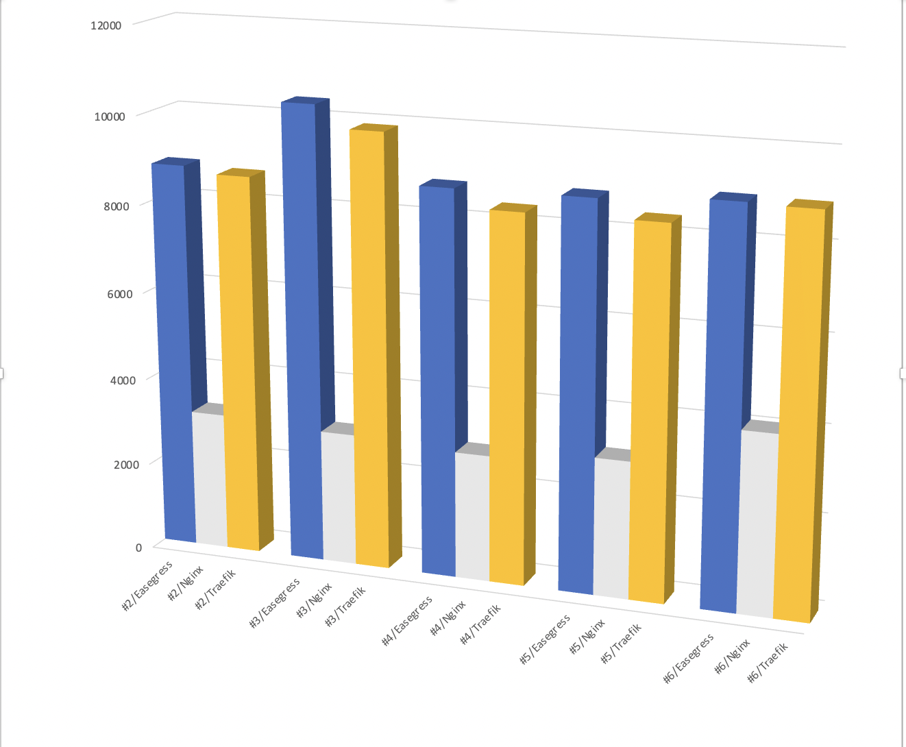
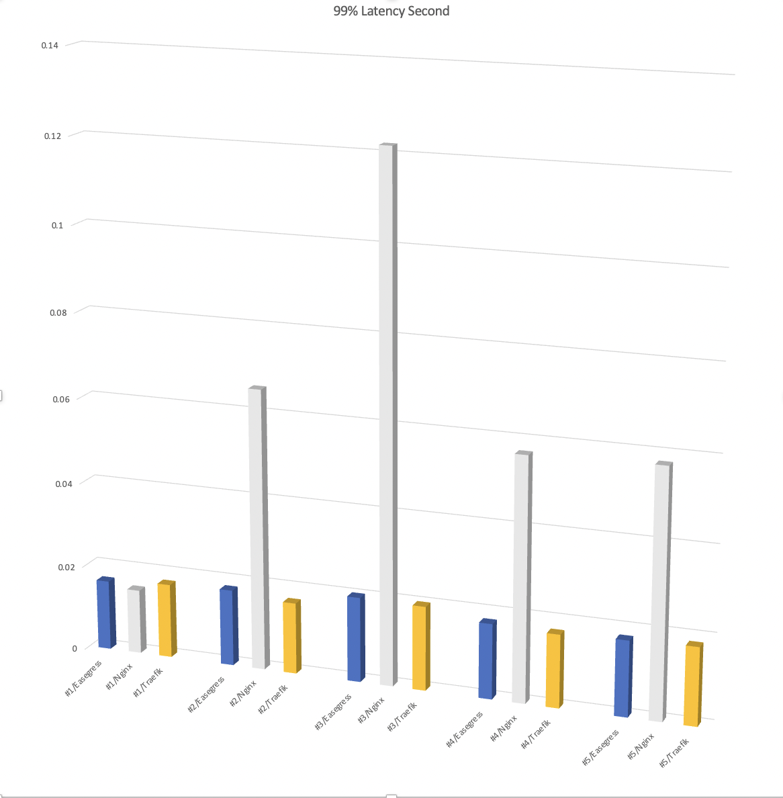

# Benchmark <!-- omit from toc -->

- [Preparing](#preparing)
  - [Environment and Topology](#environment-and-topology)
  - [Configuration](#configuration)
- [Testing](#testing)
  - [Baseline test](#baseline-test)
  - [Stress test](#stress-test)
- [Summary](#summary)
  - [RPS/P99 Latency comparing](#rpsp99-latency-comparing)
  - [Ubuntu system status](#ubuntu-system-status)
- [Benchmark Linux vs Windows](#benchmark-linux-vs-windows)
  - [Result Summary](#result-summary)
  - [Hardware and Topology](#hardware-and-topology)
  - [Software](#software)
  - [Test script](#test-script)
  - [RAW Data](#raw-data)
    - [loader -\> upstream](#loader---upstream)
    - [loader -\> linux Easegress build](#loader---linux-easegress-build)
    - [loader -\> Windows Easegress build](#loader---windows-easegress-build)
  - [loader -\> NGINX proxy](#loader---nginx-proxy)
- [References](#references)


**Background**: Easegress is commonly used in Traffic Gateway and API Gateway scenarios. This benchmark aims to indicate the performance level of Easegress as Traffic Gateway.

## Preparing
### Environment and Topology
1. **Baremetal**: AWS r5.xlarge X 3 (4core/32GB memory/100GB disk/Up to 10 Gigabit bandwidth) 
2. Operation system 
``` bash
Linux vmname 5.4.0-1029-aws #30-Ubuntu SMP Tue Oct 20 10:06:38 UTC 2020 x86_64 x86_64 x86_64 GNU/Linux`


```


| Name        | port  | vm   | version              |
| ----------- | ----- | ---- | -------------------- |
| Easegress   | 10080 | vm01 | 1.0.1(golang 1.16.5) |
| NGINX       | 8080  | vm01 | 1.18.0               |
| Traefik     | 8081  | vm01 | 2.4.9(golang 1.16.5) |
| Echo-server | 9095  | vm03 | (golang1.16.5)       |
| hey         | -     | vm02 | v0.1.4               |

``` plain 

   +----------------+                          +---------------+  
   |                |                          |               |  
   |    vm01        |<------stress test--------+     vm02      |
   | (Easegress     |                          | (Testtool:hey)|
   | /Traefik/NGINX)|<------baseline test------+               |
   |                |                          |               |
   +----------------+------+                   +---------+-----+
                           |                             | 
                         stress test            echo svr base line test 
   +----------------+      |                             | 
   |                |      |                             |
   |    vm03        |      |                             |
   | (Echo HTTPSvr) |<-----+                             |
   |                |<-----------------------------------+
   |                | 
   +----------------+ 

```

### Configuration
**NGINX**

```bash

user www-data;
worker_processes auto;
pid /run/nginx.pid;
include /etc/nginx/modules-enabled/*.conf;

events {
	worker_connections 768;
	# multi_accept on;
}

http {

	##
	# Basic Settings
	##

	sendfile on;
	tcp_nopush on;
	tcp_nodelay on;
	keepalive_timeout 65;
	types_hash_max_size 2048;
	# server_tokens off;

	# server_names_hash_bucket_size 64;
	# server_name_in_redirect off;

	include /etc/nginx/mime.types;
	default_type application/octet-stream;

	##
	# SSL Settings
	##

	ssl_protocols TLSv1 TLSv1.1 TLSv1.2 TLSv1.3; # Dropping SSLv3, ref: POODLE
	ssl_prefer_server_ciphers on;

	##
	# Logging Settings
	##

	access_log /var/log/nginx/access.log;
	error_log /var/log/nginx/error.log;

	##
	# Gzip Settings
	##

	gzip on;

	##
	# Virtual Host Configs
	##

	include /etc/nginx/conf.d/*.conf;
	include /etc/nginx/sites-enabled/*;
}

server {
    listen       8080;
    server_name  localhost;


    location /pipeline {
        proxy_pass     http://${echo_svr_ip}:9095;
        keepalive_timeout  60;
    }
}
```

**Easegress**
1. Easegress config
``` yaml
name: member-001
cluster-name: cluster-test
cluster-role: primary
cluster-client-url: http://127.0.0.1:2379
cluster-peer-url: http://127.0.0.1:2380
cluster-join-urls:
api-addr: 127.0.0.1:2381
data-dir: ./data
wal-dir: ""
cpu-profile-file:
memory-profile-file:
log-dir: ./log
member-dir: ./member
debug: false
```

2.HTTPServer+Pipeline

``` yaml
- filters:
  - kind: Proxy
    mainPool:
      loadBalance:
        policy: roundRobin
      servers:
      - url: http://${echo_server_ip}:9095
    name: proxy
  flow:
  - filter: proxy
    jumpIf: {}
  kind: HTTPPipeline
  name: pipeline-demo

- http3: false
  https: false
  keepAlive: true
  keepAliveTimeout: 60s
  kind: HTTPServer
  maxConnections: 10240
  name: server-demo
  port: 10080
  rules:
  - host: ""
    hostRegexp: ""
    paths:
    - backend: pipeline-demo
      headers: []
      pathPrefix: /pipeline
      rewriteTarget: ""
```

3. HTTPPipeline for baseline
* In order to compare with NGINX's index.html API. The Pipeline uses ResponseAdaptor to reply an NGINX' index.html like response.(Yeah, replace `nginx` with `easegress` already)

``` yaml
name: pipeline-demo
kind: HTTPPipeline
flow:
  - filter: rsp
filters:
  - name: rsp
    kind: ResponseAdaptor
    header:
      del:
      set:
      add:
    body: >+
      <!DOCTYPE html>
      <html>
      <head>
      <title>Welcome to easegress!</title>
      <style>
          body {
            width: 35em;
            margin: 0 auto;
            font-family: Tahoma, Verdana, Arial, sans-serif;
          }
      </style>
      </head>
      <body>
      <h1>Welcome to easegress!</h1>
      <p>If you see this page, the easegress web server is successfully installed and working. Further configuration is required.</p>

      <p>For online documentation and support please refer to <a href="http://easegress.org/">easegress.org</a>.<br/> Commercial support is available at <a href="http://easegress.com/">easegress.com</a>.</p>
      <p><em>Thank you for using easegress.</em></p>
      </body>
      </html>
```

**Traefik**
1. Running binary directly with command `./traefik -c ./traefik.yml` [1]
2. Static config: traefik.yaml
``` yaml 
log:
  level: INFO

entryPoints:
  web:
    address: ":8081"

providers:
  file:
    filename: /${file_path}/dynamic_conf.yml

```
3. Dynamic config: dynamic_conf.yml
``` yaml
http:
  routers:
    my-router:
      rule: "PathPrefix(`/pipeline`)"
      service: foo
      entryPoints:
      - web

  services:
    foo:
      loadBalancer:
        servers:
        - url: "http://${echo_server_ip}:9095"
```

**Echo Server**
1. [Source code](https://github.com/megaease/easegress/tree/main/example/backend-service/mirror)
2. Its logic is accepting HTTP request and printing to the console, in this testing, we only use `9095` port.


## Testing 
### Baseline test
1. **Echo-server**
* Loading echo-server directly from `vm02` to `vm03`
* **Scenario 1**: 50 concurrency/900 requests/2 miniutes limitation/not QPS limitation

``` bash

./hey -n 900   -c 50  -m GET http://${vm03_ip}:9095/pipeline

```

* **Scenario 2**: 100 concurrency/90000 requests/2 miniutes limitation/not QPS limitation
``` bash

./hey -n 90000  -c 100  -m GET http://${vm03_ip}:9095/pipeline

```

* **Scenario 3**: 120 concurrency/90000 requests/ 2 miniutes limitation/not QPS limitation

``` bash

./hey -n 90000  -c 120  -m GET http://${vm03_ip}:9095/pipeline

```

| Scenario | Total | Slowest | Fastest | Average | RPS   | 90% Latency | 95% Latency | 99% Latency | load average(top -c ) |
| -------- | ----- | ------- | ------- | ------- | ----- | ----------- | ----------- | ----------- | --------------------- |
| #1       | 0.19s | 0.015s  | 0.0103s | 0.0109s | 4517  | 0.0119s     | 0.0126s     | 0.0144s     | 0/0/0                 |
| #2       | 9.88s | 0.054s  | 0.0101s | 0.0109s | 9109  | 0.0118s     | 0.0124s     | 0.0138s     | 0.96/0.42/0.19        |
| #3       | 8.48s | 0.042s  | 0.0101s | 0.0110s | 10768 | 0.0122s     | 0.0129s     | 0.0149s     | 1.34/0.46/0.20        |


2. **NGINX**
* Loading NGINX's `index.html` url, from `vm02` to `vm01`.

* **Scenario 1**: 100 concurrency/90000 requests

``` bash

./hey -n 90000   -c 100  -m GET ${vm01}:8080/index.html  

```

| Scenario | Total | Slowest | Fastest | Average | RPS   | 90% Latency | 95% Latency | 99% Latency | load average(top -c ) |
| -------- | ----- | ------- | ------- | ------- | ----- | ----------- | ----------- | ----------- | --------------------- |
| #1       | 2.97s | 0.062s  | 0.0001s | 0.0032s | 30694 | 0.0064s     | 0.0082s     | 0.0120s     | 1.62/1.32/1.18        |


3. **Easegress**
* Loading Easegres' NGINX-index.html-like pipeline. from `vm02` to `vm01`.

``` bash

./hey -n 90000   -c 100  -m GET ${vm01}:10080/pipeline 

```

| Scenario | Total | Slowest | Fastest | Average | RPS   | 90% Latency | 95% Latency | 99% Latency | load average(top -c ) |
| -------- | ----- | ------- | ------- | ------- | ----- | ----------- | ----------- | ----------- | --------------------- |
| #1       | 1.8s  | 0.045s  | 0.0001s | 0.0020s | 49749 | 0.0039s     | 0.0051s     | 0.0122s     | 1.00/1.02/1.07        |

### Stress test
* Scenario 1: 50 concurrency/900 requests/2 miniutes limitation/not QPS limitation

``` bash

./hey -n 900   -c 50  -m GET http://${vm01_ip}:10080/pipeline   # Easegress
./hey -n 900   -c 50  -m GET http://${vm01_ip}:8080/pipeline    # NGINX
./hey -n 900   -c 50  -m GET http://${vm01_ip}:8081/pipeline    # Traefik 

```

* Scenario 2: 100 concurrency/90000 requests/2 miniutes limitation/not QPS limitation

``` bash

./hey -n 90000    -c 100  -m GET http://${vm01_ip}:10080/pipeline    # Easegress
./hey -n 90000    -c 100  -m GET http://${vm01_ip}:8080/pipeline     # NGINX
./hey -n 90000    -c 100  -m GET http://${vm01_ip}:8081/pipeline     # Traefik

```

* Scenario 3: 120 concurrency/90000 requests/ 2 miniutes limitation/not QPS limitation

``` bash

./hey -n 90000    -c 120  -m GET http://${vm01_ip}:10080/pipeline  # Easegress
./hey -n 90000    -c 120  -m GET http://${vm01_ip}:8080/pipeline   # NGINX
./hey -n 90000    -c 120  -m GET http://${vm01_ip}:8081/pipeline   # Traefik

```

* Scenario 4: 100 concurrency/900000 requests/5 miniutes limitation/not QPS limitation

``` bash

./hey -n 900000   -c 100  -m GET http://${vm01_ip}:10080/pipeline    # Easegress
./hey -n 900000   -c 100  -m GET http://${vm01_ip}:8080/pipeline     # NGINX
./hey -n 900000   -c 100  -m GET http://${vm01_ip}:8081/pipeline     # Traefik

```

* Scenario 5: 50 concurrency/ 90000 requests/2 miniutes limitation/not QPS limitation/with body `100000000000000000000000000000`

`100000000000000000000000000000` contains 30 characters which is 240 bytes, the HTTP request body length average is `from ~200 bytes to over 2KB`. [1]


``` bash

./hey -n 90000   -c 100  -m GET http://${vm01_ip}:10080/pipeline -d '100000000000000000000000000000' # Easegress
./hey -n 90000   -c 100  -m GET http://${vm01_ip}:8080/pipeline -d '100000000000000000000000000000'  # NGINX
./hey -n 90000   -c 100  -m GET http://${vm01_ip}:8081/pipeline -d '100000000000000000000000000000'  # Traefik

```

* Scenario 6: 100 concurrency/ 90000 requests/2 miniutes limitation/not QPS limitation/with body `100000000000000000000000000000`
`1000000000000010000000000000100000000000001000000000000010000000000000100000000000001000000000000010000000000000100000000000000000` contains 130 characters which is 1040 bytes, nearly 1KB.

``` bash

./hey -n 90000   -c 100  -m GET http://${vm01_ip}:10080/pipeline -d '100000000000000000000000000000 1000000000000010000000000000100000000000001000000000000010000000000000100000000000001000000000000010000000000000100000000000000000'    # Easegress
./hey -n 90000   -c 100  -m GET http://${vm01_ip}:8080/pipeline -d '100000000000000000000000000000 1000000000000010000000000000100000000000001000000000000010000000000000100000000000001000000000000010000000000000100000000000000000'    # NGINX
./hey -n 90000   -c 100  -m GET http://${vm01_ip}:8081/pipeline -d '100000000000000000000000000000 1000000000000010000000000000100000000000001000000000000010000000000000100000000000001000000000000010000000000000100000000000000000'    # Traefik

```

| Scenario/Product | Total | Slowest | Fastest | Average | RPS   | 90% Latency | 95% Latency | 99% Latency | load average(top -c ) |
| ---------------- | ----- | ------- | ------- | ------- | ----- | ----------- | ----------- | ----------- | --------------------- |
| #1/Easegress     | 0.2s  | 0.017s  | 0.0104s | 0.0113s | 4312  | 0.0125s     | 0.0140s     | 0.0164s     | 0/0/0                 |
| #1/NGINX         | 0.2s  | 0.015s  | 0.0104s | 0.0112s | 4383  | 0.0124s     | 0.0135s     | 0.0151s     | 0/0/0                 |
| #1/Traefik       | 0.2s  | 0.018s  | 0.0104s | 0.0113s | 4320  | 0.0123s     | 0.0133s     | 0.0174s     | 0/0/0                 |
| #2/Easegress     | 10s   | 0.035s  | 0.0103s | 0.0113s | 8826  | 0.0124s     | 0.0136s     | 0.0179s     | 0.34/0.10/0.03        |
| #2/NGINX         | 28s   | 0.095s  | 0.0103s | 0.0308s | 3146  | 0.0468s     | 0.0500s     | 0.0657s     | 1.37/0.35/0.11        |
| #2/Traefik       | 10s   | 0.051s  | 0.0103s | 0.0114s | 8685  | 0.0129      | 0.0139s     | 0.0167s     | 0.34/0.27/0.10        |
| #3/Easegress     | 8s    | 0.040s  | 0.0103s | 0.0114s | 10391 | 0.0129s     | 0.0145s     | 0.0199s     | 0.62/0.25/0.12        |
| #3/NGINX         | 29s   | 0.133s  | 0.0103s | 0.0373s | 3022  | 0.0614s     | 0.0607s     | 0.122s      | 1.42/0.46/0.20        |
| #3/Traefik       | 9s    | 0.011s  | 0.0103s | 0.0120s | 9892  | 0.0143s     | 0.0158s     | 0.0197s     | 0.40/0.21/0.15        |
| #4/Easegress     | 102s  | 1.515s  | 0.0103s | 0.0114s | 8775  | 0.0123s     | 0.0134s     | 0.0176s     | 2.52/0.94/0.42        |
| #4/NGINX         | 311s  | 1.112s  | 0.0103s | 0.0343s | 2893  | 0.0484s     | 0.0513s     | 0.0569s     | 3.93/2.65/1.33        |
| #4/Traefik       | 107s  | 1.394s  | 0.0103s | 0.0119s | 8371  | 0.0133s     | 0.0144s     | 0.0171s     | 0.95/0.37/0.37        |
| #5/Easegress     | 10s   | 0.059s  | 0.0103s | 0.0113s | 8797  | 0.0124s     | 0.0134s     | 0.0177s     | 0.27/0.23/0.31        |
| #5/NGINX         | 28s   | 0.086s  | 0.0103s | 0.0311s | 3130  | 0.0481s     | 0.0510s     | 0.0577s     | 1.25/0.45/0.37        |
| #5/Traefik       | 10s   | 0.172s  | 0.0103s | 0.0118s | 8393  | 0.0136s     | 0.0149s     | 0.0182s     | 0.68/0.44/0.36        |
| #6/Easegress     | 10s   | 0.079s  | 0.0103s | 0.0111s | 8950  | 0.0117s     | 0.0121s     | 0.0147s     | 1.09/1.05/1.08        |
| #6/NGINX         | 21s   | 0.139s  | 0.0103s | 0.0233s | 4095  | 0.0526s     | 0.0644s     | 0.0891s     | 1.25/0.45/0.37        |
| #6/Traefik       | 10s   | 0.063s  | 0.0103s | 0.0112s | 8916  | 0.0119s     | 0.0124s     | 0.0151s     | 1.63, 1.18, 1.11      |

## Summary
### RPS/P99 Latency comparing
1. RPS 


2. P99 Latency 


 

### Ubuntu system status 
* In Scenario #4

**Easegress**

``` bash
top - 12:39:23 up 1 day, 22:36,  1 user,  load average: 1.71, 0.83, 0.51
Tasks: 130 total,   1 running, 129 sleeping,   0 stopped,   0 zombie
%Cpu0  : 29.2 us,  7.8 sy,  0.0 ni, 60.1 id,  0.0 wa,  0.0 hi,  2.8 si,  0.0 st
%Cpu1  : 32.1 us,  7.3 sy,  0.0 ni, 58.5 id,  0.0 wa,  0.0 hi,  2.1 si,  0.0 st
%Cpu2  : 30.1 us,  7.0 sy,  0.0 ni, 58.7 id,  0.0 wa,  0.0 hi,  4.2 si,  0.0 st
%Cpu3  : 30.4 us,  8.9 sy,  0.0 ni, 57.7 id,  0.0 wa,  0.0 hi,  3.1 si,  0.0 st
MiB Mem :  31654.1 total,  20964.3 free,    548.4 used,  10141.3 buff/cache
MiB Swap:      0.0 total,      0.0 free,      0.0 used.  30652.3 avail Mem 

    PID USER      PR  NI    VIRT    RES    SHR S  %CPU  %MEM     TIME+ COMMAND                                                                             
  34028 root      20   0  836680 144760  44128 S 172.0   0.4  17:49.58 /home/ubuntu/easegress-stresstest/bin/easegress-server --config-file /home/ubuntu/e+
    491 root      20   0   81896   3748   3436 S   0.3   0.0   0:02.89 /usr/sbi         
```

**NGINX**

``` bash
top - 12:40:33 up 1 day, 22:37,  1 user,  load average: 2.30, 1.10, 0.62
Tasks: 130 total,   6 running, 124 sleeping,   0 stopped,   0 zombie
%Cpu0  :  1.0 us, 95.7 sy,  0.0 ni,  0.0 id,  0.0 wa,  0.0 hi,  3.3 si,  0.0 st
%Cpu1  :  2.0 us, 95.0 sy,  0.0 ni,  0.0 id,  0.0 wa,  0.0 hi,  3.0 si,  0.0 st
%Cpu2  :  2.0 us, 95.7 sy,  0.0 ni,  0.0 id,  0.0 wa,  0.0 hi,  2.3 si,  0.0 st
%Cpu3  :  1.3 us, 96.3 sy,  0.0 ni,  0.0 id,  0.0 wa,  0.0 hi,  2.3 si,  0.0 st
MiB Mem :  31654.1 total,  20936.9 free,    564.7 used,  10152.5 buff/cache
MiB Swap:      0.0 total,      0.0 free,      0.0 used.  30636.0 avail Mem 

    PID USER      PR  NI    VIRT    RES    SHR S  %CPU  %MEM     TIME+ COMMAND                                                                             
  33301 www-data  20   0   56144   6296   4212 R 100.0   0.0  13:02.18 nginx: worker process                                                               
  33298 www-data  20   0   56448   6600   4212 R  99.7   0.0  13:35.58 nginx: worker process                                                               
  33302 www-data  20   0   56144   6296   4212 R  99.7   0.0  13:12.51 nginx: worker process                                                               
  33299 www-data  20   0   56124   6408   4212 R  99.3   0.0  13:22.12 nginx: worker process  
```

**Traefik**

``` bash
top - 12:41:53 up 1 day, 22:38,  1 user,  load average: 2.43, 1.45, 0.79
Tasks: 130 total,   1 running, 129 sleeping,   0 stopped,   0 zombie
%Cpu0  :  0.4 us, 10.8 sy, 21.9 ni, 65.2 id,  0.0 wa,  0.0 hi,  1.8 si,  0.0 st
%Cpu1  :  0.0 us, 10.3 sy, 23.5 ni, 64.1 id,  0.0 wa,  0.0 hi,  2.1 si,  0.0 st
%Cpu2  :  0.0 us, 10.7 sy, 21.4 ni, 66.4 id,  0.0 wa,  0.0 hi,  1.5 si,  0.0 st
%Cpu3  :  0.4 us, 10.1 sy, 21.9 ni, 64.7 id,  0.0 wa,  0.0 hi,  2.9 si,  0.0 st
MiB Mem :  31654.1 total,  20901.3 free,    591.5 used,  10161.3 buff/cache
MiB Swap:      0.0 total,      0.0 free,      0.0 used.  30609.3 avail Mem 

    PID USER      PR  NI    VIRT    RES    SHR S  %CPU  %MEM     TIME+ COMMAND                                                                             
  63509 root      25   5  789068  96656  44852 S 153.5   0.3   4:10.48 ./traefik -c traefik.yml  
```

1. NGINX processes use most time in system mode, may due to the context switch between kernel mode and user mode. 
2. Easegress/Traefik uses goroutine user-space scheduling for avoding heavy context switching cost.

## Benchmark Linux vs Windows

The test is based on <https://www.nginx.com/blog/nginx-plus-sizing-guide-how-we-tested/> comparing Linux, Windows version Esagress.

### Result Summary
 
 * loader -> upstream: AVG RPS 10491.82
 * loader -> linux Easegress: AVG RPS 3187.94 (30.38% of raw)
 * loader -> Windows Easegress: 3484.75 (33.21% of raw), _note: 2 Non-2xx or 3xx responses_
 * loader -> NGINX proxy: AVG RPS 2313.15 (22.04% of raw)

### Hardware and Topology

To minimize the factors, 5 Azure VMs, with SKU [Standard D8s v3 (8 vcpus, 32 GiB memory)](https://docs.microsoft.com/en-us/azure/virtual-machines/dv3-dsv3-series), in same VNet were divided into 5 roles:

 * upstream: a NGINX act as server
 * eg: linux build of Easegress
 * egwin: windows build of Easegress
 * ngx: a NGINX proxy to upstream for baseline
 * loader: wrt to generate load to 


### Software 
 
 Easegress build with Go 1.16.6 @ `d2e5887` <https://github.com/megaease/easegress/pull/74>

 * upstream: Ubuntu 20.04.2, NGINX 1.18.0-0ubuntu1.2

   default config with 1kb file

   `/var/www/html$ dd if=/dev/random of=1kb.bin bs=1KB count=1`

 * eg: Ubuntu 20.04.2
 * egwin: Windws 2019 Server Core [10.0.17763.2061]

   config:
   
   ```
   kind: HTTPServer
   name: server-demo
   port: 10080
   keepAlive: true
   https: false
   rules:
     - paths:
       - pathPrefix: /
         backend: pipeline-demo

   name: pipeline-demo
   kind: HTTPPipeline
   flow:
     - filter: proxy
   filters:
     - name: proxy
       kind: Proxy
       mainPool:
         servers:
         - url: http://172.18.0.4/
         loadBalance:
           policy: roundRobin
   ```

 * ngx: Ubuntu 20.04.2, NGINX 1.18.0-0ubuntu1.2

   default config with `proxy_pass http://upstream/;`

 * loader: Ubuntu 20.04.2, wrt @ `a211dd`, gcc version 9.3.0

### Test script

Same as NGINX blog

```
for i in `seq 1 number-of-CPUs`; do
    taskset -c $i wrk -t 1 -c 50 -d 180s http://Reverse-Proxy-Server-IP-address/1kb.bin &
done
```

### RAW Data

#### loader -> upstream 

<details>
  <summary>run 3 x 3mins at ~avg RPS 10491.82952</summary>
  
Round 0

```
Running 3m test @ http://172.18.0.4/1kb.bin
  1 threads and 50 connections
  Thread Stats   Avg      Stdev     Max   +/- Stdev
    Latency     4.75ms    4.74ms 238.13ms   98.96%
    Req/Sec    10.94k   705.24    14.53k    80.10%
  1959529 requests in 3.00m, 2.30GB read
Requests/sec:  10885.13
Transfer/sec:     13.11MB
Running 3m test @ http://172.18.0.4/1kb.bin
  1 threads and 50 connections
  Thread Stats   Avg      Stdev     Max   +/- Stdev
    Latency     4.77ms    4.73ms 238.03ms   98.96%
    Req/Sec    10.89k   698.26    14.57k    79.16%
  1950014 requests in 3.00m, 2.29GB read
Requests/sec:  10831.33
Transfer/sec:     13.05MB
Running 3m test @ http://172.18.0.4/1kb.bin
  1 threads and 50 connections
  Thread Stats   Avg      Stdev     Max   +/- Stdev
    Latency     4.77ms    4.77ms 238.18ms   98.97%
    Req/Sec    10.89k   685.14    14.67k    80.93%
  1950506 requests in 3.00m, 2.29GB read
Requests/sec:  10834.33
Transfer/sec:     13.05MB
Running 3m test @ http://172.18.0.4/1kb.bin
  1 threads and 50 connections
  Thread Stats   Avg      Stdev     Max   +/- Stdev
    Latency     4.76ms    4.75ms 238.14ms   98.98%
    Req/Sec    10.90k   689.93    14.76k    80.60%
  1952338 requests in 3.00m, 2.30GB read
Requests/sec:  10845.12
Transfer/sec:     13.06MB
Running 3m test @ http://172.18.0.4/1kb.bin
  1 threads and 50 connections
  Thread Stats   Avg      Stdev     Max   +/- Stdev
    Latency     4.80ms    4.80ms 238.26ms   98.94%
    Req/Sec    10.79k   726.81    23.26k    82.88%
  1932326 requests in 3.00m, 2.27GB read
Requests/sec:  10732.33
Transfer/sec:     12.93MB
Running 3m test @ http://172.18.0.4/1kb.bin
  1 threads and 50 connections
  Thread Stats   Avg      Stdev     Max   +/- Stdev
    Latency     4.77ms    4.79ms 237.96ms   98.96%
    Req/Sec    10.89k   689.01    14.53k    79.32%
  1950247 requests in 3.00m, 2.29GB read
Requests/sec:  10833.31
Transfer/sec:     13.05MB
Running 3m test @ http://172.18.0.4/1kb.bin
  1 threads and 50 connections
  Thread Stats   Avg      Stdev     Max   +/- Stdev
    Latency     4.76ms    4.74ms 237.85ms   98.98%
    Req/Sec    10.92k   683.72    14.71k    80.16%
  1955528 requests in 3.00m, 2.30GB read
Requests/sec:  10862.89
Transfer/sec:     13.08MB
```
  
Round 1

```
Running 3m test @ http://172.18.0.4/1kb.bin
  1 threads and 50 connections
  Thread Stats   Avg      Stdev     Max   +/- Stdev
    Latency     5.05ms    2.57ms  67.31ms   92.84%
    Req/Sec    10.34k   576.11    14.26k    74.28%
  1851704 requests in 3.00m, 2.18GB read
Requests/sec:  10286.37
Transfer/sec:     12.39MB
Running 3m test @ http://172.18.0.4/1kb.bin
  1 threads and 50 connections
  Thread Stats   Avg      Stdev     Max   +/- Stdev
    Latency     5.06ms    2.58ms  67.46ms   92.94%
    Req/Sec    10.33k   592.61    14.98k    76.33%
  1851232 requests in 3.00m, 2.18GB read
Requests/sec:  10283.45
Transfer/sec:     12.39MB
Running 3m test @ http://172.18.0.4/1kb.bin
  1 threads and 50 connections
  Thread Stats   Avg      Stdev     Max   +/- Stdev
    Latency     5.07ms    2.64ms  67.01ms   93.03%
    Req/Sec    10.32k   609.00    14.90k    76.22%
  1847818 requests in 3.00m, 2.17GB read
Requests/sec:  10264.41
Transfer/sec:     12.36MB
Running 3m test @ http://172.18.0.4/1kb.bin
  1 threads and 50 connections
  Thread Stats   Avg      Stdev     Max   +/- Stdev
    Latency     5.07ms    2.59ms  67.08ms   92.90%
    Req/Sec    10.31k   577.30    14.33k    74.83%
  1847559 requests in 3.00m, 2.17GB read
Requests/sec:  10262.34
Transfer/sec:     12.36MB
Running 3m test @ http://172.18.0.4/1kb.bin
  1 threads and 50 connections
  Thread Stats   Avg      Stdev     Max   +/- Stdev
    Latency     5.06ms    2.60ms  67.38ms   92.94%
    Req/Sec    10.33k   575.58    14.30k    75.00%
  1850105 requests in 3.00m, 2.18GB read
Requests/sec:  10276.79
Transfer/sec:     12.38MB
Running 3m test @ http://172.18.0.4/1kb.bin
  1 threads and 50 connections
  Thread Stats   Avg      Stdev     Max   +/- Stdev
    Latency     5.06ms    2.57ms  67.06ms   92.93%
    Req/Sec    10.32k   578.32    14.41k    74.39%
  1848549 requests in 3.00m, 2.17GB read
Requests/sec:  10268.23
Transfer/sec:     12.37MB
Running 3m test @ http://172.18.0.4/1kb.bin
  1 threads and 50 connections
  Thread Stats   Avg      Stdev     Max   +/- Stdev
    Latency     5.06ms    2.57ms  67.40ms   92.95%
    Req/Sec    10.32k   567.63    14.18k    73.33%
  1849267 requests in 3.00m, 2.18GB read
Requests/sec:  10272.62
Transfer/sec:     12.37MB
```

Round 2

```
Running 3m test @ http://172.18.0.4/1kb.bin
  1 threads and 50 connections
  Thread Stats   Avg      Stdev     Max   +/- Stdev
    Latency     5.02ms    2.75ms 101.80ms   93.39%
    Req/Sec    10.44k   636.09    14.18k    74.28%
  1869402 requests in 3.00m, 2.20GB read
Requests/sec:  10382.57
Transfer/sec:     12.51MB
Running 3m test @ http://172.18.0.4/1kb.bin
  1 threads and 50 connections
  Thread Stats   Avg      Stdev     Max   +/- Stdev
    Latency     5.04ms    2.75ms  99.16ms   93.34%
    Req/Sec    10.40k   659.09    13.56k    77.50%
  1862239 requests in 3.00m, 2.19GB read
Requests/sec:  10342.95
Transfer/sec:     12.46MB
Running 3m test @ http://172.18.0.4/1kb.bin
  1 threads and 50 connections
  Thread Stats   Avg      Stdev     Max   +/- Stdev
    Latency     5.02ms    2.79ms 105.33ms   93.52%
    Req/Sec    10.44k   652.28    14.22k    76.33%
  1869267 requests in 3.00m, 2.20GB read
Requests/sec:  10382.98
Transfer/sec:     12.51MB
Running 3m test @ http://172.18.0.4/1kb.bin
  1 threads and 50 connections
  Thread Stats   Avg      Stdev     Max   +/- Stdev
    Latency     5.03ms    2.75ms 101.82ms   93.44%
    Req/Sec    10.43k   650.80    13.97k    75.33%
  1867727 requests in 3.00m, 2.20GB read
Requests/sec:  10374.00
Transfer/sec:     12.49MB
Running 3m test @ http://172.18.0.4/1kb.bin
  1 threads and 50 connections
  Thread Stats   Avg      Stdev     Max   +/- Stdev
    Latency     5.02ms    2.76ms 101.66ms   93.45%
    Req/Sec    10.44k   644.12    13.57k    74.78%
  1869288 requests in 3.00m, 2.20GB read
Requests/sec:  10383.60
Transfer/sec:     12.51MB
Running 3m test @ http://172.18.0.4/1kb.bin
  1 threads and 50 connections
  Thread Stats   Avg      Stdev     Max   +/- Stdev
    Latency     5.03ms    2.76ms 101.65ms   93.48%
    Req/Sec    10.41k   640.08    14.43k    75.22%
  1865538 requests in 3.00m, 2.19GB read
Requests/sec:  10362.34
Transfer/sec:     12.48MB
Running 3m test @ http://172.18.0.4/1kb.bin
  1 threads and 50 connections
  Thread Stats   Avg      Stdev     Max   +/- Stdev
    Latency     5.03ms    2.76ms 101.75ms   93.49%
    Req/Sec    10.41k   639.66    14.74k    76.06%
  1865395 requests in 3.00m, 2.19GB read
Requests/sec:  10361.33
Transfer/sec:     12.48MB
```
</details>


#### loader -> linux Easegress build

<details>
  <summary>run 3 x 3mins at ~avg RPS 3187.94</summary>
  
Round 0

```
Running 3m test @ http://172.18.0.6:10080/1kb.bin
  1 threads and 50 connections
  Thread Stats   Avg      Stdev     Max   +/- Stdev
    Latency    16.84ms   11.92ms 111.14ms   75.39%
    Req/Sec     3.23k   489.63     4.47k    59.28%
  578029 requests in 3.00m, 696.10MB read
Requests/sec:   3210.62
Transfer/sec:      3.87MB
Running 3m test @ http://172.18.0.6:10080/1kb.bin
  1 threads and 50 connections
  Thread Stats   Avg      Stdev     Max   +/- Stdev
    Latency    16.90ms   12.00ms 124.28ms   75.66%
    Req/Sec     3.22k   496.08     4.27k    60.33%
  576568 requests in 3.00m, 694.34MB read
Requests/sec:   3202.22
Transfer/sec:      3.86MB
Running 3m test @ http://172.18.0.6:10080/1kb.bin
  1 threads and 50 connections
  Thread Stats   Avg      Stdev     Max   +/- Stdev
    Latency    16.87ms   11.94ms 124.69ms   75.52%
    Req/Sec     3.22k   498.00     4.47k    58.61%
  577321 requests in 3.00m, 695.24MB read
Requests/sec:   3206.32
Transfer/sec:      3.86MB
Running 3m test @ http://172.18.0.6:10080/1kb.bin
  1 threads and 50 connections
  Thread Stats   Avg      Stdev     Max   +/- Stdev
    Latency    16.88ms   11.96ms 105.25ms   75.53%
    Req/Sec     3.22k   493.49     4.30k    58.89%
  577170 requests in 3.00m, 695.07MB read
Requests/sec:   3205.32
Transfer/sec:      3.86MB
Running 3m test @ http://172.18.0.6:10080/1kb.bin
  1 threads and 50 connections
  Thread Stats   Avg      Stdev     Max   +/- Stdev
    Latency    16.88ms   11.98ms 108.53ms   75.60%
    Req/Sec     3.22k   501.29     4.51k    60.11%
  577215 requests in 3.00m, 695.12MB read
Requests/sec:   3205.84
Transfer/sec:      3.86MB
Running 3m test @ http://172.18.0.6:10080/1kb.bin
  1 threads and 50 connections
  Thread Stats   Avg      Stdev     Max   +/- Stdev
    Latency    16.92ms   12.03ms 130.97ms   75.70%
    Req/Sec     3.22k   494.61     4.23k    59.78%
  576185 requests in 3.00m, 693.88MB read
Requests/sec:   3200.23
Transfer/sec:      3.85MB
Running 3m test @ http://172.18.0.6:10080/1kb.bin
  1 threads and 50 connections
  Thread Stats   Avg      Stdev     Max   +/- Stdev
    Latency    16.91ms   11.98ms 123.82ms   75.58%
    Req/Sec     3.21k   499.59     4.40k    59.22%
  575953 requests in 3.00m, 693.60MB read
Requests/sec:   3198.85
Transfer/sec:      3.85MB
```
  
Round 1

```
Running 3m test @ http://172.18.0.6:10080/1kb.bin
  1 threads and 50 connections
  Thread Stats   Avg      Stdev     Max   +/- Stdev
    Latency    16.93ms   11.91ms 106.15ms   75.31%
    Req/Sec     3.21k   484.98     4.43k    59.89%
  574356 requests in 3.00m, 691.68MB read
Requests/sec:   3189.81
Transfer/sec:      3.84MB
Running 3m test @ http://172.18.0.6:10080/1kb.bin
  1 threads and 50 connections
  Thread Stats   Avg      Stdev     Max   +/- Stdev
    Latency    16.91ms   11.90ms 119.98ms   75.29%
    Req/Sec     3.21k   488.04     4.32k    58.94%
  574730 requests in 3.00m, 692.12MB read
Requests/sec:   3192.15
Transfer/sec:      3.84MB
Running 3m test @ http://172.18.0.6:10080/1kb.bin
  1 threads and 50 connections
  Thread Stats   Avg      Stdev     Max   +/- Stdev
    Latency    16.92ms   11.94ms 107.53ms   75.39%
    Req/Sec     3.21k   486.72     4.47k    59.17%
  574757 requests in 3.00m, 692.16MB read
Requests/sec:   3192.16
Transfer/sec:      3.84MB
Running 3m test @ http://172.18.0.6:10080/1kb.bin
  1 threads and 50 connections
  Thread Stats   Avg      Stdev     Max   +/- Stdev
    Latency    16.94ms   11.94ms 108.17ms   75.36%
    Req/Sec     3.20k   491.84     4.37k    57.67%
  573961 requests in 3.00m, 691.20MB read
Requests/sec:   3187.85
Transfer/sec:      3.84MB
Running 3m test @ http://172.18.0.6:10080/1kb.bin
  1 threads and 50 connections
  Thread Stats   Avg      Stdev     Max   +/- Stdev
    Latency    16.94ms   11.96ms 121.60ms   75.46%
    Req/Sec     3.21k   489.36     4.33k    59.11%
  574327 requests in 3.00m, 691.64MB read
Requests/sec:   3189.90
Transfer/sec:      3.84MB
Running 3m test @ http://172.18.0.6:10080/1kb.bin
  1 threads and 50 connections
  Thread Stats   Avg      Stdev     Max   +/- Stdev
    Latency    16.91ms   11.92ms 106.00ms   75.38%
    Req/Sec     3.21k   490.90     4.53k    59.00%
  575036 requests in 3.00m, 692.50MB read
Requests/sec:   3193.75
Transfer/sec:      3.85MB
Running 3m test @ http://172.18.0.6:10080/1kb.bin
  1 threads and 50 connections
  Thread Stats   Avg      Stdev     Max   +/- Stdev
    Latency    16.94ms   11.94ms 109.31ms   75.39%
    Req/Sec     3.20k   494.52     4.38k    60.22%
  573824 requests in 3.00m, 691.03MB read
Requests/sec:   3187.33
Transfer/sec:      3.84MB
```

Round 2

```
Running 3m test @ http://172.18.0.6:10080/1kb.bin
  1 threads and 50 connections
  Thread Stats   Avg      Stdev     Max   +/- Stdev
    Latency    17.04ms   12.01ms 128.35ms   75.50%
    Req/Sec     3.18k   490.47     4.44k    59.89%
  570416 requests in 3.00m, 686.93MB read
Requests/sec:   3168.17
Transfer/sec:      3.82MB
Running 3m test @ http://172.18.0.6:10080/1kb.bin
  1 threads and 50 connections
  Thread Stats   Avg      Stdev     Max   +/- Stdev
    Latency    17.03ms   12.00ms 123.09ms   75.44%
    Req/Sec     3.19k   488.59     4.35k    58.83%
  570615 requests in 3.00m, 687.17MB read
Requests/sec:   3169.38
Transfer/sec:      3.82MB
Running 3m test @ http://172.18.0.6:10080/1kb.bin
  1 threads and 50 connections
  Thread Stats   Avg      Stdev     Max   +/- Stdev
    Latency    17.03ms   12.02ms 128.04ms   75.61%
    Req/Sec     3.19k   488.23     4.35k    59.50%
  570927 requests in 3.00m, 687.55MB read
Requests/sec:   3171.10
Transfer/sec:      3.82MB
Running 3m test @ http://172.18.0.6:10080/1kb.bin
  1 threads and 50 connections
  Thread Stats   Avg      Stdev     Max   +/- Stdev
    Latency    17.02ms   12.00ms 139.88ms   75.43%
    Req/Sec     3.19k   483.65     4.48k    59.39%
  570819 requests in 3.00m, 687.42MB read
Requests/sec:   3170.52
Transfer/sec:      3.82MB
Running 3m test @ http://172.18.0.6:10080/1kb.bin
  1 threads and 50 connections
  Thread Stats   Avg      Stdev     Max   +/- Stdev
    Latency    17.02ms   11.96ms 117.07ms   75.48%
    Req/Sec     3.19k   486.57     4.53k    59.44%
  570790 requests in 3.00m, 687.38MB read
Requests/sec:   3170.26
Transfer/sec:      3.82MB
Running 3m test @ http://172.18.0.6:10080/1kb.bin
  1 threads and 50 connections
  Thread Stats   Avg      Stdev     Max   +/- Stdev
    Latency    17.07ms   12.04ms 126.24ms   75.56%
    Req/Sec     3.18k   483.37     4.51k    57.78%
  569695 requests in 3.00m, 686.06MB read
Requests/sec:   3164.04
Transfer/sec:      3.81MB
Running 3m test @ http://172.18.0.6:10080/1kb.bin
  1 threads and 50 connections
  Thread Stats   Avg      Stdev     Max   +/- Stdev
    Latency    17.04ms   12.03ms 119.41ms   75.56%
    Req/Sec     3.19k   489.65     4.51k    60.17%
  570895 requests in 3.00m, 687.51MB read
Requests/sec:   3170.92
Transfer/sec:      3.82MB
```
</details>

#### loader -> Windows Easegress build

<details>
  <summary>run 3 x 3mins at ~avg RPS 3484.75619, Note: 2 Non-2xx or 3xx responses</summary>
  
Round 0

```
Running 3m test @ http://172.18.0.7:10080/1kb.bin
  1 threads and 50 connections
  Thread Stats   Avg      Stdev     Max   +/- Stdev
    Latency    15.51ms    9.64ms 166.26ms   87.44%
    Req/Sec     3.50k   597.63    10.74k    62.17%
  627493 requests in 3.00m, 755.67MB read
Requests/sec:   3485.08
Transfer/sec:      4.20MB
Running 3m test @ http://172.18.0.7:10080/1kb.bin
  1 threads and 50 connections
  Thread Stats   Avg      Stdev     Max   +/- Stdev
    Latency    15.52ms    9.68ms 173.26ms   87.47%
    Req/Sec     3.50k   584.85     8.89k    60.28%
  627178 requests in 3.00m, 755.29MB read
Requests/sec:   3483.54
Transfer/sec:      4.20MB
Running 3m test @ http://172.18.0.7:10080/1kb.bin
  1 threads and 50 connections
  Thread Stats   Avg      Stdev     Max   +/- Stdev
    Latency    15.58ms    9.94ms 289.91ms   87.81%
    Req/Sec     3.49k   567.34     5.95k    57.61%
  625987 requests in 3.00m, 753.85MB read
Requests/sec:   3476.66
Transfer/sec:      4.19MB
Running 3m test @ http://172.18.0.7:10080/1kb.bin
  1 threads and 50 connections
  Thread Stats   Avg      Stdev     Max   +/- Stdev
    Latency    15.63ms   10.27ms 359.07ms   88.21%
    Req/Sec     3.49k   552.44     4.55k    53.81%
  624510 requests in 3.00m, 752.07MB read
Requests/sec:   3468.64
Transfer/sec:      4.18MB
Running 3m test @ http://172.18.0.7:10080/1kb.bin
  1 threads and 50 connections
  Thread Stats   Avg      Stdev     Max   +/- Stdev
    Latency    15.65ms   10.44ms 368.02ms   88.37%
    Req/Sec     3.48k   548.73     4.43k    53.86%
  623871 requests in 3.00m, 751.30MB read
Requests/sec:   3465.02
Transfer/sec:      4.17MB
Running 3m test @ http://172.18.0.7:10080/1kb.bin
  1 threads and 50 connections
  Thread Stats   Avg      Stdev     Max   +/- Stdev
    Latency    15.74ms   11.08ms 428.81ms   88.97%
    Req/Sec     3.47k   554.59     4.44k    54.36%
  618941 requests in 3.00m, 745.37MB read
Requests/sec:   3437.48
Transfer/sec:      4.14MB
Running 3m test @ http://172.18.0.7:10080/1kb.bin
  1 threads and 50 connections
  Thread Stats   Avg      Stdev     Max   +/- Stdev
    Latency    15.83ms   18.15ms 641.32ms   92.95%
    Req/Sec     3.60k     1.69k   29.21k    99.28%
  643480 requests in 3.00m, 774.92MB read
Requests/sec:   3573.95
Transfer/sec:      4.30MB
```
  
Round 1

```
Running 3m test @ http://172.18.0.7:10080/1kb.bin
  1 threads and 50 connections
  Thread Stats   Avg      Stdev     Max   +/- Stdev
    Latency    15.63ms   10.18ms 189.13ms   87.27%
    Req/Sec     3.50k   593.87    12.74k    64.44%
  626952 requests in 3.00m, 755.02MB read
Requests/sec:   3482.15
Transfer/sec:      4.19MB
Running 3m test @ http://172.18.0.7:10080/1kb.bin
  1 threads and 50 connections
  Thread Stats   Avg      Stdev     Max   +/- Stdev
    Latency    15.67ms   10.30ms 271.53ms   87.49%
    Req/Sec     3.49k   550.54     7.68k    58.17%
  625709 requests in 3.00m, 753.52MB read
Requests/sec:   3475.20
Transfer/sec:      4.19MB
Running 3m test @ http://172.18.0.7:10080/1kb.bin
  1 threads and 50 connections
  Thread Stats   Avg      Stdev     Max   +/- Stdev
    Latency    15.76ms   10.96ms 447.34ms   88.27%
    Req/Sec     3.48k   536.67     4.44k    54.89%
  623678 requests in 3.00m, 751.07MB read
Requests/sec:   3464.05
Transfer/sec:      4.17MB
Running 3m test @ http://172.18.0.7:10080/1kb.bin
  1 threads and 50 connections
  Thread Stats   Avg      Stdev     Max   +/- Stdev
    Latency    15.79ms   11.41ms 454.42ms   88.68%
    Req/Sec     3.49k   538.00     4.53k    56.06%
  624380 requests in 3.00m, 751.91MB read
Requests/sec:   3467.72
Transfer/sec:      4.18MB
Running 3m test @ http://172.18.0.7:10080/1kb.bin
  1 threads and 50 connections
  Thread Stats   Avg      Stdev     Max   +/- Stdev
    Latency    15.73ms   10.55ms 298.19ms   87.97%
    Req/Sec     3.48k   546.30     4.96k    55.64%
  620402 requests in 3.00m, 747.13MB read
  Non-2xx or 3xx responses: 1
Requests/sec:   3445.56
Transfer/sec:      4.15MB
Running 3m test @ http://172.18.0.7:10080/1kb.bin
  1 threads and 50 connections
  Thread Stats   Avg      Stdev     Max   +/- Stdev
    Latency    15.85ms   12.01ms 453.41ms   89.22%
    Req/Sec     3.48k   542.47     4.81k    55.59%
  623918 requests in 3.00m, 751.36MB read
Requests/sec:   3465.34
Transfer/sec:      4.17MB
Running 3m test @ http://172.18.0.7:10080/1kb.bin
  1 threads and 50 connections
  Thread Stats   Avg      Stdev     Max   +/- Stdev
    Latency    15.92ms   12.69ms 451.41ms   89.78%
    Req/Sec     3.48k   534.15     4.59k    57.25%
  623340 requests in 3.00m, 750.66MB read
Requests/sec:   3462.17
Transfer/sec:      4.17MB
```

Round 2

```
Running 3m test @ http://172.18.0.7:10080/1kb.bin
  1 threads and 50 connections
  Thread Stats   Avg      Stdev     Max   +/- Stdev
    Latency    15.73ms   12.12ms 456.19ms   89.76%
    Req/Sec     3.50k   571.73     4.59k    55.70%
  627272 requests in 3.00m, 755.40MB read
  Non-2xx or 3xx responses: 1
Requests/sec:   3483.77
Transfer/sec:      4.20MB
Running 3m test @ http://172.18.0.7:10080/1kb.bin
  1 threads and 50 connections
  Thread Stats   Avg      Stdev     Max   +/- Stdev
    Latency    15.73ms   12.27ms 455.85ms   89.87%
    Req/Sec     3.50k   571.52     4.67k    58.31%
  626562 requests in 3.00m, 754.55MB read
Requests/sec:   3480.17
Transfer/sec:      4.19MB
Running 3m test @ http://172.18.0.7:10080/1kb.bin
  1 threads and 50 connections
  Thread Stats   Avg      Stdev     Max   +/- Stdev
    Latency    15.54ms   10.37ms 452.63ms   88.20%
    Req/Sec     3.51k   578.79     6.39k    55.67%
  628992 requests in 3.00m, 757.47MB read
Requests/sec:   3493.27
Transfer/sec:      4.21MB
Running 3m test @ http://172.18.0.7:10080/1kb.bin
  1 threads and 50 connections
  Thread Stats   Avg      Stdev     Max   +/- Stdev
    Latency    15.49ms    9.94ms 451.27ms   87.67%
    Req/Sec     3.52k   596.20     9.23k    60.50%
  629834 requests in 3.00m, 758.48MB read
Requests/sec:   3498.31
Transfer/sec:      4.21MB
Running 3m test @ http://172.18.0.7:10080/1kb.bin
  1 threads and 50 connections
  Thread Stats   Avg      Stdev     Max   +/- Stdev
    Latency    15.55ms   10.55ms 447.11ms   88.43%
    Req/Sec     3.51k   569.11     5.28k    55.61%
  629166 requests in 3.00m, 757.68MB read
Requests/sec:   3494.29
Transfer/sec:      4.21MB
Running 3m test @ http://172.18.0.7:10080/1kb.bin
  1 threads and 50 connections
  Thread Stats   Avg      Stdev     Max   +/- Stdev
    Latency    15.63ms   10.84ms 460.69ms   88.66%
    Req/Sec     3.50k   564.88     4.64k    54.78%
  626881 requests in 3.00m, 754.93MB read
Requests/sec:   3481.56
Transfer/sec:      4.19MB
Running 3m test @ http://172.18.0.7:10080/1kb.bin
  1 threads and 50 connections
  Thread Stats   Avg      Stdev     Max   +/- Stdev
    Latency    15.22ms   10.52ms 288.92ms   85.28%
    Req/Sec     3.61k     1.67k   29.04k    99.22%
  647441 requests in 3.00m, 779.69MB read
Requests/sec:   3595.95
Transfer/sec:      4.33MB
```
</details>

### loader -> NGINX proxy 

<details>
  <summary>run 3 x 3mins at ~avg RPS 2313.152857</summary>
  
Round 0

```
Running 3m test @ http://172.18.0.8/1kb.bin
  1 threads and 50 connections
  Thread Stats   Avg      Stdev     Max   +/- Stdev
    Latency   177.97ms  293.59ms   1.06s    82.09%
    Req/Sec     3.34k     1.34k    5.74k    70.84%
  417728 requests in 3.00m, 503.13MB read
Requests/sec:   2319.69
Transfer/sec:      2.79MB
Running 3m test @ http://172.18.0.8/1kb.bin
  1 threads and 50 connections
  Thread Stats   Avg      Stdev     Max   +/- Stdev
    Latency   177.98ms  293.45ms   1.07s    82.08%
    Req/Sec     3.30k     1.42k    5.89k    71.81%
  417023 requests in 3.00m, 502.28MB read
Requests/sec:   2316.31
Transfer/sec:      2.79MB
Running 3m test @ http://172.18.0.8/1kb.bin
  1 threads and 50 connections
  Thread Stats   Avg      Stdev     Max   +/- Stdev
    Latency   177.09ms  293.21ms   1.07s    82.13%
    Req/Sec     3.31k     1.35k    5.70k    72.99%
  426660 requests in 3.00m, 513.89MB read
Requests/sec:   2369.72
Transfer/sec:      2.85MB
Running 3m test @ http://172.18.0.8/1kb.bin
  1 threads and 50 connections
  Thread Stats   Avg      Stdev     Max   +/- Stdev
    Latency   177.79ms  293.49ms   1.10s    82.10%
    Req/Sec     3.37k     1.35k    5.77k    73.60%
  417413 requests in 3.00m, 502.75MB read
Requests/sec:   2318.55
Transfer/sec:      2.79MB
Running 3m test @ http://172.18.0.8/1kb.bin
  1 threads and 50 connections
  Thread Stats   Avg      Stdev     Max   +/- Stdev
    Latency   177.64ms  293.42ms   1.06s    82.09%
    Req/Sec     3.36k     1.35k    5.85k    72.79%
  419842 requests in 3.00m, 505.68MB read
Requests/sec:   2331.79
Transfer/sec:      2.81MB
Running 3m test @ http://172.18.0.8/1kb.bin
  1 threads and 50 connections
  Thread Stats   Avg      Stdev     Max   +/- Stdev
    Latency   177.89ms  293.56ms   1.06s    82.09%
    Req/Sec     3.35k     1.37k    5.69k    72.39%
  418902 requests in 3.00m, 504.54MB read
Requests/sec:   2326.34
Transfer/sec:      2.80MB
Running 3m test @ http://172.18.0.8/1kb.bin
  1 threads and 50 connections
  Thread Stats   Avg      Stdev     Max   +/- Stdev
    Latency   178.60ms  293.77ms   1.06s    82.05%
    Req/Sec     3.32k     1.40k    5.85k    71.33%
  407246 requests in 3.00m, 490.50MB read
Requests/sec:   2261.80
Transfer/sec:      2.72MB
```
  
Round 1

```
Running 3m test @ http://172.18.0.8/1kb.bin
  1 threads and 50 connections
  Thread Stats   Avg      Stdev     Max   +/- Stdev
    Latency   185.17ms  298.04ms   1.06s    81.66%
    Req/Sec     3.40k     1.38k    5.92k    71.68%
  409070 requests in 3.00m, 492.70MB read
Requests/sec:   2271.97
Transfer/sec:      2.74MB
Running 3m test @ http://172.18.0.8/1kb.bin
  1 threads and 50 connections
  Thread Stats   Avg      Stdev     Max   +/- Stdev
    Latency   184.85ms  298.08ms   1.06s    81.68%
    Req/Sec     3.36k     1.43k    5.95k    69.90%
  420095 requests in 3.00m, 505.98MB read
Requests/sec:   2333.32
Transfer/sec:      2.81MB
Running 3m test @ http://172.18.0.8/1kb.bin
  1 threads and 50 connections
  Thread Stats   Avg      Stdev     Max   +/- Stdev
    Latency   185.84ms  298.52ms   1.06s    81.65%
    Req/Sec     3.31k     1.46k    5.69k    70.99%
  404895 requests in 3.00m, 487.67MB read
Requests/sec:   2248.70
Transfer/sec:      2.71MB
Running 3m test @ http://172.18.0.8/1kb.bin
  1 threads and 50 connections
  Thread Stats   Avg      Stdev     Max   +/- Stdev
    Latency   185.23ms  298.21ms   1.07s    81.64%
    Req/Sec     3.35k     1.39k    5.82k    70.92%
  414164 requests in 3.00m, 498.84MB read
Requests/sec:   2300.23
Transfer/sec:      2.77MB
Running 3m test @ http://172.18.0.8/1kb.bin
  1 threads and 50 connections
  Thread Stats   Avg      Stdev     Max   +/- Stdev
    Latency   185.43ms  298.26ms   1.07s    81.67%
    Req/Sec     3.43k     1.36k    5.91k    70.43%
  406650 requests in 3.00m, 489.79MB read
Requests/sec:   2258.37
Transfer/sec:      2.72MB
Running 3m test @ http://172.18.0.8/1kb.bin
  1 threads and 50 connections
  Thread Stats   Avg      Stdev     Max   +/- Stdev
    Latency   185.04ms  298.02ms   1.07s    81.66%
    Req/Sec     3.28k     1.47k    6.03k    69.66%
  409675 requests in 3.00m, 493.43MB read
Requests/sec:   2275.09
Transfer/sec:      2.74MB
Running 3m test @ http://172.18.0.8/1kb.bin
  1 threads and 50 connections
  Thread Stats   Avg      Stdev     Max   +/- Stdev
    Latency   185.70ms  298.42ms   1.07s    81.66%
    Req/Sec     3.43k     1.40k    6.29k    73.01%
  405223 requests in 3.00m, 488.07MB read
Requests/sec:   2250.49
Transfer/sec:      2.71MB
```

Round 2

```
Running 3m test @ http://172.18.0.8/1kb.bin
  1 threads and 50 connections
  Thread Stats   Avg      Stdev     Max   +/- Stdev
    Latency   180.80ms  295.70ms   1.06s    81.91%
    Req/Sec     3.33k     1.37k    5.83k    71.13%
  425499 requests in 3.00m, 512.51MB read
Requests/sec:   2363.41
Transfer/sec:      2.85MB
Running 3m test @ http://172.18.0.8/1kb.bin
  1 threads and 50 connections
  Thread Stats   Avg      Stdev     Max   +/- Stdev
    Latency   181.24ms  295.77ms   1.07s    81.91%
    Req/Sec     3.28k     1.41k    5.54k    69.98%
  416763 requests in 3.00m, 501.99MB read
Requests/sec:   2314.89
Transfer/sec:      2.79MB
Running 3m test @ http://172.18.0.8/1kb.bin
  1 threads and 50 connections
  Thread Stats   Avg      Stdev     Max   +/- Stdev
    Latency   180.52ms  295.57ms   1.06s    81.92%
    Req/Sec     3.40k     1.39k    5.92k    71.45%
  429926 requests in 3.00m, 517.84MB read
Requests/sec:   2387.82
Transfer/sec:      2.88MB
Running 3m test @ http://172.18.0.8/1kb.bin
  1 threads and 50 connections
  Thread Stats   Avg      Stdev     Max   +/- Stdev
    Latency   181.84ms  296.07ms   1.07s    81.87%
    Req/Sec     3.37k     1.37k    5.78k    72.33%
  410352 requests in 3.00m, 494.27MB read
Requests/sec:   2279.01
Transfer/sec:      2.75MB
Running 3m test @ http://172.18.0.8/1kb.bin
  1 threads and 50 connections
  Thread Stats   Avg      Stdev     Max   +/- Stdev
    Latency   180.95ms  295.67ms   1.07s    81.90%
    Req/Sec     3.37k     1.34k    5.71k    71.70%
  421926 requests in 3.00m, 508.21MB read
Requests/sec:   2343.39
Transfer/sec:      2.82MB
Running 3m test @ http://172.18.0.8/1kb.bin
  1 threads and 50 connections
  Thread Stats   Avg      Stdev     Max   +/- Stdev
    Latency   180.67ms  295.63ms   1.07s    81.91%
    Req/Sec     3.32k     1.38k    5.53k    71.13%
  426454 requests in 3.00m, 513.66MB read
Requests/sec:   2368.62
Transfer/sec:      2.85MB
Running 3m test @ http://172.18.0.8/1kb.bin
  1 threads and 50 connections
  Thread Stats   Avg      Stdev     Max   +/- Stdev
    Latency   180.95ms  295.66ms   1.07s    81.91%
    Req/Sec     3.37k     1.33k    5.73k    72.53%
  420704 requests in 3.00m, 506.73MB read
Requests/sec:   2336.70
Transfer/sec:      2.81MB
```
</details>
 
## References
[1]https://stackoverflow.com/questions/60227270/simple-reverse-proxy-example-with-traefik

[2]https://stackoverflow.com/questions/5358109/what-is-the-average-size-of-an-http-request-response-header
